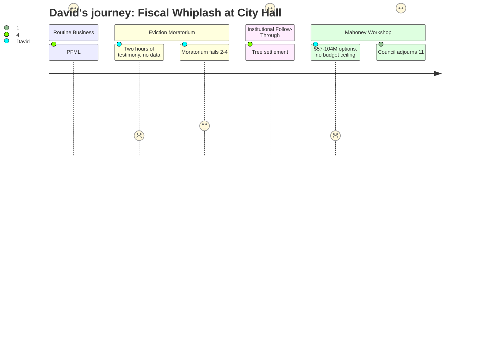

# Interpretation: David (PERSONA-002)
## Meeting: City Council Regular Meeting -- February 17, 2026 -- 2026-02-17

### Structured Points

#### 1. PFML Plan Switch to Symetra: Rare Clean Fiscal Win
- **Fact:** The city moved from the state PFML plan to Symetra, saving approximately $100,000 upfront by skipping four months of pre-launch premiums, plus ~$15,000/year ongoing for the city's share (the $726,000 total program cost is split 50/50 with employees). Employee benefits are contractually identical to the state plan; the switch is state-approved and rates are locked for 29 months from May 1.
- **Source:** [00:43:12--00:55:35]
- **Emotional valence:** positive
- **Threat level:** 1
- **Open question:** true

#### 2. City Manager's Moratorium Presentation: Notably Even-Handed Risk Accounting
- **Fact:** City Manager Marelli presented Ordinance 17 with an explicit enumeration of both benefits and drawbacks, including litigation risk, enforcement capacity limits ("we don't have a dedicated landlord-tenant enforcement division"), and the counterintuitive observation that the ordinance's intended beneficiaries -- people afraid of ICE visibility -- may be precisely the people least likely to invoke it in court or by calling the city.
- **Source:** [01:01:00--01:13:30]
- **Emotional valence:** positive
- **Threat level:** 2
- **Open question:** true

#### 3. No Quantifiable Baseline for the Problem the Moratorium Targets
- **Fact:** When asked about eviction filing volume since the ICE surge, the city manager confirmed there is no online tracking system -- isolating South Portland cases requires manually reviewing court dockets. General Assistance applications were actually down year-over-year in January (94 in 2026 vs. 121 in 2025). The city manager identified only "a handful" of informally confirmed ICE-related GA cases. Project Home's 655 regional contacts, approximately 15% from South Portland, was the best available proxy for affected households.
- **Source:** [01:20:00--01:33:30]
- **Emotional valence:** negative
- **Threat level:** 3
- **Open question:** true

#### 4. Moratorium Fails 2-4 -- But the Process Breakdown Was the Real Story
- **Fact:** Ordinance 17 failed first reading 2 in favor (Walker, Mayor Tipton), 4 opposed (Coleman, Matthews, Pride, Scott), with Councilor West recused as a rental property owner. Dissenting votes centered on the blanket structure shifting financial burden without targeting the harm. However, the procedural path -- bypassing the workshop process via a mayoral Rule 4 addition after only 6-8 hours of drafting time -- drew an explicit rebuke from Councilor Matthews and an admission from the Mayor that "in hindsight, perhaps it would've been better to bring it forward as a workshop."
- **Source:** [01:28:00--02:51:00], vote at [02:37:00--02:40:00]
- **Emotional valence:** neutral
- **Threat level:** 2
- **Open question:** true

#### 5. Tree Cutting Consent Agreement: Enforcement With Long-Term Institutional Teeth
- **Fact:** The Jetport/Diocese tree cutting settlement secured $125,000 total ($50K civil penalty, $50K tree mitigation fund donation, $25K legal cost reimbursement), 75 replacement trees at 36-inch box size with a 3-year survival inspection, and agreement recorded at the Registry of Deeds -- binding future landowners. Corporation Counsel noted that full legal cost reimbursement from the opposing party is an unusual concession in settlement.
- **Source:** [02:57:00--03:24:00]
- **Emotional valence:** positive
- **Threat level:** 1
- **Open question:** false

#### 6. Mahoney Workshop: $57M-$104M+ Options, No Agreed Budget Ceiling
- **Fact:** The design team presented six renovation scenarios for Mahoney ranging from approximately $57M (minimal A-zero, city services only, no theater or library) to ~$104M (full C-one with library addition), with police and fire facility needs explicitly flagged as separate unresolved costs. Despite months of committee work, the council has never formally established a maximum bond figure. The workshop ended at approximately 11:30 PM with informal guidance described as "A-one plus geothermal plus third-floor use" -- a direction to continue deliberating, not a decision.
- **Source:** [03:28:00--05:07:00]; cost matrix at [03:44:00--04:05:00]; guidance discussion at [04:50:00--05:07:00]
- **Emotional valence:** negative
- **Threat level:** 4
- **Open question:** true

#### 7. School Cuts + City Capital Spending + Existing Debt: Nobody Did the Combined Math
- **Fact:** South Portland currently carries $89.1M in outstanding bonds. The school district simultaneously faces a $7.2M structural gap requiring potential elimination of 78 positions (12% of staff), with per-pupil costs the highest among comparable districts at $26,651 and state funding covering only ~20% of actual costs versus the ~55% statutory target. The school tax constitutes 61% of total property taxes. No analysis of combined taxpayer burden appeared in the workshop materials or councilor discussion. Councilor Walker came closest to naming the tension: "we are potentially a community that is saying we're not gonna invest in our schools and we're not gonna invest in our libraries."
- **Source:** Fiscal context; [03:57:00--03:59:00] (outstanding bond schedule); [04:37:00--04:39:00] (Councilor Walker)
- **Emotional valence:** negative
- **Threat level:** 5
- **Open question:** true

---

### Journey Map

---

### Reactions

Look, if you only have two minutes: the Mahoney workshop happened at 10 PM, ran 90 minutes, and ended with no actual decision. The council's best guidance was something like "option A-one plus geothermal" -- and that was to a committee presenting a cost range from $57 million to over $100 million, with police and fire facility costs not even on the same slide. Meanwhile the school is facing a $7.2 million gap and potentially cutting 78 positions. The city is already carrying $89 million in bonds. The school tax is 61 cents of every property tax dollar we pay. Nobody put all of those numbers in the same sentence last night. Councilor Walker got close -- she said we might be becoming a community that doesn't invest in schools or libraries -- but she stopped before the next question: what does the combined property tax impact look like if we add a $57-100 million Mahoney bond on top of a school budget that's already the most expensive per-pupil in the region? That's the spreadsheet I'm building this week, because it's apparently not in any packet I can find.

The PFML switch to Symetra was actually solid. The HR director explained it clearly: skip four months of pre-launch premium payments, save $100,000 upfront, save another $15,000 a year for the city going forward, and employee benefits are contractually identical to the state plan. There's a minor exposure window at the end -- the 29-month rate guarantee runs out three months before you can legally re-enter the state plan if you need to -- but they got advice from their broker that Symetra will want to keep the contract. I'd want that in writing, but for a city that doesn't always find savings, this was clean execution.

The eviction moratorium failed 2-4, which is probably the analytically defensible outcome even if the process was a mess. What I give the city manager credit for: he actually presented the downside case honestly, including that the city has no enforcement division for this and that people afraid of ICE may be too scared to call the city or show up in court. That matters. What I couldn't get from this meeting: how many actual eviction filings have happened since the surge? There's no online tracking system. GA applications were down year-over-year in January. Project Home gave us maybe 75-100 South Portland households as a rough proxy. You can't design good policy without knowing if you're addressing 50 families or 500. The four votes against were analytically coherent. The problem is the council ended the night with no alternative plan either, and that's the question I'd want answered at the next meeting.