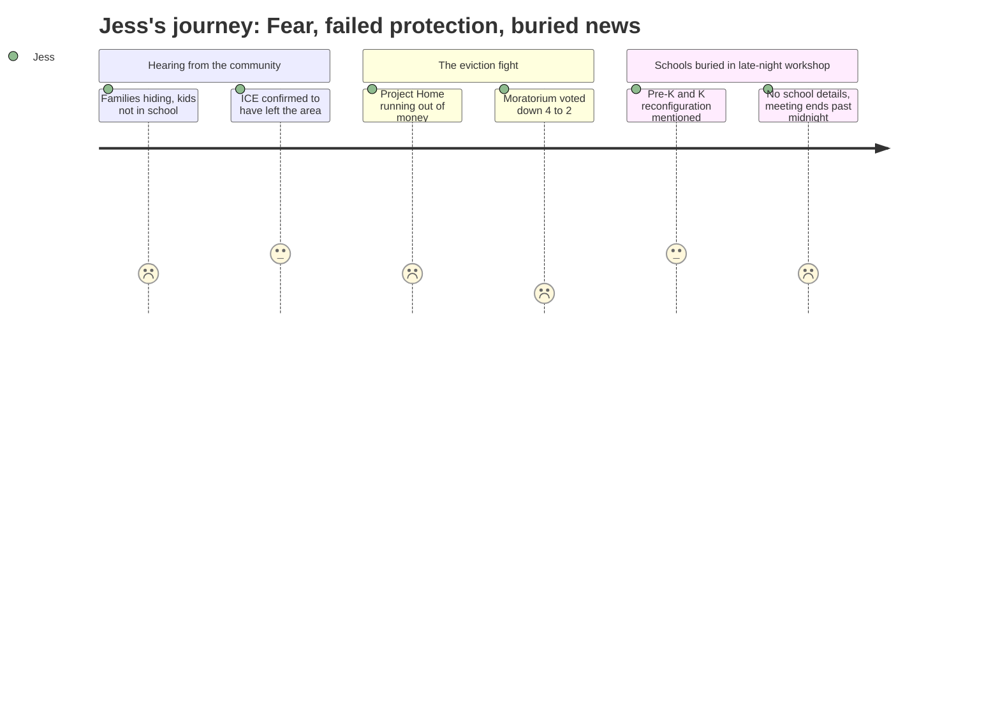

# Interpretation: Jess (PERSONA-003)
## Meeting: City Council Regular Meeting -- February 17, 2026 -- 2026-02-17

### Structured Points

#### 1. Kids are missing school right now because their parents are too afraid to let them leave the house
- **Fact:** A community advocate testified that immigrant children are not attending school — either staying home entirely or being forced into remote learning — because parents fear ICE encounters. A separate speaker, describing her own white, non-immigrant son, said he is six years old and "is wondering why there are kids in his class that still aren't there."
- **Source:** Transcript [00:20:22--00:21:25], Julia Edwards, Dawson Street
- **Emotional valence:** negative
- **Threat level:** 4
- **Open question:** true

#### 2. The emergency safety net keeping vulnerable families housed is ten days from collapse
- **Fact:** Speaker Carly Williams reported that Project Home, which has raised nearly $350,000 in response to the ICE enforcement surge, has received 655 rental assistance contacts since January 23rd — 15% of confirmed-address requests from South Portland residents. As of the date of the meeting, the fund was projected to run out of money "in 10 to 11 days."
- **Source:** Transcript [01:54:08--01:55:30], Carly Williams, Hutchinson Street
- **Emotional valence:** negative
- **Threat level:** 4
- **Open question:** true

#### 3. The council voted down the eviction moratorium -- 4 against, 2 for
- **Fact:** The first reading of a temporary 90-day eviction moratorium, intended to protect families economically disrupted by the ICE enforcement surge, failed 4-2 with one recusal. Councilors Coleman, Matthews, Pride, and Scott voted against; only Councilor Walker and Mayor Tipton voted yes. Councilor West recused due to a direct financial conflict as a landlord.
- **Source:** Transcript [02:30:32--02:31:35]
- **Emotional valence:** negative
- **Threat level:** 4
- **Open question:** true

#### 4. The ICE surge is over -- agents left before the snowstorm and haven't returned
- **Fact:** The police chief confirmed that the elevated ICE operation lasted approximately four days, that agents communicated to South Portland police staff they were leaving, departed before a weekend snowstorm, and "have not returned." He described calls for service related to ICE during the operation as "very infrequent."
- **Source:** Transcript [00:36:45--00:38:11], Police Chief
- **Emotional valence:** positive
- **Threat level:** 2
- **Open question:** true

#### 5. Elementary school reconfiguration is being planned -- pre-K and K will not be at the same schools as older grades
- **Fact:** Late in the Mahoney facilities workshop, Mayor Tipton clarified that the school department is exploring a "reconfiguration" (not a consolidation) that would assign two schools to serve pre-K, kindergarten, and grade 1, while three schools would serve grades 2, 3, and 4. The specific school assignments were not named in the meeting.
- **Source:** Transcript [04:19:08--04:19:55], Mayor Tipton
- **Emotional valence:** negative
- **Threat level:** 3
- **Open question:** true

#### 6. Someone proposed using Mahoney as a consolidated elementary school -- the city manager said the school board already walked away from that idea
- **Fact:** Community member Julia Edwards publicly raised the possibility of converting the Mahoney building into a single elementary school campus, arguing it would address what she called "a segregation problem in our elementary schools." The city manager responded that the school board formally relinquished Mahoney in 2022-23, stating they had no future use for it, and that "there hasn't been a formal request" from the school department to reconsider.
- **Source:** Transcript [04:10:45--04:18:55], Julia Edwards and City Manager
- **Emotional valence:** neutral
- **Threat level:** 3
- **Open question:** true

#### 7. Neighbors are running an extraordinary mutual aid network to hold the community together
- **Fact:** Multiple speakers described a coordinated informal network: residents driving families to work via back roads to avoid ICE, taking children to school, doing grocery shopping, and doing laundry in their own homes because it is not safe for immigrant families to go to the laundromat. One speaker noted "hundreds" of people are involved, many of whom are afraid to be publicly identified.
- **Source:** Transcript [00:14:07--00:25:23], Cassie Moon and Julia Edwards, Dawson Street
- **Emotional valence:** positive
- **Threat level:** 1
- **Open question:** false

### Journey Map

### Reactions

Oh my god, I stayed up until almost midnight watching this and I genuinely can't stop thinking about it. So there's this whole crisis happening with ICE that I only vaguely knew about, and these people came up to the microphone and just... described what it's actually been like. One woman was talking about driving a mom — who HAS a work permit, who is here legally — to work by taking back roads, and this woman dove onto the floor of the car because she was so scared. And she called her kids and told them to stay inside and lock the door and don't open it for anyone. I have a two-year-old and I could barely even process that while watching.

And then someone else, this woman Julia, talked about how HER kid — who is six and white — is asking her why there are still kids missing from his class. That hit me so hard. Because those missing kids are the same age as my daughter will be when she starts school. And then they spent like two hours arguing about a temporary pause on evictions for families like that one, and it just... failed. Four council members voted no. And I get that some of them had principled reasons, I do. But this woman named Carly stood up and said the emergency fund that's been keeping these families in their homes is going to run out of money in like ten days from that meeting. Ten days. And the answer from half the council was basically, write your state legislators, this isn't our problem to solve.

Here's the thing that sent me into a spiral at 11pm: they started talking about this old school building, the Mahoney building, and out of nowhere someone mentioned that the school department is redoing how elementary schools are organized. And the MAYOR said — kind of quickly, while correcting someone else — that the plan is two schools for pre-K, kindergarten, and first grade, and three schools for the older elementary grades. THAT'S IT. No names. No which schools. No explanation of what happens if you live near one of the "older kids" schools and you have a four-year-old. Nobody asked. Nobody answered. And then they moved on to debating elevators and geothermal heating until midnight. The school system that my kid is going to be in is being reorganized and it got like four minutes of airtime at ten at night and then nothing. I genuinely don't know what neighborhood school she's going to kindergarten at anymore.