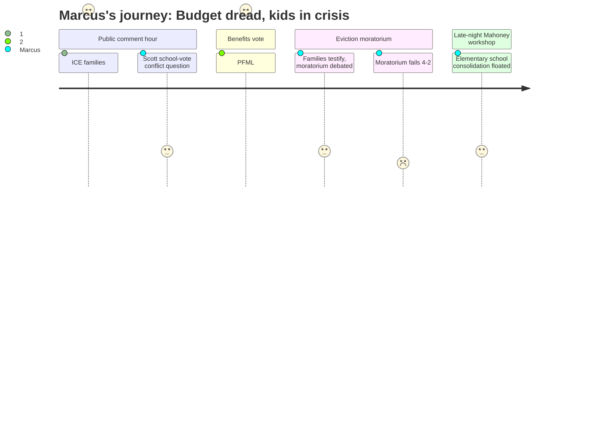

# Interpretation: Marcus (PERSONA-004)
## Meeting: City Council Regular Meeting -- February 17, 2026 -- 2026-02-17

### Structured Points

#### 1. School department joins private PFML plan — teacher take-home pay reduced
- **Fact:** HR Director Rob Netto stated the plan "actually reduces their take home pay by half a percent a year." School board representative Rosemary DeAngelo confirmed the school department has reviewed and will join the same private Symetra plan, meaning this reduction applies directly to teachers' paychecks.
- **Source:** Transcript [00:43:12–00:55:00], specifically [00:46:54–00:47:17] (DeAngelo on school department joining) and [00:52:44–00:52:56] (Netto: "it actually reduces their take home pay by half a percent a year")
- **Emotional valence:** negative
- **Threat level:** 2
- **Open question:** true

#### 2. ICE enforcement keeping students out of school — Marcus sees the empty seats
- **Fact:** Julia Edwards testified that "hundreds and hundreds of our citizens literally will not leave their homes," including children who are "missing out on school or are being forced to do remote school, which is also incredibly unfair." She also described a six-year-old in her child's class "wondering why there are kids in his class that still aren't there."
- **Source:** Transcript [00:20:20–00:23:32] (Julia Edwards public comment)
- **Emotional valence:** negative
- **Threat level:** 3
- **Open question:** true

#### 3. Councilor Scott conflict-of-interest question resolved — she will vote on the school budget
- **Fact:** Community member Ed Kai asked whether Councilor Scott's spouse being a school department employee creates a conflict of interest requiring recusal from school budget votes. The city attorney responded: "so long as Counselor Scott feels as though she can be unbiased, there's no reason, there's no necessity for her to recuse herself."
- **Source:** Transcript [00:29:22–00:34:36] (Kai comment, city attorney response)
- **Emotional valence:** neutral
- **Threat level:** 2
- **Open question:** true

#### 4. Eviction moratorium fails 4–2 — housing instability will reach Marcus's students
- **Fact:** The first reading of Ordinance 17-25/26 failed by a 4–2 vote, with only Councilors Walker and Mayor Tipton in favor; Councilor West was recused. Community member Carly Williams had testified that Project Home received 655 contacts to its emergency housing fund since January 23rd, with 15% of confirmed-address cases in South Portland, and that the fund was projected to run out "in 10 to 11 days from today."
- **Source:** Transcript [02:50:23–02:51:00] (vote); [01:54:03–01:57:21] (Williams testimony)
- **Emotional valence:** negative
- **Threat level:** 3
- **Open question:** true

#### 5. Mahoney as consolidated elementary school — first whisper at a city council meeting
- **Fact:** Community member Julia Edwards raised the possibility of using Mahoney as a single elementary school campus, noting it could free multiple school buildings for city services or housing. The city manager acknowledged no formal request from the school department exists: "there hasn't been a formal request by the school to say, hey, we're looking at Mahoney again."
- **Source:** Transcript [04:10:22–04:12:52] (Edwards comment); [04:17:55–04:18:25] (city manager response)
- **Emotional valence:** neutral
- **Threat level:** 2
- **Open question:** true

#### 6. The proposed elimination of 42 teaching positions never came up — five hours, zero minutes
- **Fact:** The district faces a $7.2M structural gap with 42 teacher positions among 78 total proposed eliminations representing 12% of staff. This is the defining crisis facing South Portland educators and the central concern of every union briefing Marcus has attended. Neither the gap nor the proposed cuts were raised by any councilor, staff member, or public commenter during the entire meeting.
- **Source:** Fiscal Context (background document); absence confirmed by transcript review
- **Emotional valence:** negative
- **Threat level:** 5
- **Open question:** true

---

### Journey Map

---

### Reactions

What hit me first was the public comment — and I mean hit. Julia Edwards described kids in my school's feeder buildings who have not left their apartments since the ICE surge. A six-year-old asking why his classmates aren't in class. A family hiding in a bedroom with a toddler while agents went door-to-door in their building. I have seen those empty seats. These aren't abstractions for me — they show up in my gradebook and in the way a kid looks when they finally come back and haven't been able to do anything for two weeks. And then the council votes four-to-two to kill the eviction moratorium. I read the city manager's memo, I understand the legal arguments, I even get why small landlords are scared. But when the Project Home rep says they've had 655 contacts in three weeks and will run out of money in ten days, and a majority of the council says "not our mechanism to solve this" — those families are going to end up somewhere, and some of those kids are going to show up in August needing more than I can give them.

The items that I'm logging specifically for the union: first, the PFML change. HR confirmed it reduces take-home pay by half a percent annually, and the school board rep stood up and said the school department is joining the same private Symetra plan. Nobody at that table pushed back on what that means for teachers under a collective bargaining agreement, or whether there's any contractual constraint on how that cost gets applied to our paychecks. I'm bringing this to my rep tomorrow. Second, the conflict-of-interest question about Councilor Scott — somebody in the audience asked whether her husband being a school employee means she should recuse from school budget votes. The city attorney said no legal requirement applies. Fine, but I'm writing that down. She was one of the four votes against the moratorium tonight. She will be one of the seven city council votes on the budget that is proposing to eliminate 42 of my colleagues.

That number — 42 teachers — never came up once in five hours. Not in public comment, not from any councilor, not even as a sidebar. I sat there watching people fight passionately about an ordinance that might have kept a handful of families from getting eviction notices, and that's important, I'm not dismissing it. But the school budget is coming to this same table in a few months and it is proposing to gut twelve percent of district staff. I want to know which of these seven people has even opened the document. The one moment that woke me up near midnight was Julia Edwards suggesting Mahoney could be used as a consolidated elementary school — which is the first time I've heard that idea floated in a public city venue, not just in a union briefing — and the city manager basically said "we haven't heard from the schools." These two bodies are about to have the most consequential fiscal collision South Portland has seen in decades and they are still not talking to each other.