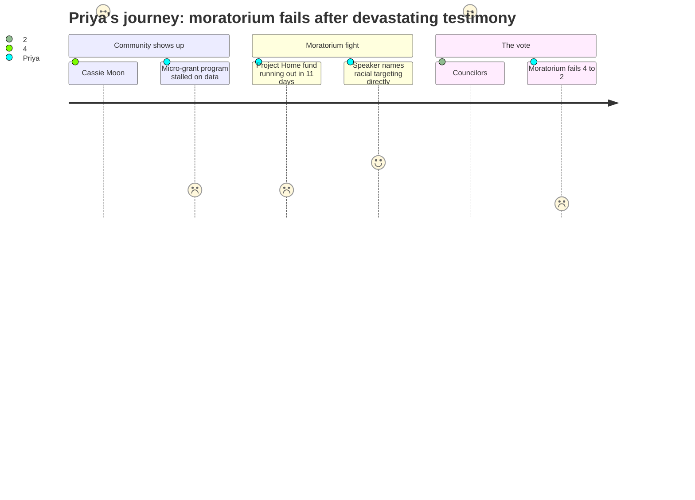

# Interpretation: Priya (PERSONA-005)
## Meeting: City Council Regular Meeting -- February 17, 2026 -- 2026-02-17

---

### Structured Points

#### 1. Community infrastructure is filling the gap institutions won't
- **Fact:** Multiple speakers described a shadow mutual-aid network of hundreds of South Portland residents — providing transportation, groceries, laundry, childcare, and safe shelter for immigrant families unable to leave their homes. Cassie Moon testified she drives a mother to work via back roads while ICE circles the neighborhood, then picks her up at midnight to take her somewhere other than her own home. Julia Edwards reported "hundreds and hundreds" of neighbors, including children, are refusing to leave.
- **Source:** Citizen Discussion Part I [00:14:11 -- 00:28:45], testimony of Cassie Moon, Julia Edwards, and Carolyn Nishan
- **Emotional valence:** positive
- **Threat level:** 2
- **Open question:** true

#### 2. Business micro-grant program stalled; no South Portland-specific data was collected
- **Fact:** The city's economic development director determined that the Greater Portland Council of Governments survey did not track data by municipality, leaving no disaggregated evidence of ICE's economic impact on South Portland businesses specifically. Staff recommended not moving forward with any grant or loan program. Human Rights Commission Chair Pedro Vasquez pushed back directly: "Loss of revenue happens immediately. Rent, payroll and inventory costs do not wait for surveys or regional consensus."
- **Source:** Petitions and Communications [00:03:30 -- 00:06:01]; Citizen Discussion Part I [00:25:54 -- 00:28:05]
- **Emotional valence:** negative
- **Threat level:** 3
- **Open question:** true

#### 3. City manager names the enforcement catch-22 the council didn't resolve
- **Fact:** During his own presentation on the moratorium, the city manager warned that the people the ordinance was designed to protect might be too afraid to use it — because calling the city to file a complaint, or appearing in court to raise the ordinance as a defense, would create a record and increase their visibility to the very authorities they feared. He said the ordinance's "effectiveness depends on tenants being aware of this ordinance. Would they bring it up as a defense."
- **Source:** City manager presentation on Ordinance 17 [01:08:30 -- 01:09:45]
- **Emotional valence:** negative
- **Threat level:** 4
- **Open question:** true

#### 4. Project Home emergency housing fund projected to run out within 11 days
- **Fact:** Speaker Carly Williams reported that Project Home had received 655 contacts requesting rental assistance since January 23rd, with 15% of those with confirmed addresses living in South Portland. As of that afternoon, staff told her the fund — which raised nearly $350,000 — was projected to run out in 10 to 11 days. The need had already outpaced both nonprofit resources and what general assistance could absorb.
- **Source:** Public comment on Ordinance 17 [01:54:15 -- 01:56:10]
- **Emotional valence:** negative
- **Threat level:** 4
- **Open question:** true

#### 5. A community speaker names the racial targeting the council didn't
- **Fact:** Lindsay Maria stated directly: "What we're seeing essentially is that a group of people that's being affected economically in this period is actually just any of our neighbors who are black or brown… we have a situation in our town where the only people who have an eviction problem are black and brown people. In my mind, that is completely unacceptable for any civic unit, for any community." No councilor who voted against the moratorium engaged with this framing on the record.
- **Source:** Public comment on Ordinance 17 [01:49:30 -- 01:50:50]
- **Emotional valence:** positive
- **Threat level:** 3
- **Open question:** false

#### 6. Human Rights Commission chair discloses he carries his birth certificate for protection
- **Fact:** Pedro Vasquez, the chair of the South Portland Human Rights Commission — an official advisory body to the council — ended his public comment by saying: "My name and my skin marks me and makes me a target to what's happening in our community. I and members of my family are walking around with our birth certificates." He testified twice in an official capacity: once urging action on the micro-grant program and once formally recommending a 60-day eviction moratorium.
- **Source:** Citizen Discussion Part I [00:25:54 -- 00:28:38]; Public comment on Ordinance 17 [02:16:41 -- 02:18:25]
- **Emotional valence:** negative
- **Threat level:** 5
- **Open question:** false

#### 7. Moratorium fails 4-2; dissenting majority reframes landlord risk as the equity concern
- **Fact:** Ordinance 17 failed its first reading 4-2, with Councilors Scott, Coleman, Matthews, and Pride voting no. Councilor Scott argued the moratorium "shifts that burden from one sector of the population to another sector of the population" and that it was "not appropriate for us to judge whether or not one sector is more harmed." Councilor Pride called it "a sledgehammer not a scalpel." Neither acknowledged that the economic harm to tenants was imposed by federal enforcement activity — not by tenant choices — or engaged with the racial dimension named by Lindsay Maria minutes earlier.
- **Source:** Council deliberation and vote on Ordinance 17 [02:37:20 -- 02:50:35]
- **Emotional valence:** negative
- **Threat level:** 5
- **Open question:** true

---

### Journey Map

---

### Reactions

The community showed up and it didn't matter. That's the headline. Cassie Moon testified about driving a mother to work via back roads while ICE circled the neighborhood, picking her up at midnight because going home would risk leading agents to her kids. Pedro Vasquez — the chair of the city's own Human Rights Commission, testifying in his official advisory capacity — ended his comments by telling the council that he and his family now carry their birth certificates everywhere because of how they look. A ten-year-old was quoted asking, "Why are they doing this to us? My parents work and pay taxes and do everything right." Four councilors voted no anyway.

What I keep coming back to is the framing from the no votes. Councilor Scott said the moratorium "shifts that burden from one sector of the population to another" — as if tenants and landlords are equally situated in this moment. Councilor Pride called it "a sledgehammer not a scalpel." Neither of them engaged with what Lindsay Maria said out loud in that room: that the only people facing eviction right now are Black and brown people. She said it on the record. And the city manager himself had already told the council, in his own presentation, that the people most at risk might be too afraid to even invoke the ordinance — because appearing in court or calling the city creates a record, and visibility is exactly what these families are trying to avoid. The city's own expert named the structural catch-22 and the council voted no anyway. The dissenting majority proposed GA fund direct assistance as the alternative, which requires the same kind of institutional contact and documentation they'd just acknowledged vulnerable people couldn't safely provide.

Here's what I'm tracking going forward: Project Home was projected to run out of emergency housing funds within eleven days of this meeting. The micro-grant program is paused because the regional survey didn't disaggregate South Portland data — that is a data-collection choice someone made, and we should be asking who decided not to track impact by municipality. And Julia Edwards raised South Portland's redlining history in public comment, and the city manager acknowledged segregated housing at Red Bank, a 1930s rating system that targeted Black, immigrant, and Catholic communities — and then nothing. No commitment to investigate. No follow-up action. The council ended the meeting after midnight still workshopping which option of a city hall renovation to take to voters. Meanwhile the city's own advisory chair is carrying his birth certificate in his pocket and Project Home has eleven days of runway. That gap is what we're working with.