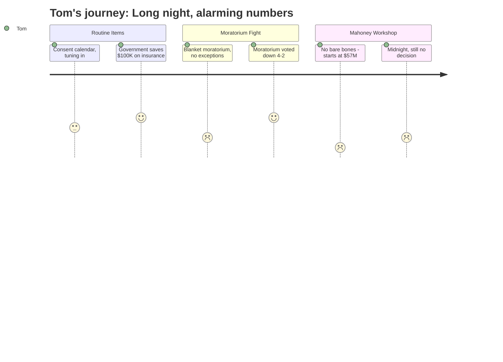

# Interpretation: Tom (PERSONA-006)
## Meeting: City Council Regular Meeting -- February 17, 2026 -- 2026-02-17

### Structured Points

#### 1. One Bright Spot: City Switches Insurance Plan, Saves $100K
- **Fact:** The city voted to move its paid family and medical leave coverage from the state plan to Symetra, a private insurer, saving approximately $100,000 in upfront premiums — split 50/50 between city and employees — plus roughly $15,000 per year in ongoing savings on a three-year contract. HR Director Rob Netto noted the private rate was below the state premium, and the state has approved the arrangement.
- **Source:** [00:43:13–00:58:42], HR Director Rob Netto's presentation and vote on Order #148-25/26
- **Emotional valence:** positive
- **Threat level:** 1
- **Open question:** false

#### 2. A Citizen Puts Into Words What Tom Has Been Thinking
- **Fact:** During the PFML discussion, a citizen commenter (Edward, Romano Road) called out the state legislature directly, saying it "throws these mandates out there but they don't really think about what the consequences are long term for property owners who are paying property taxes." He also noted that South Portland is considered a "rich community" and therefore doesn't receive its full promised share of state education funding — yet the mandates still land on local taxpayers.
- **Source:** [00:49:22–00:51:00], citizen comment during public comment on Order #148-25/26
- **Emotional valence:** negative
- **Threat level:** 3
- **Open question:** true

#### 3. City Proposes Blanket Eviction Moratorium — No Exceptions for Small Landlords
- **Fact:** Ordinance #17-25/26 would have blocked most eviction notices citywide from February 1 through April 30, 2026. The city manager acknowledged the ordinance had to be written broadly — covering all landlords and all tenants — because targeting it narrowly to ICE-affected cases was "very difficult." Rent remains legally owed but collection is delayed. City staff also warned the ordinance carried litigation risk and set a precedent that could be triggered any time the council declared a community hardship.
- **Source:** [01:00:15–01:13:00], City Manager Scott Morelli's presentation of Ordinance #17-25/26
- **Emotional valence:** negative
- **Threat level:** 4
- **Open question:** false

#### 4. Moratorium Fails First Reading — Four Councilors Vote It Down
- **Fact:** The eviction moratorium failed 4–2, with Councilor West recused due to owning rental property. Councilor Scott argued that the ordinance "shifts the burden from one sector of the population to another" and that the city should support affected residents through direct city funding rather than forcing costs onto landlords. Councilors Coleman, Matthews, and Pride each raised similar concerns about breadth and precedent.
- **Source:** [02:37:15–02:40:00], councilor deliberation and vote on Ordinance #17-25/26
- **Emotional valence:** positive
- **Threat level:** 1
- **Open question:** false

#### 5. Landlords Warn: This Is Market Signal, Not Just a Temporary Measure
- **Fact:** The Rental Housing Alliance executive director testified that the moratorium would effectively double the already-lengthy eviction timeline (8–10 weeks existing process, plus 90-day moratorium), and that a blanket ordinance "creates broad uncertainty and risk in the housing system" that would discourage new rental investment in South Portland. A small landlord commenter asked the council directly: if ICE returns in July, would this ordinance come back? The city manager acknowledged there was nothing preventing that.
- **Source:** [01:34:09–01:43:00], public comment from Sarah McKee (Rental Housing Alliance), Tim McIver, Matt Layton, and Ed (Romano Road); city manager response at approximately [02:28:00]
- **Emotional valence:** negative
- **Threat level:** 3
- **Open question:** true

#### 6. Mahoney Renovation: Even the Cheapest Option Costs $57 Million
- **Fact:** Design consultants presented six Mahoney renovation scenarios ranging from approximately $57 million (minimal renovation, city offices only, two floors, no library) to $105 million (full build-out including library and community spaces). The committee chair reported that the M3C found "no such thing as a bare bones approach" because ADA, life safety, structural, and energy code upgrades are automatically triggered by any change of building use — and the 100-year-old structure cannot be upgraded selectively.
- **Source:** [03:14:11–04:07:00], workshop presentation by Mike Halsey (M3C Committee Chair) and Craig Piper (SMRT Architects)
- **Emotional valence:** negative
- **Threat level:** 5
- **Open question:** true

#### 7. Five-Hour Meeting Ends Past Midnight — No Decision Made on Mahoney
- **Fact:** The meeting ran 5 hours and 7 minutes before adjourning. The Mahoney workshop concluded without a formal vote or binding direction; councilors gave vague preference for an "A-one plus geothermal" option but set no timeline for a bond referendum. The question of what happens to police and fire stations — potentially tens of millions more — was explicitly deferred to future discussions.
- **Source:** Meeting duration per transcript (05:07:07 total); adjournment exchange at approximately [05:03:00–05:07:00]
- **Emotional valence:** negative
- **Threat level:** 2
- **Open question:** true

---

### Journey Map

---

### Reactions

I sat through the whole thing last night — five hours, didn't get home until well past midnight — and the number I can't stop thinking about is fifty-seven million. That's the absolute floor for what they're talking about spending on Mahoney school. Minimum, just to move city offices in there with no frills. The top of the range is a hundred and five million. And that's before you even start on police, fire, or the library. The committee consultant said it plainly: there's no such thing as a bare bones approach. Once you change the use of a building that old, all the code requirements kick in and you can't pick and choose. I understand that. But fifty-seven million minimum? On top of everything else they're asking us to absorb? I'd really like to see that broken down into what it adds to the average tax bill before anyone starts talking bond referendum.

The other thing that had me up was what they tried to do with landlords. They put forward something called an eviction moratorium — a city rule that would have stopped any landlord from starting eviction proceedings for three months. They said it was to help people affected by the ICE situation, which I understand, but they couldn't write it narrowly enough to apply only to those cases. So it would have covered every tenant in the city, for any reason. Private lease agreements, just set aside. The rent's still owed, technically, but you can't do a thing about it for ninety days. I'm not a landlord, but if the city can decide one morning that your signed contract doesn't apply anymore because they've declared some kind of emergency, that's a door I don't want opened. Thank God four of the seven councilors had the sense to vote it down. Councilor Scott said it as well as anyone: you don't fix a problem by moving the cost onto someone who didn't cause it.

One credit where it's due: they voted to switch some employee insurance plan from the state to a private company, saving a hundred thousand dollars up front and fifteen thousand a year going forward. That's how government should operate. And there was a man in the audience — Edward, lives on Romano Road — who said during that discussion what I've been saying for years. The legislature passes mandates and never thinks about what they cost the property owner. And South Portland in particular gets shortchanged on state education funding because Augusta has decided we're a wealthy community — but the mandates still land here just the same as everywhere else. I'd like to know who exactly is getting rich in this city, because from where I'm sitting it isn't the homeowners paying the bills.