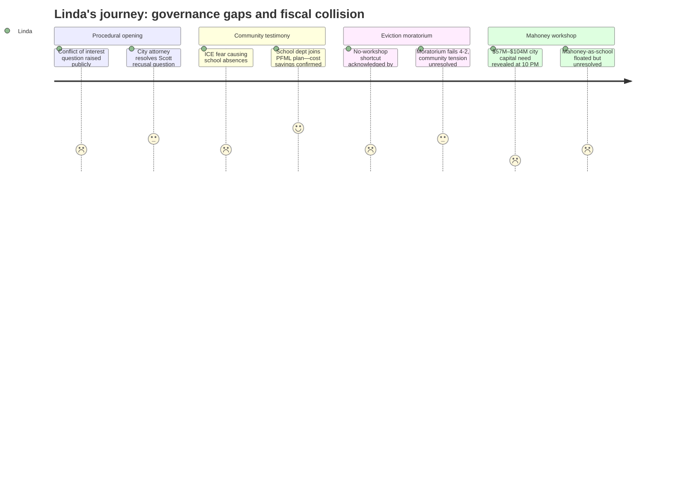

# Interpretation: Linda (PERSONA-007)
## Meeting: City Council Regular Meeting -- February 17, 2026 -- 2026-02-17

### Structured Points

#### 1. Conflict of Interest Question About Councilor Scott Enters Public Record
- **Fact:** Resident Ed Cobb used public comment to question whether Councilor Scott — whose spouse works for the school department — should be recused from any school budget discussion or vote. The city attorney clarified that Maine statute requires recusal only when a municipal official owns 10% or more of a corporation receiving a contract; nothing in the rules compels the council to take action when a conflict is merely raised. Scott may vote as long as she believes she can be unbiased.
- **Source:** Transcript [00:29:05–00:34:36]
- **Emotional valence:** neutral
- **Threat level:** 2
- **Open question:** true

#### 2. School Department Joins Symetra PFML Plan, Capturing Cost Savings
- **Fact:** During public comment on Order 148 (the PFML private-plan transfer), school board representative Rosemary DeAngelos confirmed that the school department had reviewed the issue with the city and would join the Symetra plan. DeAngelos explicitly noted this was a coordinated decision and expressed appreciation for the opportunity.
- **Source:** Transcript [00:46:40–00:47:25]
- **Emotional valence:** positive
- **Threat level:** 1
- **Open question:** false

#### 3. ICE Enforcement Is Keeping Children Out of School — and No One Is Naming That as an Enrollment Problem
- **Fact:** Multiple public speakers described children not attending school due to fear of ICE enforcement. Julia Edwards stated directly that families "will not let their children leave their homes for good reason" and that "those kids are missing out on school or are being forced to do remote school." Cassie Moon described a mother who would not let her children leave the house and told them to keep the door locked. One speaker specified children at apartment complexes including Red Bank Village, Liberty Commons, and Summit Terrace.
- **Source:** Transcript [00:14:12–00:17:18] (Moon testimony); [00:20:19–00:23:31] (Edwards testimony); [01:39:00–01:41:00] (Westfall testimony on specific buildings)
- **Emotional valence:** negative
- **Threat level:** 3
- **Open question:** true

#### 4. Eviction Moratorium Fails 4–2; Mayor Acknowledges Bypassing Workshop Was a Mistake
- **Fact:** Ordinance 17-25/26 failed on first reading 4–2 (Walker and Tipton in favor; Coleman, Matthews, Pride, and Scott opposed). During council deliberation, Counselor Matthews asked why the ordinance had not gone through a workshop. The city manager explained the mayor used Rule 4 authority to add it directly. Mayor Tipton acknowledged: "In hindsight, perhaps it would've been better to bring it forward as a workshop."
- **Source:** Transcript [01:28:04–01:29:05] (Matthews question and city manager response); [01:32:14] (Tipton acknowledgment); [02:50:23–02:50:44] (vote result)
- **Emotional valence:** neutral
- **Threat level:** 2
- **Open question:** true

#### 5. Mahoney Workshop Reveals $57M–$104M City Capital Need — Potentially Landing on the Same November Ballot as School Budget Pressure
- **Fact:** Designer Craig Piper presented six Mahoney renovation scenarios ranging from $57M (option A-zero, city services only, minimal renovation) to approximately $104M (option C-one, full build-out with library). Police and fire capital needs add roughly $57M more if addressed in parallel. After a late-night workshop, council's informal consensus leaned toward "A-one plus geothermal, third-floor use" — a subset of the full project — with discussion of putting a bond to voters in November 2026.
- **Source:** Transcript [03:44:00–03:45:30] (Piper on cost ranges); [04:27:15–04:28:00] (city manager question about November ballot); [04:53:50–04:55:50] (council informal A-one consensus)
- **Emotional valence:** negative
- **Threat level:** 4
- **Open question:** true

#### 6. Late-Night Comment Floats Mahoney as Elementary School Campus; City Manager Confirms No Formal School Department Request
- **Fact:** At approximately 11 PM, public commenter Julia Edwards asked whether the council had seriously considered using Mahoney as a consolidated elementary school campus, noting it would free up other school buildings for housing and scattered city services. Mayor Tipton confirmed she had raised this idea at a prior meeting. City manager clarified that the school board had previously formally told the city it had no use for Mahoney and that the city should take it over; no formal request to revisit that position has been submitted.
- **Source:** Transcript [04:09:20–04:14:00]
- **Emotional valence:** neutral
- **Threat level:** 2
- **Open question:** true

### Journey Map

### Reactions

The conflict of interest question came up exactly as I feared it would — in public, at a city council meeting, one week after Karen Scott disclosed her husband works for the district. Ed Cobb asked a fair question and the attorney gave the right legal answer: no statutory threshold is met, no council vote required, she can participate. Fine. That's where we land legally. But now it's in the transcript, it'll show up in every school budget public comment between now and validation, and it gives opponents a procedural talking point if the budget passes narrowly. I'm not worried about the outcome, I'm worried about the distraction. At a moment when we need people focused on what 78 eliminated positions actually means for kids in classrooms, the last thing we need is a process fight that pulls focus from the substance.

What genuinely will keep me up is the Mahoney workshop. They're sitting there at 10 PM, running through scenarios from $57 million to $104 million just for that building — before touching police and fire — and the conversation on the table is whether to put a bond to voters in November. The same November we're asking property taxpayers to absorb a 6% school tax increase that represents our reduced ceiling after cutting 42 teachers and 36 other positions. Nobody in that room ran the combined number. What does a city bond plus school budget increase do to the median South Portland homeowner's bill in the same tax year? That's not a hypothetical, that's the political environment our school budget validation vote will live in. I understand the city has legitimate deferred capital needs — I've seen the fire station, I know what police and fire are dealing with — but the fiscal pressure is not additive, it's multiplicative when voters are fatigued.

The ICE piece connects to my world more directly than the city council framing suggests. Julia Edwards described children "missing out on school or being forced to do remote school." Cassie Moon described a mother telling her children to keep the door locked and not open it for anyone. The city manager said GA requests tied to ICE were "a handful" — but that's general assistance, not school attendance. I know what the numbers look like in buildings near Red Bank and Summit Terrace. When Project Home is projected to exhaust its emergency housing fund in ten days, with 15% of requests coming from South Portland, that is families who — if they lose housing — leave our enrollment. And lost enrollment affects our state subsidy calculation the following year. The housing instability conversation and the school budget conversation are in different governance silos on Tuesday nights, but they land in the same place: my budget, my kids, my classrooms.