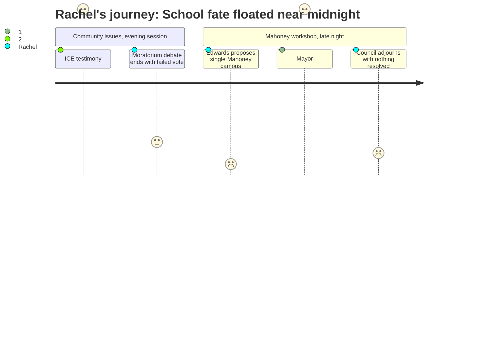

# Interpretation: Rachel (PERSONA-008)
## Meeting: City Council Regular Meeting -- February 17, 2026 -- 2026-02-17

### Structured Points

#### 1. Community member proposes putting all elementary students at a single Mahoney campus
- **Fact:** During the late-night Mahoney facilities workshop, community member Julia Edwards suggested the city consider "making a single elementary school campus on the Mahoney site," with pre-K and kindergarten potentially sent to the Brown campus — implying that existing neighborhood elementary school buildings would be repurposed for housing or city services.
- **Source:** Transcript [04:10:22–04:12:52]
- **Emotional valence:** negative
- **Threat level:** 4
- **Open question:** true

#### 2. Mayor Tipton describes a grade-split "reconfiguration" that would require every elementary student to change schools at second grade
- **Fact:** Mayor Tipton corrected Edwards' language, noting the school board uses the word "reconfiguration" rather than "consolidation," and described the plan as placing pre-K/K/1 at two schools and grades 2/3/4 at three different schools — a structure requiring every current elementary student to change buildings between first and second grade. She stated this would save the district $2 million.
- **Source:** Transcript [04:22:10–04:24:15]
- **Emotional valence:** negative
- **Threat level:** 5
- **Open question:** true

#### 3. City manager confirms no formal school board request to reclaim Mahoney — yet
- **Fact:** The city manager clarified that the school board relinquished Mahoney in 2022–23, stating they had no future use for it, and that no formal request has been made to reclaim it. The single-campus idea raised at this meeting was community-originated, not district-initiated.
- **Source:** Transcript [04:17:15–04:18:45]
- **Emotional valence:** positive
- **Threat level:** 2
- **Open question:** true

#### 4. A 23% elementary enrollment decline is the explicit engine driving restructuring
- **Fact:** Elementary enrollment fell from 1,401 to 1,080 students in four years — a 23% decline that is simultaneously driving the $7.2M budget shortfall and the grade-reconfiguration discussions that could disrupt current school assignments citywide.
- **Source:** Fiscal Context
- **Emotional valence:** neutral
- **Threat level:** 3
- **Open question:** false

#### 5. Councilor Walker flags that cutting schools and libraries together sends a damaging signal about community values
- **Fact:** Councilor Walker said she was troubled by the optics of being a community that was "not going to invest in our schools and not going to invest in our libraries," framing both the school budget crisis and the proposed library deferral as a combined signal about priorities.
- **Source:** Transcript [04:38:40–04:39:15]
- **Emotional valence:** neutral
- **Threat level:** 2
- **Open question:** true

#### 6. Children of immigrant families in South Portland schools are being kept home due to ICE fear
- **Fact:** Multiple public speakers testified that immigrant parents were keeping children out of school, with one speaker noting children were "missing out on school" or "forced to do remote school, which is also incredibly unfair." These are children enrolled in South Portland public schools.
- **Source:** Transcript [00:20:25–00:22:10]
- **Emotional valence:** negative
- **Threat level:** 2
- **Open question:** false

#### 7. Mahoney decision ends past midnight with the school-use option neither endorsed nor ruled out
- **Fact:** After an exhausting workshop that stretched to nearly 11:30 PM, council provided only vague guidance ("A1 plus geothermal") to the Mahoney committee. No council member responded to the Edwards school-consolidation idea — it was neither endorsed nor rejected before adjournment.
- **Source:** Transcript [05:03:30–05:07:07]
- **Emotional valence:** negative
- **Threat level:** 3
- **Open question:** true

---

### Journey Map

---

### Reactions

You would not believe this meeting. I stayed until almost 11:30 and I'm both exhausted and furious and I can't sleep. The first three hours were the ICE stuff and the eviction moratorium — and those things matter, there were parents up there saying their kids are being kept home from school because they're scared, which is heartbreaking — but I stayed because I heard the Mahoney workshop was on the agenda and I needed to see what they said about the schools. I sat through hours of landlord testimony to get to it.

So around 10:30, this woman Julia Edwards gets up during the Mahoney discussion and just casually suggests that the city should consider putting ALL the elementary kids on one single campus at Mahoney. All of them. Pre-K and kindergarten maybe going to Brown, everyone else at Mahoney, and the rest of our schools becoming affordable housing or city offices. Nobody pushed back on that. Nobody. The city manager said the school board hasn't formally asked for Mahoney back, which honestly is the one piece of information I'm holding onto right now. But then the mayor — the mayor — started explaining the school board's plan, and she was very careful about the words. They don't call it consolidation, she said. They call it reconfiguration. What it actually means is: pre-K through first grade in two schools, second through fourth in three different schools. So every single elementary kid in this city switches buildings when they hit second grade. Loses their teacher. Starts over. She said it saves two million dollars. My kid's established friendships and teacher relationships cost two million dollars, apparently.

Nothing was voted on — the whole Mahoney discussion dissolved into confused talk about elevators and geothermal energy at 11:30 at night, which is not a decision about anything. But nobody said the school idea was off the table. Nobody said the grade-split isn't happening. I'm texting parents tonight and we need to find out when the school board meets next, because based on what I heard the mayor say, this reconfiguration plan is much further along than any of us knew. They stopped calling it consolidation and started calling it reconfiguration, which means they know exactly how it sounds — and they're doing it anyway.