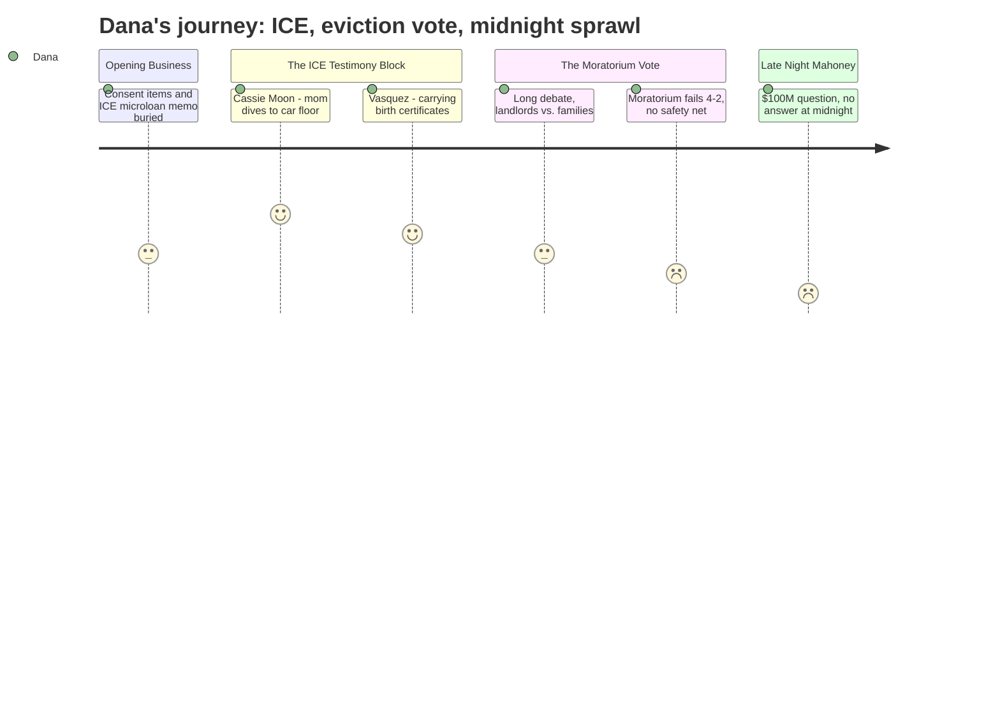

# Interpretation: Dana (PERSONA-009)
## Meeting: City Council Regular Meeting -- February 17, 2026 -- 2026-02-17

---

### Structured Points

#### 1. The car floor moment
- **Fact:** Community volunteer Cassie Moon testified that when she arrived to drive an immigrant mother to work, the woman "opens the back door and dives to the floor of my car crying." Moon said she took back roads to get her safely to work, then picked her up at midnight and drove her somewhere other than home because the woman was afraid to return. She described doing this routinely — shopping, laundry, school runs — for multiple immigrant families while ICE was in the area.
- **Source:** Transcript [00:14:37 -- 00:17:00]
- **Emotional valence:** positive
- **Threat level:** 5
- **Open question:** true

#### 2. Pedro Vasquez carrying his birth certificate
- **Fact:** Pedro Vasquez, chair of the South Portland Human Rights Commission, testified first on the micro-loan program and then on the eviction moratorium. At the close of his micro-loan testimony he told the council: "my name and my skin marks me and makes me a target to what's happening in our community. I and members of my family are walking around with our birth certificates."
- **Source:** Transcript [00:28:24 -- 00:28:58]
- **Emotional valence:** negative
- **Threat level:** 5
- **Open question:** false

#### 3. Project Home is running out of money in ten days
- **Fact:** Speaker Carly Williams testified that Project Home — which has raised nearly $350,000 since January 23rd in response to ICE activity — has received 655 contacts requesting emergency rental assistance, 15% of them from South Portland households. As of the date of the meeting, the fund was "projected to run out of their funds in 10 to 11 days."
- **Source:** Transcript [01:54:32 -- 01:55:45]
- **Emotional valence:** negative
- **Threat level:** 5
- **Open question:** true

#### 4. Eviction moratorium fails 4--2
- **Fact:** The council voted down the first reading of a temporary eviction moratorium (Ordinance 17-25/26) that would have covered February 1 through April 30. Mayor Tipton and Councilor Walker voted yes. Councilors Scott, Coleman, Matthews, and Pride voted no. Councilor West, who disclosed owning five rental units in South Portland, recused herself from the vote entirely.
- **Source:** Transcript [02:30:22 -- 02:30:48]
- **Emotional valence:** negative
- **Threat level:** 4
- **Open question:** true

#### 5. The no votes offered an alternative with no money attached
- **Fact:** Three of the four no-vote councilors — Scott, Coleman, and Pride — said during deliberation that they would support direct rent assistance to affected families through mechanisms like the General Assistance fund or donations to groups like Project Home. None of these alternatives were funded or scheduled at the time of the vote. Councilor Pride explicitly said he would "100% support this council donating money to Project Home."
- **Source:** Transcript [02:37:855 -- 02:44:635]
- **Emotional valence:** neutral
- **Threat level:** 3
- **Open question:** true

#### 6. Conflict of interest question plants a flag for the school budget fight
- **Fact:** Public commenter Ed Cobb asked whether Councilor Scott should recuse herself from school budget deliberations because her spouse is a school department employee. The city attorney, responding on the spot, said no recusal is required unless there is a direct pecuniary interest meeting a 10% ownership threshold. Mayor Tipton noted that Councilor West's conflict (owning rental property) is "a direct financial interest, which is very distinct from the indirect type of interest that Councilor Scott has with regard to a general budget."
- **Source:** Transcript [00:29:04 -- 00:34:36]
- **Emotional valence:** neutral
- **Threat level:** 2
- **Open question:** true

#### 7. Mahoney City Center workshop runs to midnight and produces no decision
- **Fact:** After five-plus hours of other business, the council held a long-scheduled workshop on the Mahoney building renovation project. Design firm SMRT presented six options ranging from $57M to $105M depending on scope. The committee chair stated the full committee still recommends the original comprehensive plan. Most councilors seemed to prefer a stripped-down "Option A-1 plus geothermal" version, but no option was formally endorsed and the discussion was suspended without guidance — at approximately 11:30 PM.
- **Source:** Transcript [03:28:00 -- 05:07:07]
- **Emotional valence:** negative
- **Threat level:** 3
- **Open question:** true

---

### Journey Map

---

### Reactions

Okay so here's the pitch. The lead is the eviction moratorium vote — council had a chance to buy time for immigrant families who couldn't go to work because ICE was outside their door, and they killed it 4 to 2. But the real content is everything that happened before that vote. We've got a woman named Cassie Moon — volunteer, not an official, just a neighbor — who testified about driving an immigrant mom to work on back roads at 1 PM, picking her up at midnight, and taking her somewhere else to sleep because she was afraid to go home. The mom dove to the floor of the car when she got in. That's a thirty-second piece of television by itself. I need to get Cassie on camera tomorrow.

Then there's Pedro Vasquez — he's the chair of the South Portland Human Rights Commission, man of color, credible, already speaking publicly. He closes his testimony by telling the council that he and his family are physically carrying their birth certificates right now because, quote, "my name and my skin marks me and makes me a target." He said it calmly. That's your soundbyte. That's the closer for the package.

Here's the complication: the four no-votes weren't unreasonable, which makes this harder to write as a clean good guys versus bad guys story. They said the ordinance was too broad — any tenant in the city could use it, not just immigrants — and they worried about small landlords living paycheck to paycheck. We had a duplex owner at the podium who said she's on social security and she was in favor of protecting immigrants but scared she couldn't make her mortgage. Real people on both sides. Three of the no-votes said they'd support direct rent assistance through general assistance or Project Home — but there's no money allocated and no timeline. Meanwhile one speaker testified that Project Home is going to run out of emergency housing funds in ten days. So the nonprofit safety net is almost gone and the public one wasn't activated. That's the story: the clock is running.

For b-roll I want Red Bank Village, Liberty Commons, and Summit Terrace — those are the specific complexes named in testimony where ICE was active, going door to door. I also want a map or a shot of Dawson Street for the tree-cutting resolution angle if we ever do a follow. The Mahoney thing is a separate segment for another day — they went until 11:30 PM arguing over a $57-to-100-million building renovation with no decision. I sat through it. Nothing usable for tonight. Anchor intro I'm thinking: "South Portland's city council voted down a plan to pause evictions for immigrant families last night — even as volunteers testified about driving those same families on back roads to stay safe from ICE." Does that work?