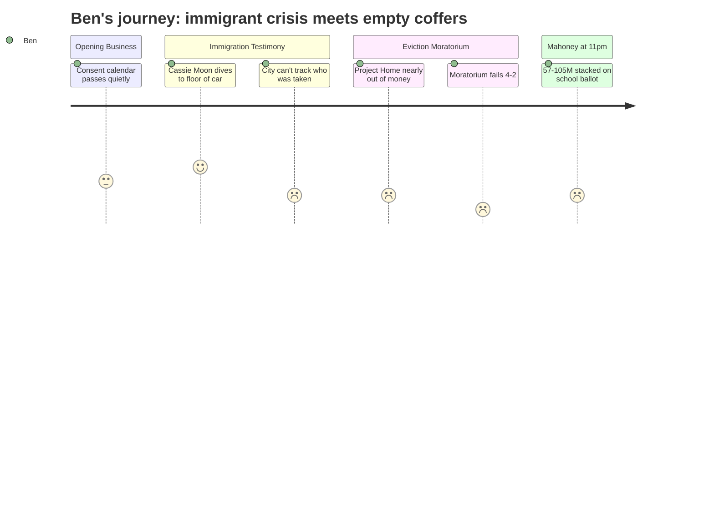

# Interpretation: Ben (PERSONA-010)
## Meeting: City Council Regular Meeting -- February 17, 2026 -- 2026-02-17

### Structured Points

#### 1. Cassie Moon Drives a Mother Home at Midnight
- **Fact:** A South Portland resident testified in detail about driving an immigrant mother — who called her children to stay inside and lock the door, "even if they know them" — to and from work on back roads while ICE was active in the neighborhood, then driving her to a second location at midnight rather than home. The mother dived to the floor of the car when picked up.
- **Source:** Transcript [00:14:17–00:16:56]
- **Emotional valence:** negative
- **Threat level:** 3
- **Open question:** true — How many South Portland families are currently managing life this way, and will any of them talk to me for a story?

#### 2. The City Has No Way to Know Who Was Taken
- **Fact:** The city manager confirmed that the municipality receives no notification from ICE when South Portland residents are detained or transferred out of state. There is no searchable aggregate database. A public commenter cited that 206 people in the Portland area were recently arrested, 182 transferred to out-of-state facilities. The city manager confirmed that information is entirely "held by ICE and not shared with any of the communities."
- **Source:** Transcript [00:35:35–00:36:04] and public comment [00:19:25–00:19:42]
- **Emotional valence:** negative
- **Threat level:** 3
- **Open question:** true — How many South Portland residents are unaccounted for, and does anyone know?

#### 3. Children Staying Home From School — The Number Nobody Said
- **Fact:** Multiple public speakers testified that children were not attending school due to ICE fear. Julia Edwards stated that "those kids are missing out on school or are being forced to do remote school." Zenya Pantos testified to a specific family that kept a child home rather than walk to school during the enforcement period.
- **Source:** Transcript [00:20:45–00:21:00] and [02:13:00–02:13:30]
- **Emotional valence:** negative
- **Threat level:** 4
- **Open question:** true — South Portland elementary enrollment has already dropped 23% in four years. Is fear-based school avoidance accelerating that decline, and does anyone in the school district have data on attendance in the weeks surrounding the enforcement surge?

#### 4. Project Home Will Run Out of Money in 10 to 11 Days
- **Fact:** Resident Carly Williams testified that Project Home had received 655 contacts requesting rental assistance since January 23rd; 505 had confirmed addresses, and 15% lived in South Portland — roughly 75 households. The organization had raised nearly $350,000 and distributed over $196,000 to 95 households across the region. At the current demand rate, they were projected to exhaust their fund "in 10 to 11 days from today."
- **Source:** Transcript [01:54:12–01:55:35] cross-referenced with Sarah McKee testimony [01:35:45–01:37:00]
- **Emotional valence:** negative
- **Threat level:** 4
- **Open question:** true — What happens to South Portland families applying for help after Project Home runs dry, and is there any public funding mechanism that could fill the gap?

#### 5. Eviction Moratorium Fails 4-2 After Two Hours of Testimony
- **Fact:** Following more than two hours of public comment that included testimony about midnight escapes, children hiding in bedrooms, and families who had fled government violence in their home countries now experiencing something they described as similar, the council voted 4-2 against the first reading of the eviction moratorium. Councilors Walker and Mayor Tipton voted yes. Councilors Coleman, Matthews, Pride, and Scott voted no. Councilor West recused herself because she and her husband own five residential rental units.
- **Source:** Transcript [02:30:17–02:30:44]
- **Emotional valence:** negative
- **Threat level:** 3
- **Open question:** true — Councilors Scott and Pride both said they'd support direct funding assistance as an alternative. Is there an order, a council directive, or a General Assistance fund allocation actually coming, or was that aspirational?

#### 6. Councilor Scott's School Connection — Settled, But Worth Noting
- **Fact:** A resident asked at public comment whether Councilor Scott had a conflict of interest in the school budget process because her spouse is a school district employee. Corporation counsel clarified that state statute requires recusal only when a direct or indirect pecuniary interest meets a 10% ownership threshold in a corporation receiving a contract — a standard Councilor Scott does not meet. The resolution was that she may participate in school budget discussions and votes.
- **Source:** Transcript [00:29:22–00:30:02] and [00:33:52–00:34:36]
- **Emotional valence:** neutral
- **Threat level:** 2
- **Open question:** true — This question is now answered, but if the school budget vote is close and contentious, will it resurface? Worth noting in my file for later in the season.

#### 7. Mahoney Renovation: $57M to $105M, Same Ballot Year as School Budget
- **Fact:** At the late-night workshop beginning around 10pm, architect Craig Piper presented cost estimates for Mahoney building scenarios ranging from approximately $57 million (city services only, Option A) to $104 million (full city center with library, Option C). Council members spent the final hour debating which option to bring to voters in a November 2026 bond referendum — the same election cycle in which the school district's fiscal crisis will almost certainly require a referendum of its own.
- **Source:** Transcript [03:44:00–03:45:00] and workshop discussion through [05:07:00]
- **Emotional valence:** negative
- **Threat level:** 4
- **Open question:** true — Has anyone calculated what the combined impact of a school budget increase and a Mahoney bond issue would be on a median South Portland property tax bill? Because nobody in that room said the number, and that's the number readers need.

---

### Journey Map

---

### Reactions

The vote failing is the obvious peg but it's not the story. The story is the gap — this council sat through two hours of some of the most specific, grounded, emotionally honest public comment I've seen at a South Portland meeting in years, and four of them still voted no. That gap is the story. Councilor Scott said something I want to pull: the moratorium "shifts the burden from one sector of the population to another," and she'd rather the city fund it directly. That's a principled position, and it puts a number on the table that doesn't exist yet — how much would a city-funded rental stabilization program actually cost, and is anyone serious about doing it? That's a story I can write before the next meeting.

But the thing I can't stop thinking about is the school connection. Julia Edwards said there are kids in her son's first-grade class who still aren't there. Zenya Pantos testified to a family that kept their daughter home rather than walk to school. I've been staring at the enrollment numbers for two months — 1,401 elementary students in 2020, 1,080 now, a 23% drop — and nobody in that chamber put those two things together out loud. I need to call the district's enrollment office and ask specifically about attendance patterns in January and February. If fear-based absences are nudging those numbers, that deepens the structural gap the superintendent is already trying to explain to people. I also need to call Project Home first thing tomorrow. A resident said they're out of money in 10 to 11 days from February 17th — that clock is already running.

The Mahoney workshop ran until 11:30 at night and I almost turned it off, but I'm glad I didn't, because I think the piece nobody has written yet is the tax-bill piece. The council is actively workshopping a $57-to-$105 million bond referendum for November — same November the school budget will almost certainly land on a ballot. Has anyone sat down and calculated what both of those, combined, mean for a $350,000 South Portland home? Because that's the number that makes this tangible for a reader who hasn't been following any of this. I'm going to call the city finance director and see if she'll run those scenarios with me. That's the piece that makes readers feel it.