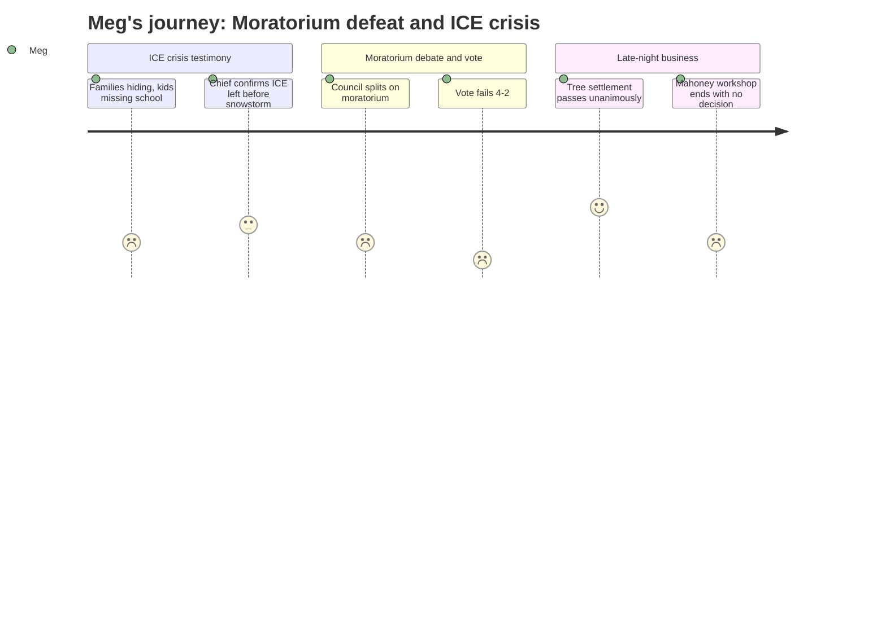

# Interpretation: Meg (PERSONA-011)
## Meeting: City Council Regular Meeting -- February 17, 2026 -- 2026-02-17

### Structured Points

#### 1. ICE Left South Portland Before the Snowstorm
- **Fact:** Police Chief Danaher testified that ICE's local operation ended the Friday night before the recent snowstorm and agents left Saturday morning. SPPD received fewer than a handful of calls while ICE was present — mostly abandoned vehicles after arrests and one assist call to Portland PD at a hotel where protesters had gathered. The Chief stated on record: "my information is that they're not here."
- **Source:** [00:36:50--00:38:30], Police Chief Danaher testimony responding to public commenter Jeff Steinberg's four questions
- **Emotional valence:** positive
- **Threat level:** 2
- **Open question:** true

#### 2. Eviction Moratorium Failed 4-2 on First Reading
- **Fact:** Ordinance 17, which would have paused most eviction notices and filings from February 1 through April 30, 2026, was voted down on first reading. Walker and Mayor Tipton voted yes; Coleman, Matthews, Pride, and Scott voted no. Councilor West recused at the start of discussion, disclosing that she and her husband own five residential rental units in two South Portland buildings — a direct financial conflict. Rent would still have been owed; the moratorium only delayed the eviction clock.
- **Source:** [00:59:45--01:01:30], West recusal statement; [02:30:05--02:31:05], vote record
- **Emotional valence:** negative
- **Threat level:** 4
- **Open question:** true

#### 3. Project Home Is Projected to Run Out of Money in Days
- **Fact:** Speaker Carly Williams testified that Project Home has received 655 contacts requesting emergency rental assistance since January 23rd. Of the 505 with confirmed addresses, 15% are in South Portland. The organization has raised nearly $350,000 and distributed over $196,000 to stabilize 95 households. As of February 17, staff told her they were projected to run out of funds in 10 to 11 days.
- **Source:** [01:54:00--01:56:00], Carly Williams public comment on Ordinance 17
- **Emotional valence:** negative
- **Threat level:** 4
- **Open question:** true

#### 4. Children Are Missing School Because Families Won't Leave Their Homes
- **Fact:** Multiple speakers testified to this directly. Julia Edwards described a 6-year-old in her son's class who still isn't coming to school. A written statement read by Carly Williams, written by a South Portland school employee, described a family with young children who spent the ICE surge hiding in their bedroom, kept their kids home for safety, and are now behind on rent after a parent missed multiple shifts. Zenya Pantos, who works in early intervention, testified about a family whose child she serves who missed school when a parent stayed home to supervise because they couldn't safely walk her there.
- **Source:** [00:20:20--00:22:00], Julia Edwards testimony; [01:45:35--01:47:05], Zenya Pantos testimony; [01:55:30--01:57:00], Carly Williams reading school colleague statement
- **Emotional valence:** negative
- **Threat level:** 4
- **Open question:** true

#### 5. Councilor Scott's Conflict of Interest: City Attorney Says No Recusal Required
- **Fact:** A member of the public, Ed KI, raised the question at public comment of whether Councilor Scott should have been recused from the February 10 school board budget workshop because her spouse is a school employee. The city attorney clarified on the record that state law and council rules do not require recusal in this case — the statutory threshold involves owning 10% or more of a corporation receiving a contract, which does not apply here. Scott participated in all discussion and voted no on the eviction moratorium.
- **Source:** [00:29:30--00:30:05], Ed KI public comment; [00:33:20--00:34:30], city attorney response
- **Emotional valence:** neutral
- **Threat level:** 2
- **Open question:** false

#### 6. Mahoney City Center: $57M to $104M in Options, No Decision Reached by Midnight
- **Fact:** Design firm SMRT presented six renovation scenarios for the Mahoney building ranging from approximately $57 million (city offices only, two floors, minimal site work) to $104 million (full renovation including library addition, theater, gym, and geothermal). The Mahoney City Center Committee formally recommended against a bare-bones approach. In informal council discussion after 11 PM, members seemed to lean toward a scaled-down option with geothermal and use of the third floor, without a library addition — but no formal vote was taken and no binding guidance was given.
- **Source:** [03:28:00--04:50:00], Mahoney City Facilities workshop
- **Emotional valence:** neutral
- **Threat level:** 2
- **Open question:** true

#### 7. Jetport/Diocese Tree Settlement Approved: $125,000 and 75 Replacement Trees
- **Fact:** The council voted unanimously to authorize a consent agreement settling the unauthorized tree-clearing at Dawson Street properties in January 2025. Terms: $50,000 civil penalty, $50,000 donation to the city's tree mitigation fund, approximately $25,000 reimbursement of city legal fees — $125,000 total. The settlement also requires planting 75 trees (gray birch, balsam fir, northern white cedar, 36-inch box size) in the Dawson Street buffer, with a three-year survival inspection requirement. The agreement runs with the land and is recorded at the Registry of Deeds.
- **Source:** [02:56:00--03:13:00], city manager and corporation counsel presentation; [03:21:00--03:22:30], vote
- **Emotional valence:** positive
- **Threat level:** 1
- **Open question:** false

---

### Journey Map

---

### Reactions

Ok here's the short version because I know everyone's been waiting. The eviction moratorium is dead — first reading failed 4-2 tonight. Tipton and Walker voted yes, Coleman, Matthews, Pride, and Scott all voted no. Councilor West didn't vote at all; she disclosed at the start of the item that she and her husband own five rental units in two South Portland buildings, which is a direct financial conflict, so she had to sit out. To be clear about what this would have done: rent would still have been owed, it wasn't forgiveness — it just would have paused the eviction clock through April 30. The no votes said it was too broad, too much burden on small landlords, and that direct funding (like General Assistance) would be more targeted. That's the argument that won tonight.

Two things I want to get right for anyone who's been asking: First, ICE. The police chief said tonight on the record that ICE left South Portland the Friday night before the snowstorm and hasn't come back. His words: "my information is that they're not here." SPPD got fewer than a handful of calls the whole time ICE was operating — mostly abandoned cars after arrests. Not "permanently done" but gone for now, confirmed by the chief. Second, the Councilor Scott conflict of interest question from the February 10 school board meeting. The city attorney explained tonight that state law doesn't require her to recuse — the legal threshold is owning 10% or more of a corporation that's getting a contract, which doesn't apply to a spouse being a school employee. Scott voted no on the moratorium.

The thing I can't let go: Project Home — the group that's been handing out emergency rent money to families — has gotten 655 requests since January 23rd. Fifteen percent of those with confirmed addresses are in South Portland. They've raised about $350,000, they've already paid out over $196,000, and a speaker testified tonight that as of today they are projected to run out of funds in 10 to 11 days. That's around February 27th. The moratorium was supposed to be breathing room while families waited to get back to work and while funding caught up. That option is gone. And separately: this meeting had speaker after speaker describing kids who are still not showing up to school because their parents are afraid to walk them there — including a written statement from a South Portland school employee about a family with young children who hid in their bedroom when ICE came through their building door to door and is now behind on rent. That's not abstract. Those are kids in our schools right now.