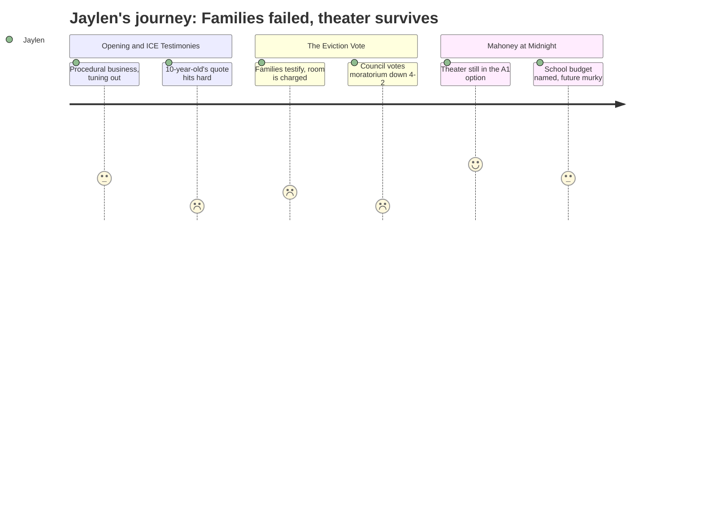

# Interpretation: Jaylen (PERSONA-012)
## Meeting: City Council Regular Meeting -- February 17, 2026 -- 2026-02-17

### Structured Points

#### 1. A 10-year-old asked why the government is doing this to their family
- **Fact:** Community member Cassie Moon, speaking during Citizen Discussion, quoted a child directly: "In the words of a 10-year-old who asked me, why are they doing this to us? My parents work and pay taxes and do everything right." Moon was describing how she had been personally driving an immigrant mother — who hid on the floor of her car to avoid detection — to and from work each day while the woman's children stayed locked inside.
- **Source:** Transcript [00:16:57--00:17:11]
- **Emotional valence:** negative
- **Threat level:** 4
- **Open question:** false

#### 2. Students are missing school — not because they're sick, but because their parents are afraid to walk them there
- **Fact:** Multiple speakers described school-aged children missing class because of ICE activity. Julia Edwards mentioned that her 6-year-old son wondered "why there are kids in his class that still aren't there." Carolyn Nihon warned that "there are young people that may have to drop out of school because they're too afraid, uh, to come outside." A third speaker, Zenya Pantos, described a family that had kept their daughter home all week rather than risk walking her to school.
- **Source:** Transcript [00:21:18--00:21:22], [00:23:46--00:24:01], [01:46:30--01:47:05]
- **Emotional valence:** negative
- **Threat level:** 4
- **Open question:** true

#### 3. The fund helping immigrant families cover rent was going to run out of money in roughly 10 days
- **Fact:** Community member Carly Williams told the council that Project Home had received 655 requests for emergency rental assistance since January 23rd, with 15% of those requests confirmed as coming from South Portland. As of the meeting date, she said the organization was "projected to run out of their funds in 10 to 11 days from today."
- **Source:** Transcript [01:55:33--01:56:10]
- **Emotional valence:** negative
- **Threat level:** 3
- **Open question:** true

#### 4. The council voted down the eviction moratorium 4 to 2
- **Fact:** After more than an hour of public testimony and council debate, the first reading of an ordinance that would have temporarily blocked evictions failed. Mayor Tipton announced: "That's Counselors Walker and Tipton" voting in favor; "the remaining four counselors who are voting this evening" — Coleman, Matthews, Pride, and Scott — voted against passage. Councilor West was recused because she owns rental property.
- **Source:** Transcript [02:23:20--02:23:35]
- **Emotional valence:** negative
- **Threat level:** 4
- **Open question:** false

#### 5. The councilors who voted no explained themselves in policy language that never mentioned the children
- **Fact:** Councilor Scott said the moratorium "shifts that burden from one sector of the population to another sector of the population" and that it was not the right approach. Councilor Pride called it "a sledgehammer, not a scalpel," and said he would have preferred direct funding to the affected families. Neither addressed the testimony about children missing school or the 10-year-old's question. Councilor Coleman's alternative suggestion was to call Senator Collins.
- **Source:** Transcript [02:37:55--02:38:25], [02:42:35--02:42:55], [02:40:27--02:41:15]
- **Emotional valence:** negative
- **Threat level:** 2
- **Open question:** true

#### 6. The theater and gym are included in the Mahoney renovation option the council appears to be leaning toward
- **Fact:** Design consultant Craig Piper explained that the "zero" versions of renovation options A, B, and C leave the Mahoney theater and gym unused. The "one" versions — A1, B1, C1 — "allows cost or the ability to use the theater and gym." After the workshop discussion, Mayor Tipton summarized the council's apparent direction: "It seems the majority are A one. I heard four A plus ones."
- **Source:** Transcript [03:41:25--03:42:25], [05:01:34--05:01:40]
- **Emotional valence:** positive
- **Threat level:** 2
- **Open question:** true

#### 7. A councilor directly connected the Mahoney decision to the school budget squeeze
- **Fact:** During the late-night Mahoney workshop, Councilor Walker named both crises together: "We are struggling with our school budget and we're struggling with the burden that that's going to place on our taxpayers. And now we're also talking about making the library wait. And so we are potentially a community that is saying, we're not gonna invest in our schools and we're not gonna invest in our libraries."
- **Source:** Transcript [04:38:44--04:39:01]
- **Emotional valence:** negative
- **Threat level:** 3
- **Open question:** true

#### 8. The idea of using Mahoney as an elementary school campus was raised — and turned out to have never been formally considered
- **Fact:** Community member Julia Edwards suggested at the workshop that Mahoney could become a consolidated elementary school campus, freeing up existing school buildings for housing and scattered city services. The city manager responded that the school department had formally relinquished Mahoney in 2022 or 2023, declaring they would have no future use for it, and that no formal request to reverse that decision had ever been made.
- **Source:** Transcript [04:10:14--04:11:25], [04:17:00--04:17:50]
- **Emotional valence:** neutral
- **Threat level:** 2
- **Open question:** true

---

### Journey Map

---

### Reactions

Okay so I don't usually watch city council meetings but I was following the ICE stuff on Instagram and someone shared the livestream, so I ended up watching a big chunk of it. Basically there's been this situation where ICE came through South Portland and has been arresting people, and families have been hiding at home, and kids have been missing school. Multiple people came and testified about it — one woman described literally driving someone to work while they hid on the floor of her car because they were terrified of getting grabbed. Someone else quoted a 10-year-old who asked, "Why are they doing this to us? My parents work and pay taxes and do everything right." And there were people saying that high schoolers might drop out entirely because they're too scared to leave their houses. Like, South Portland high schoolers.

The council was voting on this thing to pause evictions for 90 days — because these families couldn't pay rent since they couldn't go to work without risking arrest. And the organization helping them pay rent said they're literally going to run out of money in like 10 days. After an hour of this testimony — and it was powerful, people were visibly shaking — four of seven councilors voted no. Two voted yes. The four who voted no gave these careful policy explanations about how the moratorium would "shift the burden" to landlords and how it was a "sledgehammer, not a scalpel." One of them said to call Senator Collins. That was her concrete suggestion. Call a senator.

The other thing — and I have a personal stake in this — is that the meeting went until like midnight because they were also debating what to do with the old Mahoney school building. There's this whole plan to turn it into a city center, and whether the theater and gym get renovated depends on which option they pick. The option the council seems to be landing on apparently does include the theater, so I'll take that win. But one of the councilors said something that stuck with me: she named the school budget and the library cuts in the same breath and said the city might be telling people "we're not gonna invest in our schools and we're not gonna invest in our libraries." And I sat with that. Because the same night that four people voted to not protect families with kids from getting evicted — while the theater question was still uncertain — it really did feel like the question of who this city actually shows up for hadn't been answered.