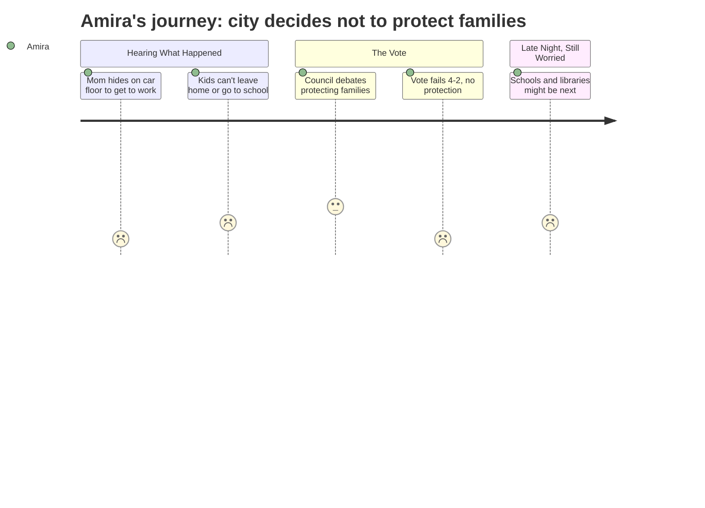

# Interpretation: Amira (PERSONA-013)
## Meeting: City Council Regular Meeting -- February 17, 2026 -- 2026-02-17

### Structured Points

#### 1. A neighbor had to lay on the floor of a car just to go to work
- **Fact:** Community advocate Cassie Moon described driving a neighbor to work while ICE was active in the area. The neighbor "runs to my car, opens the back door, and dives to the floor of my car crying," then called her children before leaving and told them to stay inside, lock the door, and "not open it for anyone. Even if she know, if they know them."
- **Source:** [00:14:56--00:17:15], Cassie Moon, Citizen Discussion Part I
- **Emotional valence:** negative
- **Threat level:** 5
- **Open question:** true

#### 2. A 10-year-old asked: "Why are they doing this to us?"
- **Fact:** Cassie Moon quoted a 10-year-old child who asked her: "Why are they doing this to us? My parents work and pay taxes and do everything right, I can't understand these things, but I trust my parents."
- **Source:** [00:16:57--00:17:14], Cassie Moon, Citizen Discussion Part I
- **Emotional valence:** negative
- **Threat level:** 4
- **Open question:** true

#### 3. Kids were missing school and having nightmares because of ICE
- **Fact:** Julia Edwards told the council that "many of them will not let their children leave their homes for good reason. So those kids are missing out on school or are being forced to do remote school, which is also incredibly unfair." She also described children — including her own six-year-old, who kept asking why classmates weren't at school — "having nightmares."
- **Source:** [00:21:08--00:21:26], Julia Edwards, Citizen Discussion Part I
- **Emotional valence:** negative
- **Threat level:** 4
- **Open question:** true

#### 4. Families couldn't pay rent because fear kept them from going to work
- **Fact:** Zenya Pantos described a family where one parent stayed home for over a week because they "did not feel safe walking" their daughter to school — leaving "this family now extremely stressed about rent." Separately, Olivia Westfall confirmed: "Eviction notices were posted this week and so many through no fault of their own are not able to pay."
- **Source:** [01:46:37--01:47:02], Zenya Pantos; [01:39:26--01:39:30], Olivia Westfall, public testimony on Ordinance 17
- **Emotional valence:** negative
- **Threat level:** 4
- **Open question:** true

#### 5. The council voted 4-2 against protecting those families from eviction
- **Fact:** The temporary eviction moratorium (Ordinance 17) failed its first reading. Only Councilor Walker and Mayor Tipton voted yes. Councilors Scott, Matthews, Pride, and Coleman voted no, citing concerns about burden on small landlords, legal risk, and process.
- **Source:** [02:30:22--02:30:46]
- **Emotional valence:** negative
- **Threat level:** 5
- **Open question:** true

#### 6. The fund helping families pay rent was about to run out of money
- **Fact:** Carly Williams reported that Project Home, which had raised nearly $350,000 and helped 95 households, was "projected to run out of their funds in 10 to 11 days from today" because the need had been overwhelming.
- **Source:** [01:55:35--01:55:42], Carly Williams, public testimony on Ordinance 17
- **Emotional valence:** negative
- **Threat level:** 4
- **Open question:** true

#### 7. A councilor said the city might be becoming one that doesn't invest in schools or libraries
- **Fact:** During the late-night Mahoney City Center workshop, Councilor Walker said: "we are potentially a community that is saying, we're not gonna invest in our schools and we're not gonna invest in our libraries. And what does that say about where we are as a community?"
- **Source:** [04:38:43--04:38:56], Councilor Walker, Mahoney/City Facilities Workshop
- **Emotional valence:** negative
- **Threat level:** 3
- **Open question:** true

---

### Journey Map

---

### Reactions

It wasn't really about the school budget — or at least that's not the part that stayed with me. There was this woman who got up and talked about driving her neighbor to work because ICE was circling the neighborhood. And her neighbor had to lay flat on the floor of the car so no one could see her through the windows. She left her kids home alone with the doors locked and told them don't open it for anyone — even people they know. And then the same woman read what a 10-year-old said to her, this kid who was basically my age, who asked, "why are they doing this to us? My parents work and pay taxes and do everything right." I don't know. That hit me really hard. Because that's the thing — they ARE doing everything right, and it doesn't matter.

The whole big vote at the meeting was about whether to stop landlords from kicking those families out of their apartments while all this was happening. Because they couldn't go to work because they were scared, so they fell behind on rent, and now eviction notices are already being sent. And the group that's been helping families pay rent is literally going to run out of money in like two weeks — one of the women who spoke said that. So this vote mattered right now, for real people. Hours of people got up and said please vote yes, all these stories about families hiding in their homes. And then they voted no — four people voted no, only two said yes. Some of the reasons were about landlords and legal risk and stuff I didn't fully understand. But it felt like — you can't tell a family to use the legal system when they're too scared to show up anywhere. That doesn't add up.

Also, at like midnight there was this really long part about some old school building they want to turn into a city center, and I was basically tuning it out, but then one councilor said something that caught me. She said the city might be becoming one that "doesn't invest in schools or libraries anymore," and asked what that says about who they are. And honestly, that scared me. Because things at school are already changing — teachers leaving, programs maybe getting cut, class sizes going up. Nobody asked us. Nobody asked the kids what we think about any of it. And watching this whole meeting, I kept feeling like — nobody asked the families hiding in their houses either. All these decisions get made by people in a room, and you just find out after.