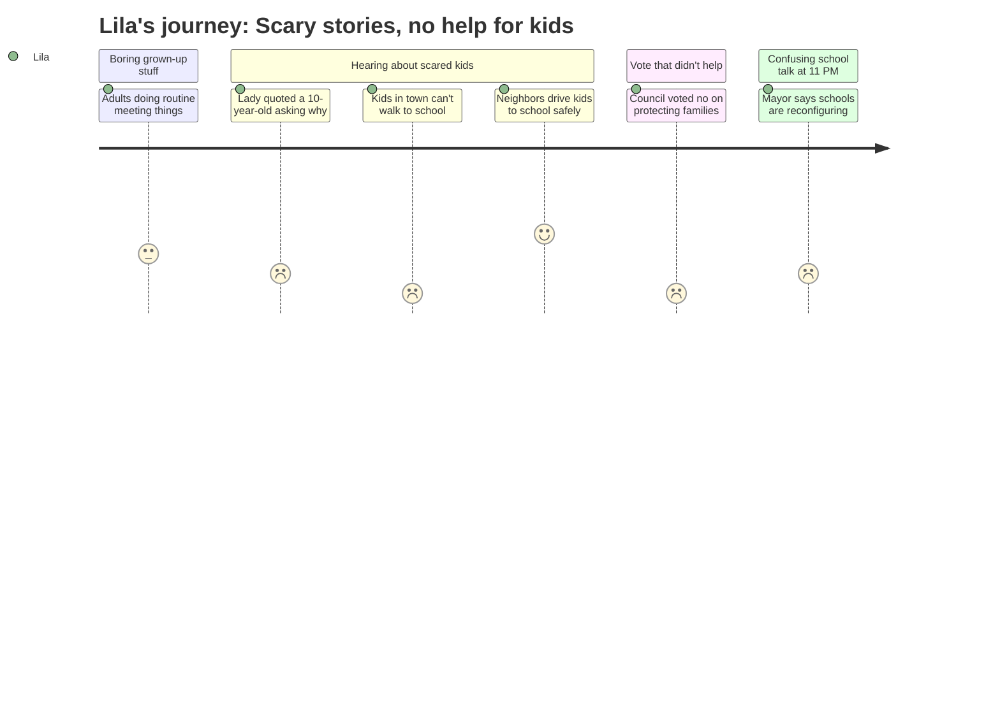

# Interpretation: Lila (PERSONA-014)
## Meeting: City Council Regular Meeting -- February 17, 2026 -- 2026-02-17

### Structured Points

#### 1. Kids in South Portland can't go to school because they're scared
- **Fact:** Multiple people at the meeting told the council that children in South Portland have been kept home from school because their families are afraid of ICE. Community member Julia Edwards described her six-year-old son wondering why kids in his class "still aren't there." Early intervention worker Zenya Pantos described a specific family that kept their daughter home for over a week because she didn't feel safe walking to school.
- **Source:** [00:21:18–00:22:14] Julia Edwards, Citizen Discussion Pt. 1; [01:46:20–01:46:50] Zenya Pantos, public comment on Ordinance 17
- **Emotional valence:** negative
- **Threat level:** 3
- **Open question:** true

#### 2. A kid one year older than Lila asked "why are they doing this to us?"
- **Fact:** Community member Cassie Moon quoted a 10-year-old child who asked her directly: "Why are they doing this to us? My parents work and pay taxes and do everything right. I can't understand these things, but I trust my parents."
- **Source:** [00:17:01–00:17:09] Cassie Moon, Citizen Discussion Pt. 1
- **Emotional valence:** negative
- **Threat level:** 2
- **Open question:** true

#### 3. ICE agents went inside apartment buildings and banged on every door
- **Fact:** Zenya Pantos, who visits families through her job in early intervention, told the council that ICE agents entered a large apartment building and went door to door, banging on every door. A family with a toddler spent the afternoon hiding in a bedroom, hoping their door was locked.
- **Source:** [01:47:21–01:47:45] Zenya Pantos, public comment on Ordinance 17
- **Emotional valence:** negative
- **Threat level:** 3
- **Open question:** true

#### 4. Neighbors were helping kids get to school safely
- **Fact:** A school employee's written testimony, read aloud by community member Carly Williams, described neighbors driving children to school during the weeks of ICE activity. Another resident, Rosemary DeAngelos, described setting her alarm for 5:45 AM every morning to drive a friend safely to work because he cannot go out in public alone.
- **Source:** [01:56:38–01:56:45] Carly Williams reading written testimony, public comment on Ordinance 17; [02:12:50–02:13:05] Rosemary DeAngelos, public comment on Ordinance 17
- **Emotional valence:** positive
- **Threat level:** 1
- **Open question:** false

#### 5. Four out of six council members voted NO on helping those families
- **Fact:** The council voted 4–2 against the first reading of an ordinance that would have temporarily prevented landlords from evicting tenants during the period of ICE enforcement. Only Councilor Walker and Mayor Tipton voted yes. The four who voted no included Councilors Scott, Coleman, Pride, and Matthews.
- **Source:** [02:30:20–02:30:35] Roll call vote on Ordinance 17
- **Emotional valence:** negative
- **Threat level:** 4
- **Open question:** true

#### 6. Someone suggested putting all elementary school kids in one place — the old Mahoney building
- **Fact:** Very late in the meeting, during a discussion about the Mahoney building, community member Julia Edwards asked the council to consider whether the old school building could become "a single elementary school campus" for all South Portland elementary students, rather than city offices. She said having all kids together as early as possible would help address what she described as segregation across the elementary schools.
- **Source:** [04:10:22–04:12:00] Julia Edwards, public comment on Mahoney/City Facilities Workshop
- **Emotional valence:** negative
- **Threat level:** 2
- **Open question:** true

#### 7. The mayor said it's a "reconfiguration" — and Lila's grade band moves to three schools
- **Fact:** Mayor Tipton clarified that the school board has stopped using the word "consolidation" and is calling the changes a "reconfiguration." Under the plan, pre-K, kindergarten, and 1st grade students would attend two of the schools, while students in grades 2, 3, and 4 would be distributed across three of the schools. She said this would save the school department approximately $2 million. No specific school names were mentioned.
- **Source:** [04:19:35–04:20:05] Mayor Tipton, Mahoney/City Facilities Workshop
- **Emotional valence:** negative
- **Threat level:** 5
- **Open question:** true

### Journey Map

### Reactions

Okay so my mom stayed up SO late watching the city council meeting on the computer and this morning she was really tired and I asked what happened. There was this woman who helps immigrant families and she said a TEN year old kid — just one year older than me — asked her, "Why are they doing this to us? My parents work and pay taxes and do everything right." I keep thinking about that because I would ask the exact same question. And a bunch of other people said that kids in South Portland can't even go to school right now because their parents are too scared. Someone's little brother who is SIX is asking his mom why his classmates aren't in class anymore. And this lady who goes into people's homes for her job said one girl couldn't walk to school and her mom had to stay home from work for a whole week just to keep her safe. But also some people are getting up really early to drive kids to school, so at least someone is helping.

The council was voting on whether to make a rule so families who couldn't pay rent — because they were too scared to go to work — wouldn't get kicked out of their homes. But four out of six people said NO. I don't understand why. If someone is hiding in their apartment because the government is banging on doors, that's not the same as just not wanting to pay. And now those families could lose their homes and have to move somewhere else, which means those kids would have to go to a different school and wouldn't see their friends.

The really confusing part was at like 11 o'clock at night, when I was basically falling asleep, they started talking about the schools. Some lady said maybe all the elementary school kids in South Portland should go to one big school at the old Mahoney building. And then the mayor said the school board isn't calling it "consolidation" — they're calling it "reconfiguration" — and the plan is that grades 2, 3, and 4 would go to three of the schools. I'm in 4th grade. Which three schools? Is Dyer one of them? Nobody said Dyer's name the whole entire night.