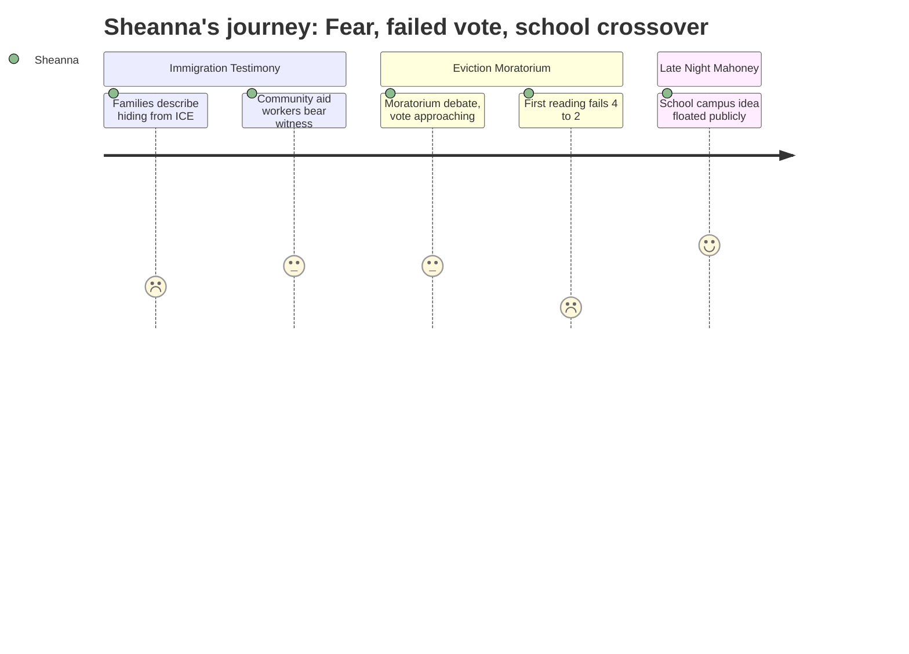

# Interpretation: Sheanna (PERSONA-015)
## Meeting: City Council Regular Meeting -- February 17, 2026 -- 2026-02-17

### Structured Points

#### 1. ICE Fear Is Emptying Sheanna's Classrooms
- **Fact:** Multiple community members testified during Citizen Discussion that immigrant families had been keeping children home from school out of fear of ICE. Julia Edwards noted that her white 6-year-old son was asking why classmates still weren't at school. Carolyn Nihon described young people potentially dropping out entirely. Zenya Pantos, who works in early intervention, described a high-needs toddler family that had been sheltering in place for over a week — and noted they were working with South Portland schools for support.
- **Source:** Transcript [00:14:07--00:25:01; 01:46:11--01:47:33]
- **Emotional valence:** negative
- **Threat level:** 5
- **Open question:** true

#### 2. Project Home Is Ten Days From Running Out of Rental Assistance
- **Fact:** Speaker Carly Williams reported that Project Home had received 655 contacts requesting emergency rental help since January 23rd; 15% of those with confirmed addresses live in South Portland. As of the meeting date, the fund was projected to run out in 10 to 11 days.
- **Source:** Transcript [01:54:35--01:55:45]
- **Emotional valence:** negative
- **Threat level:** 5
- **Open question:** true

#### 3. The Eviction Moratorium Failed on First Reading, 4-2
- **Fact:** Ordinance 17-25/26 — a temporary eviction moratorium covering February 1 through April 30, 2026 — failed to pass first reading. Councilors Walker and Mayor Tipton voted in favor; Councilors Scott, Matthews, Coleman, and Pride voted against. Councilor West was recused due to a direct financial interest as a landlord.
- **Source:** Transcript [02:30:15--02:30:38]
- **Emotional valence:** negative
- **Threat level:** 5
- **Open question:** true

#### 4. The City Manager Acknowledged Fear Would Prevent Families from Actually Using the Ordinance
- **Fact:** City Manager Morelli's presentation explicitly flagged "practical accessibility concerns" — noting that families most at risk from ICE activity might be too afraid to call the city to file a complaint, since doing so would create a record and increase their visibility. He said the ordinance might function better as a deterrent to landlords than as an active remedy for tenants.
- **Source:** Transcript [01:07:08--01:09:08]
- **Emotional valence:** negative
- **Threat level:** 4
- **Open question:** true

#### 5. Dissenting Councilors Preferred Targeted Funding Over a Blanket Moratorium
- **Fact:** Councilor Pride, voting no, said he would fully support directing city funds to organizations like Project Home and Greater Portland Family Promise — which he noted directly serves new Mainers — rather than a blanket moratorium he called "a sledgehammer, not a scalpel." Councilor Scott said she could support funding General Assistance but felt the moratorium wrongly shifted burden from one vulnerable population to another.
- **Source:** Transcript [02:42:35--02:44:05; 02:37:25--02:39:40]
- **Emotional valence:** neutral
- **Threat level:** 3
- **Open question:** true

#### 6. A Community Member Publicly Raised Using Mahoney as a Consolidated Elementary School Campus
- **Fact:** During the late-night Mahoney workshop public comment period, Julia Edwards — a Dawson Street resident — asked whether the council had genuinely considered whether Mahoney could become a single elementary school campus, with freed school buildings repurposed for housing or distributed city services. She explicitly named South Portland's elementary school "segregation problem" and said consolidation should happen "as early as possible."
- **Source:** Transcript [04:10:22--04:12:45]
- **Emotional valence:** positive
- **Threat level:** 1
- **Open question:** true

#### 7. The School Department Formally Relinquished Mahoney in 2022-2023 — Before the Current Budget Crisis
- **Fact:** City Manager Morelli confirmed that around 2022-2023, the school department told the city it no longer had a use for Mahoney and asked the city to take it over. A 2018 analysis had found bringing Mahoney up to current educational code would have cost upwards of $40 million and still would not have met classroom size standards. There has been no formal school request for the building since.
- **Source:** Transcript [04:18:05--04:22:15]
- **Emotional valence:** negative
- **Threat level:** 3
- **Open question:** true

#### 8. Councilor Walker Named the Contradiction at the Heart of Both Budget Crises
- **Fact:** During the Mahoney workshop discussion, Councilor Walker said the council risked becoming "a community that is saying, we're not gonna invest in our schools and we're not gonna invest in our libraries. And what does that say about where we are as a community?"
- **Source:** Transcript [03:38:45--03:39:05]
- **Emotional valence:** negative
- **Threat level:** 4
- **Open question:** false

---

### Journey Map

---

### Reactions

I watched the whole thing tonight and I have to be honest — the ICE testimony section wasn't news to me. I'm IN those buildings. I've seen the attendance sheets. I know the families who aren't answering doors. But hearing Zenya describe a family hiding in their bedroom while agents went door to door in the building — that's a family someone on my team is working with right now. And then we hear that Project Home has 10 days of money left, 15% of their cases are South Portland families, and the moratorium just went down 4-2. So what exactly is the plan for the kids who've already missed two weeks of school and now might also lose their housing before summer? That's going to follow them through elementary school. I know it, because I see what housing instability does to MTSS referrals.

The vote was the hardest part to sit through. I don't think Councilor Pride or Councilor Scott are heartless — I heard the argument about targeted funding being more precise. But here's what I know from doing this work: telling a family who's afraid to stand at a bus stop that there's a city process they can use to defend themselves is not the same as actually protecting them. The city manager said it himself in the presentation — people are too scared to call the city and create a paper trail. A moratorium that deters landlords from filing in the first place doesn't require the family to do anything. That deterrent function was the whole point, and the council voted it down without really grappling with that.

The thing that actually woke me back up at 11pm was Julia Edwards raising Mahoney as an elementary school campus. She said almost exactly what I've been saying in parking lots and planning periods for two years — consolidate the elementary schools, address the equity gaps we've built in, free up the buildings. The city manager confirmed the school department walked away from Mahoney in 2022 and that's true, I remember that year. But that decision happened before enrollment hit 1,080, before reconfiguration was back on the table, before this budget crisis forced everyone to look at the numbers honestly. Nobody in that room connected what's happening at the school board right now to what the city council is deciding about Mahoney. Two completely siloed processes, same community, same children. And if those decisions get made independently, both of them are going to be worse for it.