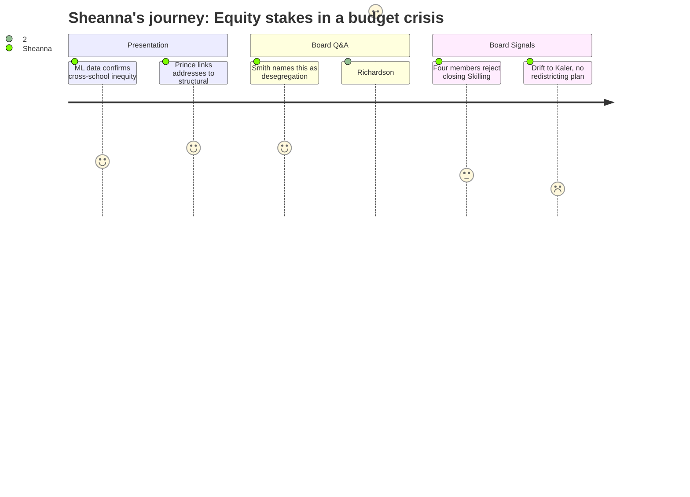

# Interpretation: Sheanna (PERSONA-015)
## Meeting: School Board Budget Workshop I -- March 2, 2026 -- 2026-03-02

### Structured Points

#### 1. Multilingual learner distribution data confirms what Sheanna lives daily
- **Fact:** Director of Multilingual Programs Perkins presented data showing that multilingual learners range from 6% of students at Small Elementary to 33% at Skilling — a 27-point spread across five buildings in the same district — directly linking this disparity to unequal learning experiences and noting that greater demographic parity would "create greater efficiency and consistency of these services within and across schools."
- **Source:** Transcript [00:22:09--00:23:55]
- **Emotional valence:** positive
- **Threat level:** 1
- **Open question:** false

#### 2. Dr. Prince names structural housing segregation as the operational root cause
- **Fact:** When Member Feller asked for the case for reconfiguration, Dr. Prince stated explicitly that address-based attendance replicates structural housing inequities: "Any system that we use that is based on your address alone will replicate those structural inequities." He connected this directly to the 6%-to-33% multilingual learner variation as the operational result.
- **Source:** Transcript [00:54:50--00:56:00]
- **Emotional valence:** positive
- **Threat level:** 1
- **Open question:** false

#### 3. Board Member Smith frames reconfiguration as desegregation — and names whose voices are absent
- **Fact:** Member Smith stated: "I think we should look at this as desegregation," noting that "historically it's very easy politically to make decisions that involves busing black and brown kids" and pointing to who was present in the meeting room as evidence of whose interests receive political pressure. He connected this to civil rights history explicitly.
- **Source:** Transcript [01:04:25--01:05:30]
- **Emotional valence:** positive
- **Threat level:** 1
- **Open question:** false

#### 4. SPTA raises MTSS and specialized-services space crisis that Sheanna works inside daily
- **Fact:** The SPTA president, reading member questions during public comment, asked: "Are we accounting for space for learning that takes place already outside of a traditional full group classroom setting? We already have issues with space for specialized services and small group instruction for students with unique learning needs. Multilingual, gifted and talented, special education students receiving MTSS services. A great deal of that work happens in hallways and stairwells."
- **Source:** Transcript [02:15:50--02:16:15]
- **Emotional valence:** negative
- **Threat level:** 4
- **Open question:** true

#### 5. Richardson confirms the Boundaries and Configurations Committee's equity work was approved and then abandoned
- **Fact:** Member Richardson stated: "This board approved several proposals by that steering committee. And this board never did anything with those proposals." She called the current moment "a bit of a bait and switch," noting that fiscal savings were never part of the prior equity conversation — that work was purely about equity — and now the two are being collapsed under budget pressure.
- **Source:** Transcript [00:57:55--01:00:30]
- **Emotional valence:** negative
- **Threat level:** 3
- **Open question:** false

#### 6. Four board members publicly reject closing Skilling
- **Fact:** Members Dowling, Feller, Richardson, and Chair DeAngelo each stated they could not support closing Skilling. DeAngelo made the geographic-equity argument explicitly: closing Skilling would mean everyone in Brick Hill, Cortland Courts, Red Bank, Country Garden, Sunset Park, and Thornton Heights "would be bused from pre-K through fourth grade" — and that when 72% of the students who *can* walk to Skilling *do* walk, it's likely because they have no other option.
- **Source:** Transcript [01:41:25--02:08:35]
- **Emotional valence:** positive
- **Threat level:** 2
- **Open question:** true

#### 7. Board consensus drifts toward closing Kaler — the second most marginalized school — with no redistricting equity plan
- **Fact:** Multiple board members indicated preference for options 1.3 or 1.4, which close Kaler, the district's second-most-concentrated school for low-income and multilingual students. When Richardson asked when redistricting details would be available and whether they would come before the budget vote, Dr. Prince acknowledged the mechanics had not yet been modeled and could not commit to a timeline.
- **Source:** Transcript [01:47:25--01:54:50] and [02:28:05--02:31:30]
- **Emotional valence:** negative
- **Threat level:** 4
- **Open question:** true

### Journey Map

### Reactions

Tyler Smith said the word out loud. *Desegregation.* He said historically it's very easy politically to make decisions that involve busing Black and brown kids, and he pointed at the room and named who wasn't there. I've been saying versions of this in planning meetings and hallway conversations for years — that the reason I'm driving between three buildings every week is because we've let housing segregation set school composition by default — and to hear a board member actually frame this as a civil rights issue, with real feeling, in a public meeting, I wasn't expecting it. And then Dr. Prince backed it up with exactly the operational logic: address-based attendance will always reproduce housing inequity. That isn't a political argument. That is what I see when I look at my caseload spread across buildings. The 6%-to-33% multilingual learner gap that April Perkins put on the slide — I don't experience that as a statistic. I experience it as three buildings where I can actually group kids for targeted English language development because there's enough critical mass, and two buildings where I'm essentially doing individual support because there aren't enough students to form a tier-two cohort. Reconfiguration with real redistricting is the only way that changes.

What's keeping me up is what happens after tonight. Four board members said they won't close Skilling — I think that's right, and DeAngelo's Dairy Queen argument was one of the most direct equity statements I've heard at a board meeting in years. But the room was clearly drifting toward option 1.3 or 1.4, which closes Kaler. I work at Kaler. Those families are the second-most-concentrated population in this district for free-and-reduced lunch and multilingual learners. And every time someone at that table said "redistricting," the answer was essentially: we haven't modeled it yet, we'll need more time, we need board direction first. No plan. No equity accountability structure. No answer to the question the SPTA asked — and asked on behalf of people like me — about where kids who currently receive MTSS support in hallways and stairwells are supposed to go when we close a building and push those students into already-crowded spaces. Stacy Morin got up and said she's been working at Skilling for 18 years and she helps kids she doesn't even have on her caseload because she just knows them. That's what cross-building relationships look like. That's what gets lost if you reconfigure without thinking about continuity for your most fragile students.

The thing Richardson said about the bait and switch is still sitting with me. She said the board approved the Boundaries and Configurations Committee's direction and then did nothing with it. And Dr. Prince said, yes, you're right, we didn't take the next step, and now we have another demand that gives us the opportunity to finally make the choice. That's honest, at least. But what I also heard Chair DeAngelo say at the very end — and I don't think many people caught it because public comment had been going for ninety minutes by then — was that diversity and equity are two different things, and you can mix kids across schools without building equity if you don't have the structures, the training, and the policy to make belonging real. She said it like a warning. That's the whole story. Grade-level reconfiguration with real redistricting could genuinely change how I do my job for the better — the grouping efficiency, the service coherence, the reduction in travel time I spend every week that could be instructional time instead. But all of that depends entirely on redistricting being done with demographic equity as the actual goal, not just as the language we use to justify a fiscal decision. And I didn't hear a single accountability measure for that tonight. Not one.