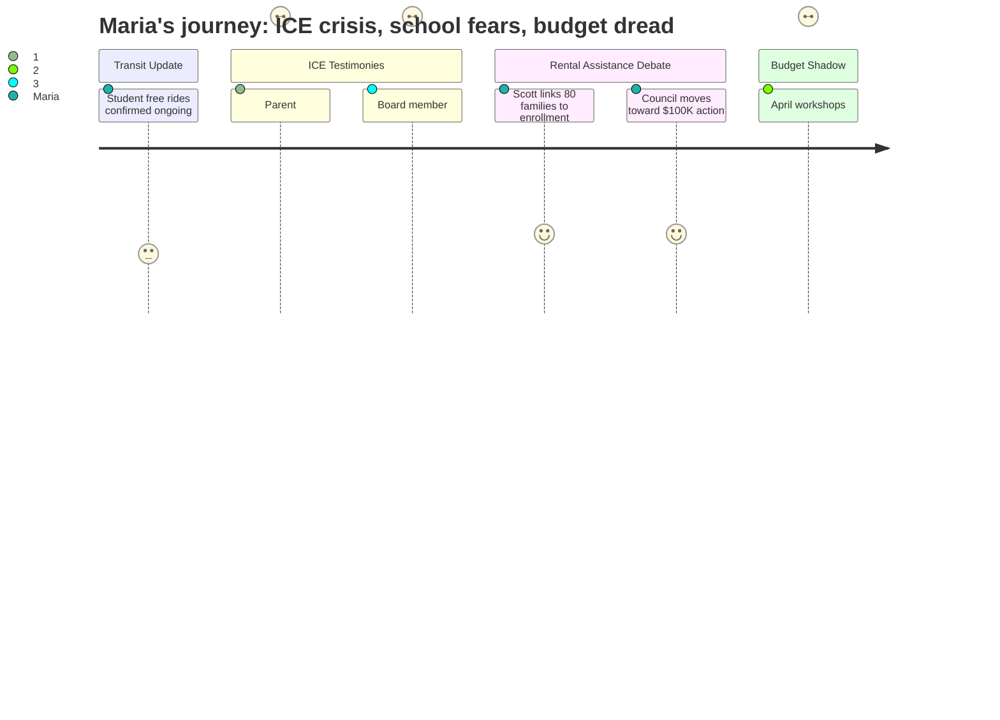

# Interpretation: Maria (PERSONA-001)
## Meeting: City Council Regular Meeting -- March 10, 2026 -- 2026-03-10

### Structured Points

#### 1. Parent Testimony: ICE Agents Reportedly Seen Near Elementary School Driveway
- **Fact:** A public commenter read aloud a written statement from a South Portland parent who said a neighbor reported seeing ICE agents near the elementary school driveway during the January enforcement surge. The same parent said their children were too scared to attend class and that the parent lost work because they could not leave the children home alone and unprotected.
- **Source:** [01:07:30–01:08:30], public comment from Margot Kralik reading submitted family testimony during the rental assistance item
- **Emotional valence:** negative
- **Threat level:** 5
- **Open question:** true

#### 2. School Board Member Clarifies: No ICE Activity Actually Occurred Inside South Portland Schools
- **Fact:** Rosemary DeAngelis, identifying herself as a school board member, stated during public comment that she was kept informed of all ICE activity near South Portland schools throughout the surge and that no ICE activity occurred inside or at any South Portland school. She said she did not want anyone leaving the meeting believing children had been taken from bus stops or school grounds.
- **Source:** [01:15:30–01:16:40], Rosemary DeAngelis public comment on the rental assistance item
- **Emotional valence:** neutral
- **Threat level:** 2
- **Open question:** false

#### 3. Public Commenter Connects ICE Enforcement Directly to School Enrollment Decline
- **Fact:** Commenter Alex Redfield argued that South Portland's immigrant community is disproportionately young and working-age, and that the January disruption was hitting this group at precisely the moment the city is already "wrestling with the impacts of long-term trends of aging populations, meaning fewer school-age families, meaning decreased enrollment in schools."
- **Source:** [01:19:34–01:19:38], Alex Redfield public comment on the rental assistance item
- **Emotional valence:** negative
- **Threat level:** 4
- **Open question:** true

#### 4. Councilor Scott Frames Rental Assistance as a School Enrollment Investment
- **Fact:** Councilor Carter Scott explicitly tied the rental assistance decision to school enrollment, arguing that the approximately 80 affected South Portland families represent students "who may not be in that school system next year," calling that potential loss "a much bigger financial burden than a hundred thousand dollars."
- **Source:** [01:29:46–01:30:01], Councilor Scott's deliberation on the rental assistance item
- **Emotional valence:** positive
- **Threat level:** 2
- **Open question:** false

#### 5. School Budget Crisis Invoked Repeatedly, But Not Addressed
- **Fact:** Both Councilor Matthews and school board member Rosemary DeAngelis referenced having watched the school board meeting the previous evening. Matthews cited the school board chair's call to "be very cautious of every dime that we spend." DeAngelis said she was "very sensitive" to current financial responsibilities "as I'm trying to deal with the present school budget," in explaining her preference for a modest initial donation.
- **Source:** [01:22:43–01:22:57], Councilor Matthews; [01:17:18–01:17:42], Rosemary DeAngelis public comment
- **Emotional valence:** negative
- **Threat level:** 4
- **Open question:** true

#### 6. Council Coalescing Around ~$100K Rental Assistance Via Project HOME
- **Fact:** After debate ranging from $20,000 (Councilor West) to $168,000 (Councilor Walker), the city manager said he would bring a formal order to the next meeting at approximately $100,000 — the average of council positions — to be administered through Project HOME for South Portland families affected by the January ICE enforcement, with no requirement to disclose immigration status.
- **Source:** [01:44:57–01:45:15], city manager summarizing council consensus; no immigration status disclosure confirmed at [00:53:52–00:54:07]
- **Emotional valence:** positive
- **Threat level:** 1
- **Open question:** true

#### 7. April Budget Workshops Are On the Calendar — That Is When Cuts Get Real
- **Fact:** The workshop schedule shows three budget workshops: April 14 (Budget Workshop #1), April 28 (Budget Workshop #2), and May 12 (Budget Workshop #3, labeled "Parking Lot"). No specifics about school program cuts were discussed at this meeting, but the repeated background references to the school board's budget crisis signal April as the moment when decisions affecting classrooms will be made.
- **Source:** Agenda, Section C.1 Workshop Schedule; school budget references at [01:22:43] and [01:17:18]
- **Emotional valence:** negative
- **Threat level:** 4
- **Open question:** true

---

### Journey Map

---

### Reactions

I finally sat through the whole thing — got home at almost 10:30. They spent the first hour on buses and then over an hour on bikes, and I was honestly half on my phone for most of that. But then they got to the rental assistance discussion and I put the phone down.

Someone read written statements from families affected by the January ICE raids. One of them specifically said that a neighbor reported seeing ICE agents near the **elementary school driveway**. Our kids go to elementary school in this city. This parent wrote that their children were too scared to go to class and that they lost work because they couldn't leave their kids alone. I don't care if the police chief said "less than five arrests" in South Portland — when you're seven years old and someone tells you there were enforcement vans near your school, that doesn't just go away. Rosemary DeAngelis did get up and clarify as a school board member that no ICE activity actually happened inside any South Portland school, which helped a little. But the fear was real enough to cause a lockdown. Real enough that families are still behind on rent months later.

What gave me some actual hope was Councilor Scott — I really like her. She made the argument that we shouldn't think of these 80 families as a line item. They're families with kids in our schools. She said if they get evicted and leave South Portland, that's 80 fewer students in the district, and that makes the whole budget crisis worse. She basically said keeping those families here is fiscally responsible. I wanted to stand up. Somebody finally said it out loud. The council is going to vote on about $100,000 to go through Project HOME — not locked in yet, but it sounds like it's actually happening at the next meeting.

Here's what's going to keep me up: the school budget came up twice in passing — not as an agenda item, just in the background, like everyone knows it's coming. Councilor Matthews said the school board chair told them last night to "be cautious of every dime." Rosemary DeAngelis basically said the same thing while also trying to support the rental fund. Nobody at this city council meeting said "art teacher" or "classroom aide" or "music" — but April 14th, April 28th, May 12th are now on my calendar. That's when it all lands. And I'm going to be in that room.