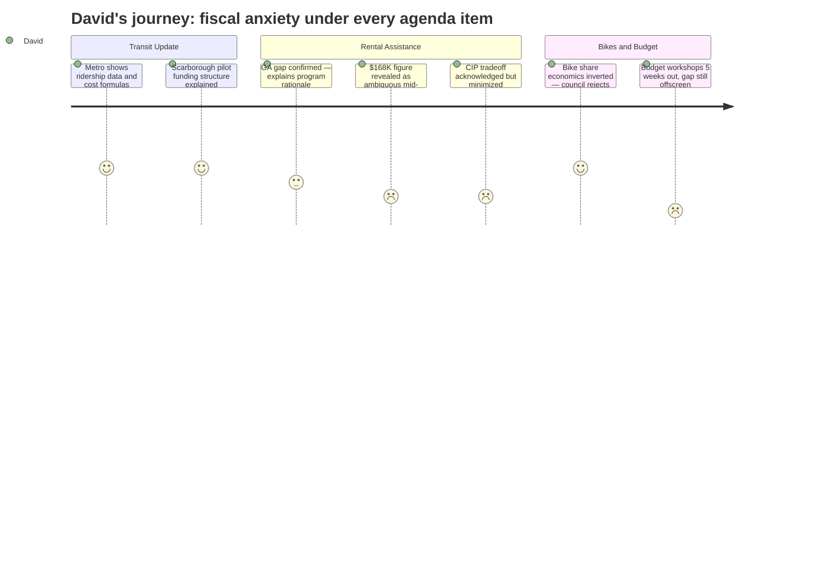

# Interpretation: David (PERSONA-002)
## Meeting: City Council Regular Meeting -- March 10, 2026 -- 2026-03-10

### Structured Points

#### 1. Metro's cost allocation formula is transparent and data-backed
- **Fact:** Metro's Executive Director stated South Portland's share of new Scarborough route costs will be proportional to the ~28% of route mileage within city limits, with any ongoing local assessment rolling into regular annual billing starting in 2028 only if the two-year pilot performs — and only if council approves continuation.
- **Source:** [13:44–14:30]
- **Emotional valence:** positive
- **Threat level:** 1
- **Open question:** false

#### 2. The GA eligibility gap is real and state-mandated — not rhetorical
- **Fact:** GA Director Chris Pupke confirmed on the record that per state instruction, missing work specifically out of fear of immigration enforcement does not constitute "just cause" under GA work requirements. Residents with jobs who temporarily lost income may not qualify for standard GA — creating a documented program gap that the proposed fund would fill.
- **Source:** [00:58:55–01:00:07]
- **Emotional valence:** neutral
- **Threat level:** 2
- **Open question:** false

#### 3. The $168K rental assistance need figure is ambiguous and unverified
- **Fact:** The city manager cited Project HOME's figure of $168K to assist all 80 South Portland households on their list, then acknowledged mid-discussion that he "didn't get clarity on whether that's including ones they've already assisted or ones that are still to be assisted."
- **Source:** [01:00:43–01:01:36]
- **Emotional valence:** negative
- **Threat level:** 3
- **Open question:** true

#### 4. Rental assistance draw reduces next year's CIP pool dollar-for-dollar
- **Fact:** When directly asked about fiscal impact, the city manager confirmed that $150K from undesignated fund balance would reduce next year's CIP draw by exactly that amount — "next year we might spend 2.85 million" instead of the roughly $3M currently planned — and noted there are already capital requests going unfunded each year.
- **Source:** [01:04:07–01:06:11]
- **Emotional valence:** negative
- **Threat level:** 3
- **Open question:** false

#### 5. Bike share economics are inverted for a city this size
- **Fact:** Councilor West researched comparable programs and found that in Boise, Baltimore, and Oakland, bike share operators pay the city annual fees ($70K–$100K) plus per-ride charges. South Portland was being asked to pay $120K for 40 bikes — $3,000 per bicycle — a cost structure that signals the city lacks the population density to support a self-sustaining program.
- **Source:** [03:50:28–03:55:08]
- **Emotional valence:** positive
- **Threat level:** 1
- **Open question:** false

#### 6. Three budget workshops are five weeks out with a $7.2M structural gap still unaddressed
- **Fact:** The workshop schedule lists Budget Workshop #1 on April 14, with two more following. The fiscal backdrop entering this meeting includes a $7.2M structural school budget gap, a depleted school fund balance, and 78 proposed position eliminations. This meeting spent roughly 3.5 hours on transit operations, rental relief, and bicycle policy.
- **Source:** Agenda item C.1; Fiscal context
- **Emotional valence:** negative
- **Threat level:** 4
- **Open question:** true

#### 7. E-bike ordinance update aligns policy with already-observed behavior
- **Fact:** Park ranger data from 104 hours of Greenbelt observation (2023–2024) showed e-bikes already in regular use, averaging 10.15 mph vs. 9.25 mph for pedal bikes, with roughly one complaint per year reaching Parks. Council's decision to mirror state law (Class 1 and 2 allowed) codifies what was already happening on the path.
- **Source:** [03:13:15–03:14:40]; [03:28:20–03:33:40]
- **Emotional valence:** neutral
- **Threat level:** 1
- **Open question:** false

---

### Journey Map

---

### Reactions

The Metro section was genuinely the most useful part of the night. They brought actual numbers — 201K rides in 2025, on-time performance trending toward their stated 90% goal, and a clear cost-allocation formula: 28% of the Scarborough route runs through South Portland, so roughly 28% of any future local assessment falls here. That's the kind of data I can plug into a spreadsheet. The two-year pilot structure with a data-driven continuation decision is the right model. I wish more of what comes before council was structured this clearly.

The rental assistance discussion was harder to evaluate. The GA director confirmed something important: the state has explicitly told cities that fear of immigration enforcement does not count as "just cause" under GA work requirements. That's a real structural gap, not a talking point, and it explains why a separate fund matters. But the $168K figure made me stop. The city manager admitted he didn't know whether that number covered families Project HOME had already helped or families still waiting. That ambiguity is a $168K problem. Council ended up around $100K on a reimbursement basis through Project HOME — probably the right call, but I'd want verified current need before the check gets cut. At minimum, the reimbursement structure means they're not writing a blank check, so the accountability mechanism is there even if the need estimate isn't clean. The CIP tradeoff was at least named honestly: $100K less next year in the capital pool, period.

What I kept coming back to all night is the backdrop. There are three budget workshops starting April 14 and a $7.2M structural gap in the school budget with 78 positions on the table. Everything discussed tonight — and it was a long night — happened in the shadow of something that never actually got addressed directly. The bike share rejection was the clearest call of the evening: Councilor West did the math, found that comparable cities charge operators rather than subsidizing them, and the majority drew the right conclusion. But that's three and a half hours of airtime spent on transit, rental relief, and bicycle ordinances when the fiscal reckoning is five weeks away. I hope the discipline in the room April 14 looks different than what I watched tonight.