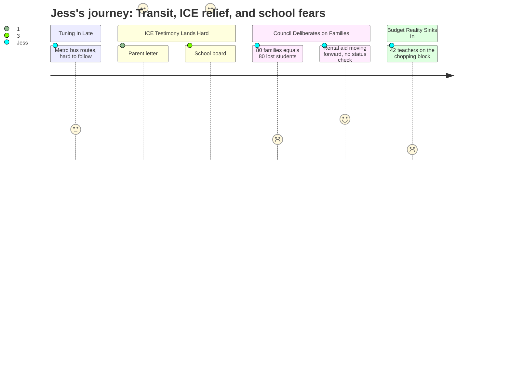

# Interpretation: Jess (PERSONA-003)
## Meeting: City Council Regular Meeting -- March 10, 2026 -- 2026-03-10

### Structured Points

#### 1. A parent's letter: children too scared to go to school
- **Fact:** A letter read aloud at public comment described a South Portland parent who was "terrified to send my children to school" after the January ICE operation, stating that her children's school "was on lockdown" and that "a neighbor told me they saw ICE agents near the elementary school driveway. My kids were too scared to go to class."
- **Source:** [01:07:58–01:08:31] (Margot Kralik reading submitted parent letter, public comment on rental assistance)
- **Emotional valence:** negative
- **Threat level:** 4
- **Open question:** true

#### 2. School board member contests the lockdown account — but the fear persisted
- **Fact:** School board member Rosemary DeAngelis, speaking at public comment, stated she "was kept abreast of all ICE activities near our schools" and that "we did not have any ICE activities in any of our schools." However, public commenter Chelsea Bian directly countered that "the fear went on much longer than" the official four-day surge and that "ICE operations are ongoing in our state."
- **Source:** [01:15:42–01:16:00] (DeAngelis public comment); [01:12:26–01:12:44] (Bian public comment)
- **Emotional valence:** neutral
- **Threat level:** 3
- **Open question:** true

#### 3. Enrollment already down 23% — and a public speaker connects it to immigration enforcement
- **Fact:** Elementary enrollment declined 23% in four years (1,401 to 1,080 students). Public commenter Alex Redfield explicitly connected immigration enforcement to this trajectory, stating that newcomers to Maine are "disproportionately younger and of working age right at a time where our community is wrestling with the impacts of long-term trends of aging populations, meaning fewer school-age families, meaning decreased enrollment in schools."
- **Source:** Fiscal Context; [01:19:28–01:19:57] (Alex Redfield public comment)
- **Emotional valence:** negative
- **Threat level:** 4
- **Open question:** true

#### 4. $7.2M school budget gap — 42 teacher positions proposed for elimination
- **Fact:** The district faces a $7.2M structural budget gap requiring approximately 78 position eliminations, including 42 teachers — 12% of staff. Councilor West referenced watching the school board meeting the previous evening and stated "we have a situation that is grim with our school budget." Councilor Matthews cited the school board chair's warning to "be very cautious of every dime that we spend."
- **Source:** Fiscal Context; [01:26:50–01:27:04] (Councilor West); [01:22:44–01:23:05] (Councilor Matthews)
- **Emotional valence:** negative
- **Threat level:** 5
- **Open question:** true

#### 5. A councilor explicitly connects housing instability to student enrollment loss
- **Fact:** During the rental assistance deliberation, Councilor Scott argued: "I see 80 families as being 80 students who may not be in that school system next year, and that's a much bigger financial burden than a hundred thousand dollars." This was her stated rationale for supporting the rental assistance fund over the objections of colleagues citing fiscal constraints.
- **Source:** [01:29:46–01:30:09] (Councilor Scott, council discussion on rental assistance)
- **Emotional valence:** negative
- **Threat level:** 3
- **Open question:** true

#### 6. City moving toward rental assistance — no immigration status disclosure required
- **Fact:** After public testimony and deliberation, council appeared to converge around approximately $100,000 from undesignated fund balance channeled through Project HOME. The city manager's proposed program structure explicitly stated it "would not require the disclosure of immigration status" and that the city would not "voluntarily share any of this program information... with federal enforcement authorities."
- **Source:** [00:53:48–00:54:07] (City Manager, program structure); [01:44:56–01:45:04] (City Manager summarizing council consensus)
- **Emotional valence:** positive
- **Threat level:** 1
- **Open question:** false

#### 7. Bus service near schools flagged as an active improvement priority
- **Fact:** Metro Executive Director Glen Fenton confirmed that high school students continue to ride for free and that Metro recently met with South Portland High School's principal to align bus schedules with bell times. The proposed route restructuring would add more consistent service near "the high school, the community center" — areas Metro's own ridership data identified as currently underserved.
- **Source:** [00:29:38–00:30:02] (Fenton Q&A on student ridership); [00:22:48–00:23:10] (Tremblay route restructuring presentation)
- **Emotional valence:** positive
- **Threat level:** 2
- **Open question:** true

### Journey Map

### Reactions

Oh my god, okay, so I finally got through most of the South Portland city council meeting and I need to tell you about it. For the first half they're talking about bus routes and fare policy and I'm basically half-listening and then suddenly they're reading these letters from families affected by the ICE thing in January. And one of them said that her kids' school went on lockdown and a neighbor saw ICE agents in the school driveway, and her kids were too scared to go to class. I literally stopped what I was doing. Like — is this the school Maisie's going to? And then near the end of that whole section a school board member gets up and says actually no, there were no ICE activities at any of our schools, so the letter was wrong. And I know that's supposed to make me feel better but it just made me feel worse? There was enough confusion and real, documented fear that a parent genuinely didn't know whether ICE was at her kid's school. That's the environment. That's what we're talking about.

And then this guy does this whole public comment where he connects immigrant families leaving to school enrollment dropping — he says people who are new to Maine are younger and have kids, and when they leave, schools lose enrollment. And he's right, because apparently enrollment is already down 23% in just the last four years at the elementary level. One of the councilors even said out loud that she sees 80 families as 80 students who might not be in the school system next year. So they know. They see the connection. And they're trying to pass a rental assistance fund to keep these families from being evicted — no immigration status required, which is genuinely a good thing — but the fact that this is what's holding the community together right now is a lot to sit with.

But here's the thing that is going to keep me up. The school budget barely came up on the agenda, but two different councilors mentioned watching the school board meeting the night before, and both said it was "grim" and that everyone is having to be "very cautious of every dime." I looked it up after: they're talking about cutting 42 teachers. Forty-two. Maisie starts kindergarten in two years. Nobody at this meeting was talking about incoming families, about what the program will look like for little kids, about whether full-day K is still going to exist. It was all about managing the system they have right now. I really need to find out more before we decide whether to stay here long-term, because right now I have no idea what we're walking into.