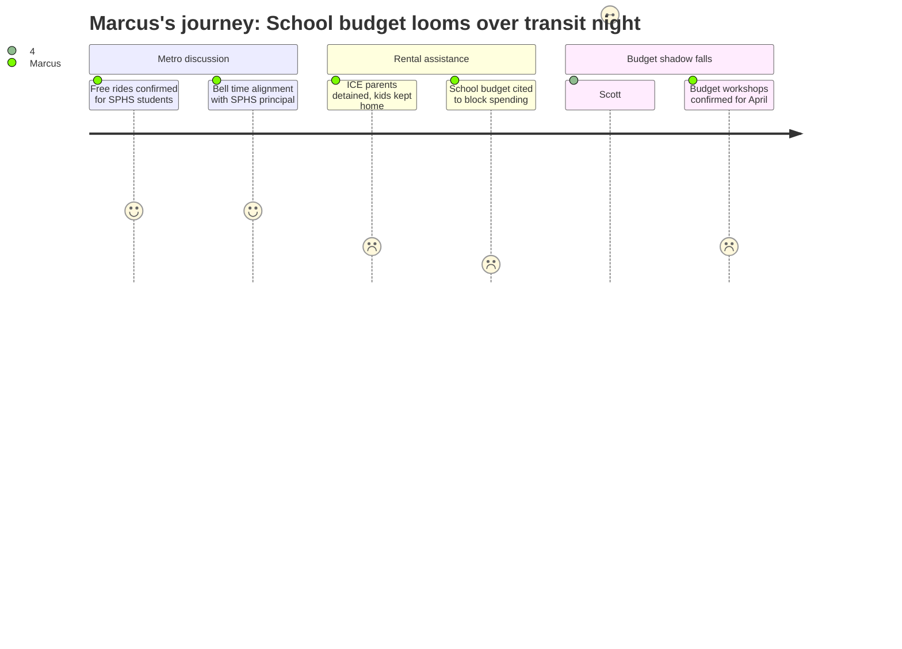

# Interpretation: Marcus (PERSONA-004)
## Meeting: City Council Regular Meeting -- March 10, 2026 -- 2026-03-10

### Structured Points

#### 1. Metro confirms free bus rides for SPHS students and is working on bell-time alignment
- **Fact:** Metro's executive director confirmed that South Portland High School students can ride free using their school pass, following confusion during the merger transition. Metro staff also met with SPHS Principal Sarah Glenn specifically to explore aligning service schedules with school bell times.
- **Source:** [00:29:34--00:30:02] — Councilor Matthews asks about free student rides; Metro Executive Director Glenn Fenton confirms and describes meeting with SPHS principal.
- **Emotional valence:** positive
- **Threat level:** 1
- **Open question:** true — Will free student ridership survive if the district cuts transportation from its own budget to close the $7.2M gap?

#### 2. ICE family testimony describes parents detained, children kept home from school
- **Fact:** Public testimony read aloud included accounts from South Portland parents who kept children home during the January ICE enforcement surge. One parent wrote: "My kids were too scared to go to class, and I have lost work because I could not leave them alone." Another described their husband detained on his way to work, leaving her unable to pay rent after diverting savings to legal fees.
- **Source:** [01:07:13--01:08:57] — Public testimony from Margot Kralik and Emily Hansen reading submitted resident statements.
- **Emotional valence:** negative
- **Threat level:** 3
- **Open question:** true — How many of those children are still academically behind after weeks of disrupted attendance, and what support is available to them?

#### 3. Councilor Matthews disclosed his phone was "filled with texts" from teachers and ed techs
- **Fact:** While arguing against the rental assistance spending, Councilor Matthews disclosed that "my phone was filled with text messages and personal emails from community members, teachers, ed techs" as context for why fiscal caution had to govern all decisions.
- **Source:** [01:22:43--01:23:08] — Councilor Matthews' statement during rental assistance deliberation.
- **Emotional valence:** negative
- **Threat level:** 4
- **Open question:** false — The alarm is already reverberating. Teachers are already reaching out to elected officials. The question is whether it changes anything.

#### 4. School board chair's "cautious of every dime" message formally entered the city council room
- **Fact:** Matthews invoked the previous night's school board meeting and the board chair's public statement — that the district must "be very cautious of every dime that we spend" — as the defining frame for the city's overall fiscal situation. Matthews also stated directly that the school department represents "sixty-two percent of the entire budget" and that "we cannot afford" additional expenditures.
- **Source:** [01:22:43--01:24:14] — Councilor Matthews' extended statement during rental assistance deliberation.
- **Emotional valence:** negative
- **Threat level:** 5
- **Open question:** true — What does "cautious" concretely mean for the 42 teaching positions and 16 ed tech positions proposed for elimination in the FY27 budget?

#### 5. Councilor Scott made the enrollment argument no budget document makes: 80 families = 80 students
- **Fact:** Councilor Scott argued for funding the full rental assistance amount partly on school enrollment grounds: "I see eighty families as being eighty students who may not be in that school system next year, and that's a much bigger financial burden than a hundred thousand dollars."
- **Source:** [01:29:46--01:30:09] — Councilor Scott's statement during rental assistance deliberation.
- **Emotional valence:** positive
- **Threat level:** 2
- **Open question:** true — Will this enrollment-stability argument get carried into the April budget workshops where FTE decisions are actually made?

#### 6. The city's fund balance is described as near-depleted before the school budget fight even starts
- **Fact:** The city manager confirmed the rental assistance proposal would draw from "undesignated fund balance" and would "reduce our capacity for future CIP items." The district's own fund balance is described as essentially exhausted in the fiscal context for FY27. Multiple councilors explicitly framed the overall fiscal condition as severely constrained.
- **Source:** [01:04:55--01:05:16] — City manager's funding explanation; Fiscal Context (fund balance essentially depleted; $7.2M structural gap requiring cuts to hold a 6% tax ceiling).
- **Emotional valence:** negative
- **Threat level:** 4
- **Open question:** true — With no cushion on either the city or school side, what happens if an emergency or additional revenue shortfall hits between now and June?

#### 7. Budget workshops are confirmed for April 14, April 28, and May 12 — the actual arena
- **Fact:** The workshop schedule review confirmed three budget workshops: April 14 (Budget Workshop #1), April 28 (#2), and May 12 (#3). These are the sessions where the school department's proposed cuts — including the elimination of 42 teaching positions and 16 ed tech positions representing 12% of district staff — will be formally on the table before the council.
- **Source:** City Council Agenda, Section C-1 (Workshop Schedule); Fiscal Context (78 positions proposed for elimination, including 42 teachers and 16 ed techs).
- **Emotional valence:** neutral
- **Threat level:** 5
- **Open question:** true — Will the union have a documented voice in those workshops, or will staffing decisions arrive at the council already baked in?

---

### Journey Map

---

### Reactions

I watched the whole thing last night and the part that got me was Matthews. He's up there arguing against the rental assistance and he just drops it — his phone was "filled with texts from teachers and ed techs." So they know. We're already reaching out. The school board chair said "cautious of every dime" the night before and Matthews repeated it at the council table like it was the whole argument. Six weeks until the first budget workshop, forty-two teaching positions on the chopping block, and the council spent four hours on Metro route restructuring, bike share ordinance frameworks, and whether Class 3 e-bikes should be allowed on the Greenbelt. The disconnect is genuinely hard to sit with.

The ICE testimony hit differently when you realize those are your students' families. The parent who kept their kids home because they saw ICE near the school driveway — those children fell behind in February, and nobody at this meeting talked about the academic cost of that. Councilor Scott made the enrollment argument that nobody else was willing to make: eighty families helped equals eighty students who might stay in South Portland. She's right, and it's the argument the union has been making for years. Every family pushed out by an eviction is one fewer student in a classroom, one fewer reason to justify a section, one fewer teaching position to protect. Community stability and staffing levels aren't separate ledgers. They're the same ledger.

Then the meeting pivoted to an hour of bike share vendor frameworks and another hour on e-bike classifications. I don't care about the Greenbelt right now. April 14th is the first budget workshop — that's when FTE counts go on the table and we find out if "cautious with every dime" means cutting electives first, or AP sections, or ed tech positions, or all of it. I need to see the staffing line items before that workshop, not after. And I need the association at the table before someone decides the cleanest path to seven point two million dollars runs straight through personnel.