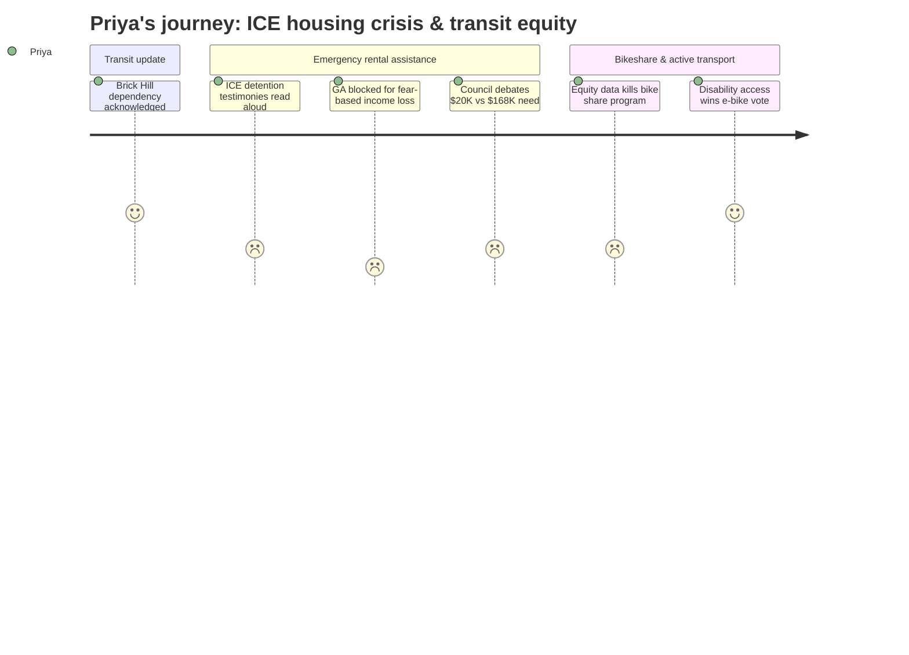

# Interpretation: Priya (PERSONA-005)
## Meeting: City Council Regular Meeting -- March 10, 2026 -- 2026-03-10

### Structured Points

#### 1. Three ICE-impacted residents speak through proxies — and the details land hard
- **Fact:** Community members Margot Kralik and Emily Hansen read three first-person accounts into the record: a detained man held in freezing conditions who fell due to ill-fitting shoes and received no medical attention; a parent who kept children home from school after seeing ICE near the elementary school driveway and then lost income; and a woman whose detained husband was the primary earner, forcing her to spend rent money on a lawyer.
- **Source:** [01:06:43--01:09:34], public comment on rental assistance
- **Emotional valence:** negative
- **Threat level:** 4
- **Open question:** true — Were these specific families connected to Project HOME before the workshop? And why are residents reading these testimonies on behalf of others rather than the affected people speaking themselves?

#### 2. State rules structurally block GA eligibility for the most impacted residents
- **Fact:** Social services director Chris Pupke confirmed on record that the state instructed the city that missing work "specifically out of fear of encountering immigration enforcement" does not constitute just cause under General Assistance eligibility requirements — meaning the residents most directly disrupted by the ICE surge likely cannot access the existing safety net program.
- **Source:** [00:59:18--00:59:55], Q&A between city manager and Chris Pupke
- **Emotional valence:** negative
- **Threat level:** 4
- **Open question:** true — Is anyone organizing at the state level to change this rule? This is a policy that fails people at the exact moment they need protection.

#### 3. City explicitly commits to no immigration status disclosure in rental program
- **Fact:** The city manager's proposal explicitly stated the program would not require disclosure of immigration status as part of any application, and would not voluntarily share program information or applications with federal enforcement authorities, unless compelled by law or court order.
- **Source:** [00:53:48--00:54:04], city manager's rental assistance presentation
- **Emotional valence:** positive
- **Threat level:** 2
- **Open question:** true — What happens under subpoena? What legal infrastructure exists to defend those protections if challenged?

#### 4. Councilor West anchors the funding debate on arrest counts rather than disruption scale
- **Fact:** Councilor West explicitly cited "the surge lasted four days and less than five people were arrested in South Portland" and noted "the bulk of the surge was Portland and Lewiston" as factors in his reasoning for offering only $20,000 — the lowest amount proposed — toward a need Project HOME identified as $168,000 for 80 South Portland households.
- **Source:** [01:25:59--01:26:21], council deliberation on rental assistance
- **Emotional valence:** negative
- **Threat level:** 3
- **Open question:** true — Does the council have a shared framework for evaluating fear-based economic disruption as distinct from arrest numbers? Or will "only five arrests" become the recurring justification for minimizing response?

#### 5. Metro identifies Brick Hill and Red Bank as transit-dependent and underserved — then proposes to fix it
- **Fact:** Metro Director of Transit Development stated that Brick Hill residents "are really dependent on transit" with "relatively limited" current options, and that Brick Hill is already "overperforming" its service allocation — indicating suppressed demand. The proposed neighborhood connector route would add weekend service to Red Bank and Brick Hill specifically.
- **Source:** [00:22:53--00:23:12], Metro transit planning presentation
- **Emotional valence:** positive
- **Threat level:** 2
- **Open question:** true — These route changes are proposed for 2027 at earliest and depend on budget stability. Given the $7.2M school budget gap and city financial stress mentioned at the end of the meeting, will transit investment survive the coming fiscal pressure?

#### 6. National equity research on bike share deployed to kill the program rather than improve its design
- **Fact:** Councilor West quoted a study finding that bike share schemes "disproportionately serve young, male, white, highly educated, and from higher income groups" — but used this finding as a reason to oppose the program rather than to demand equity-centered design requirements. The sustainability staff had explicitly cited "equitable access to resilient transportation" as one of two primary rationales for the program. The council rejected the bike share proposal, with only Councilor Walker in support.
- **Source:** [02:53:28--02:54:08], council deliberation on bike share; [01:51:02--01:51:56], sustainability presentation
- **Emotional valence:** negative
- **Threat level:** 2
- **Open question:** true — Will the equity critique generate any alternative investment in cycling access for low-income residents, or does it simply close the door?

#### 7. Council settles at ~$100K — roughly 60% of Project HOME's identified South Portland need
- **Fact:** After deliberations ranging from $20,000 (Councilor West) to $168,000 (Councilor Walker), the city manager calculated an average of approximately $94,000 across all council positions and said the order coming to the next meeting would reflect approximately $100,000 to Project HOME on a reimbursement basis. Project HOME has identified 80 South Portland households needing assistance at an average of approximately $2,100 each — totaling $168,000.
- **Source:** [01:44:03--01:44:58], city manager synthesis of council guidance
- **Emotional valence:** neutral
- **Threat level:** 3
- **Open question:** true — The $68,000 gap between identified need and approved funding means approximately 32 families go unserved. Will Project HOME flag those households to the council before the June 1 deadline, and will anyone bring a supplemental appropriation?

---

### Journey Map

---

### Reactions

OK so the headline from this meeting is the rental assistance debate, and I need people to understand what actually happened there. Three testimonies got read into the record — a man who was detained in a freezing room, fell because his shoes didn't fit, lost his job, and got an eviction letter while he was locked up. A parent who watched her kids fall apart from fear and lost income because she couldn't leave them home alone. A woman who drained her rent savings on a lawyer for her detained husband. These are South Portland residents. This is on the record. And then the same council that listened to all of that spent the next hour deliberating whether four days of federal terror was *really* disruptive enough to justify the full ask. Councilor West literally said "less than five people were arrested in South Portland" — as if the measure of harm is arrest numbers and not the fact that an entire community went into hiding. That framing is going in my notes because we're going to see it again.

Here's the structural thing that nobody named but that I cannot stop thinking about: Chris Pupke, who runs GA, confirmed on the record that the state told the city that missing work out of fear of ICE doesn't count as "just cause" for General Assistance eligibility. Read that again. The exact population this crisis hit hardest is the one systematically excluded from the program designed to help them. The state built a hole in the floor exactly where these families were standing. That's not an accident, and nobody said it out loud as a policy problem that needs to be fixed at the state level. I'm going to be making some calls this week. What I will give the city credit for: the proposal explicitly bars immigration status disclosure and says the city won't voluntarily share anything with federal enforcement. That's a real commitment, and I want it in writing when the order comes to vote next meeting.

They landed at roughly $100,000 through Project HOME — which is about $68,000 short of the 80 households Project HOME has already identified in South Portland. Councilor Walker was the only one who came out for the full $168K and said plainly: "It costs a lot to be poor." The rest found various comfortable middle grounds. The bike share discussion earlier in the evening had its own version of this pattern — Councilor West actually quoted research that bike share programs nationally serve "disproportionately young, male, white, highly educated, and from higher income groups," which is real and important equity data, but the council used it to kill the program entirely rather than demand equity-centered design requirements. That's textbook: equity gets invoked to avoid the harder work of actually building equity in. I want to be at the April budget workshops. There's a $7.2M gap coming, and I need to see who absorbs the cuts.