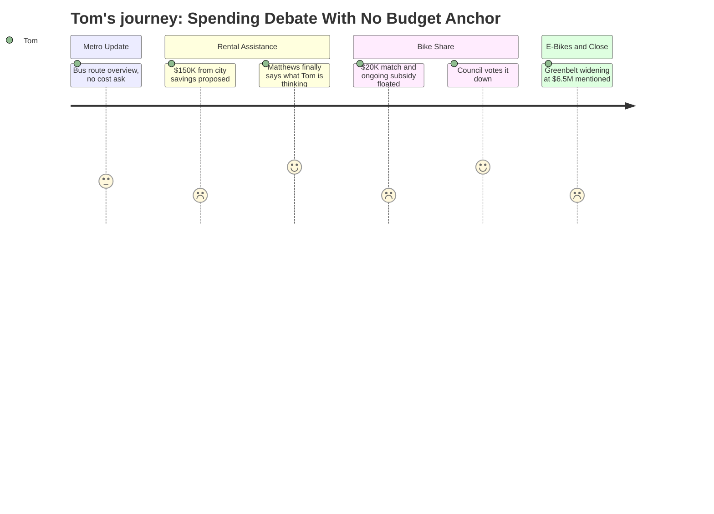

# Interpretation: Tom (PERSONA-006)
## Meeting: City Council Regular Meeting -- March 10, 2026 -- 2026-03-10

### Structured Points

#### 1. $100–150K Proposed From City Savings for Rental Assistance
- **Fact:** The city manager recommended drawing up to $150,000 from the city's undesignated fund balance to provide emergency rental assistance to residents affected by the January ICE enforcement activity. The council's discussion landed at roughly $94,000 average, with the city manager stating he would round to $100,000 for the formal order.
- **Source:** Transcript [00:54:47--00:55:12] and [01:44:57--01:45:01]
- **Emotional valence:** negative
- **Threat level:** 4
- **Open question:** true — How much of this money will actually get back to the fund balance if demand doesn't materialize? Nobody said clearly how unused funds would be tracked or returned.

#### 2. City Manager Explicitly Confirms Rental Assistance Reduces Next Year's Capital Budget
- **Fact:** When Councilor Coleman asked whether the $150,000 would have a meaningful impact on CIP, the city manager confirmed: "next year we might spend 2.85 million" instead of the typical $3 million from undesignated fund balance on capital projects — a direct, acknowledged tradeoff.
- **Source:** Transcript [01:05:37--01:06:13]
- **Emotional valence:** negative
- **Threat level:** 3
- **Open question:** false — The tradeoff was stated plainly; it just didn't seem to change many votes.

#### 3. Councilor Matthews Issues Fiscal Warning Nobody Else Matched
- **Fact:** Councilor Matthews was the only councilor to oppose the rental assistance outright on fiscal grounds, arguing: "the city of South Portland is financially in big trouble right now" and citing the school department as "sixty-two percent of the entire budget." He also referenced the school board chair's call the prior evening to "be very cautious of every dime that we spend."
- **Source:** Transcript [01:22:43--01:24:48]
- **Emotional valence:** positive
- **Threat level:** 2
- **Open question:** true — Why was Matthews the only one connecting the rental assistance vote to the looming school budget crisis? The rest of the council either ignored or dismissed that connection.

#### 4. Bike Share's $20K City Match Was Rejected — Unanimously
- **Fact:** A proposed one-year pilot of 40 bikes across 8 stations, requiring a $20,000 municipal match to unlock $100,000 in MaineDOT funding, was rejected by six of seven councilors. Multiple councilors cited fiscal timing, the city's spread-out geography, and concern about competing with a local bike shop employing eleven people.
- **Source:** Transcript [03:09:08--03:01:20] (multiple councilor statements); Agenda Item B.3
- **Emotional valence:** positive
- **Threat level:** 1
- **Open question:** false — Council was clear: not now. The sustainability director noted the $100,000 in state funding would "just go back to the state" — which Tom would see as fine.

#### 5. New Scarborough Bus Route Will Trigger a South Portland Assessment Starting 2028
- **Fact:** Metro's Executive Director stated the new Scarborough-to-Portland route launching summer 2026 is "fully funded for the first two years" by external grants. After that pilot, Metro will report back with "a cost estimate for what the local assessment might be to continue that service," which would roll into annual assessments beginning in 2028. South Portland covers approximately 28% of the route.
- **Source:** Transcript [00:13:22--00:14:30]
- **Emotional valence:** neutral
- **Threat level:** 2
- **Open question:** true — What will South Portland's share of the annual cost actually be in 2028? Nobody gave a dollar figure, and the council never asked.

#### 6. Greenbelt Widening Estimated at $6.5 Million — No Funding Source Identified
- **Fact:** The city manager disclosed that full Greenbelt widening to address width deficiencies — a prerequisite that stalled the original e-bikes ordinance — is currently estimated at $6.5 million. A first step of inspection and preliminary design alone would cost $200,000. Staff acknowledged grant applications are being pursued but no funding has been secured.
- **Source:** Transcript [03:16:43--03:17:00]
- **Emotional valence:** negative
- **Threat level:** 3
- **Open question:** true — Is this $6.5 million going to end up on property taxpayers if grants don't come through? Council didn't ask, and no one mentioned it when they approved moving forward with e-bikes anyway.

---

### Journey Map

---

### Reactions

So they want to take a hundred thousand dollars out of the city's savings — the city manager called it the "undesignated fund balance" — and hand it to a nonprofit to help families who lost income when ICE came through in January. I get that those people had a hard time. I really do. But the city manager sat there and said it out loud: doing this means we spend $150,000 less on capital projects next year. Roads, equipment, whatever's in that pile — it gets cut. And this is on top of a school budget that's already burning through its reserves. Nobody on that dais connected those two things except Councilor Matthews, who basically had to beg people to pay attention.

Matthews said it plain: the school department is sixty-two percent of the entire city budget, and the school board chair had just stood up the night before and said to watch every dime. He voted no, Councilor West was willing to go as low as twenty thousand, and everyone else was somewhere between a hundred thousand and a hundred sixty-eight thousand. The final number they're bringing back as an order is going to be around a hundred thousand. So the guy watching out for the taxpayers was outvoted. That's where we are.

I'll give them one thing: they killed the bike share. Six out of seven said no to spending twenty grand matching a state grant for forty bikes. One of the business owners in the room — she runs a local bike shop with eleven employees — stood up and pointed out that a national company coming in undercuts her. And several councilors said, flat out, the city just can't afford it right now. So that was actually the right call. But then in the same meeting they committed to a hundred thousand out of savings for rental assistance, so it's not like there's a real principle at work here. They'll say no to twenty thousand for bikes and yes to a hundred thousand for something else. I left that meeting not knowing what the rule is. And nobody asked what the new Scarborough bus route is going to cost us in 2028 when the grant money runs out. That number's coming. Nobody wanted to talk about it tonight.