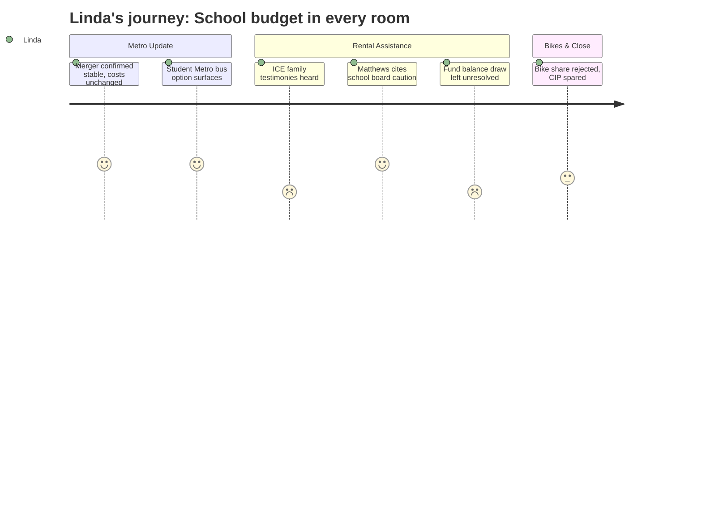

# Interpretation: Linda (PERSONA-003)
## Meeting: City Council Regular Meeting -- March 10, 2026 -- 2026-03-10

### Structured Points

#### 1. Council Members Publicly Invoked the School Board's Fiscal Warning
- **Fact:** Councilor Matthews cited watching the previous night's school board meeting and stated the board chair's call for extreme caution was grounds to oppose new city spending. Councilor West echoed it minutes later: "I did listen to the school board last night. And I mean, those are our children."
- **Source:** [01:22:43–01:23:14]; [01:26:30–01:27:03]
- **Emotional valence:** positive
- **Threat level:** 1
- **Open question:** false

#### 2. Fund Balance Draw for Rental Assistance Left Unresolved Going Into Next Meeting
- **Fact:** The workshop ended without a vote. The city manager will bring an order to the next meeting averaging council preferences at approximately $94–100K from undesignated fund balance. He confirmed on record that a $150K draw would reduce next year's CIP pool from roughly $3M to $2.85M.
- **Source:** [01:04:40–01:06:20]; [01:43:56–01:45:04]
- **Emotional valence:** negative
- **Threat level:** 3
- **Open question:** true

#### 3. High School Students Riding Metro — a Transportation Budget Thread Worth Pulling
- **Fact:** During both the Metro presentation and public comment, a school board member surfaced the possibility of SPHS students using Metro buses as their district transportation, noting it would require a cost discussion between Metro and the district's facilities director, Mike Nally.
- **Source:** [00:29:34–00:30:02]; [01:03:03–01:03:50]
- **Emotional valence:** positive
- **Threat level:** 1
- **Open question:** true

#### 4. School Board Member Corrected the ICE/Schools Record Publicly
- **Fact:** A school board member used the rental assistance public comment period to state on the record that no ICE activities occurred at South Portland schools — directly responding to prior testimony that had referenced school lockdowns and ICE agents near an elementary school driveway.
- **Source:** [01:11:51–01:12:35]
- **Emotional valence:** positive
- **Threat level:** 2
- **Open question:** false

#### 5. School Department's 62% Budget Share Named as a Fiscal Constraint Lever
- **Fact:** Councilor Matthews stated explicitly that the school department is 62% of the entire city budget and used the school board's public call for fiscal caution as his primary argument against rental assistance spending — inverting the usual dynamic so that the school crisis shaped a city-side vote.
- **Source:** [01:23:14–01:24:10]
- **Emotional valence:** neutral
- **Threat level:** 3
- **Open question:** true

#### 6. Metro Merger Is Operationally Stable — No Additional Assessment
- **Fact:** Metro confirmed all 8 transferred South Portland employees remain employed, ridership held at approximately 201,000 annual rides, on-time performance is trending upward, and a new Scarborough/Route 1 corridor service launches summer 2026 with no increase in South Portland's assessment.
- **Source:** [00:02:57–00:04:20]; [00:07:17–00:07:36]; [00:12:22–00:13:28]
- **Emotional valence:** positive
- **Threat level:** 1
- **Open question:** false

#### 7. GA Eligibility Gap Exposes a Structural Hole in the Safety Net
- **Fact:** The general assistance director confirmed that state guidance explicitly bars "fear of immigration enforcement" from qualifying as just cause for not working — meaning residents displaced by the ICE surge cannot access GA under existing rules, creating a gap the emergency fund would fill rather than duplicate.
- **Source:** [00:59:10–00:59:52]
- **Emotional valence:** negative
- **Threat level:** 3
- **Open question:** true

#### 8. Bike Share CIP Ask Illustrated FY27 Capital Competition, Then Was Rejected
- **Fact:** The sustainability department requested a $20K municipal match in the FY27 CIP to unlock $100K in MaineDOT funding for a one-year bike share pilot. Council declined to proceed. The ask was notable as one more demand on a capital pool already under school-budget-related pressure.
- **Source:** [02:07:44–02:08:35]; Workshop agenda item 3
- **Emotional valence:** neutral
- **Threat level:** 2
- **Open question:** false

---

### Journey Map

---

### Reactions

Sat through the whole meeting — three and a half hours, most of it buses and bikes — and the thing still with me this morning is the moment Matthews cited our board chair. He said he watched our meeting the night before and was glad the chair told everyone to watch every dime. Then West followed up with "those are our children" while explaining his hesitation on rental assistance. I felt both things at once: some relief that the fiscal message is actually landing over there, and a low-grade dread that our budget crisis has become such a visible signal it's showing up in every unrelated decision the city makes now. That's either leverage for us, or it's a warning that we're becoming the backdrop for everyone else's debates. Not sure yet which it is.

The rental assistance discussion was hard. The testimony was real — families in our community, scared, behind on rent, receiving quit notices. The school board member who spoke did the right thing correcting the record about ICE at our schools, because the earlier testimony had gotten close to inaccurate and I'm glad it was addressed publicly. But I'm still tracking that fund balance draw with real concern. The city manager said on record that a $150K draw reduces next year's CIP pool from roughly $3 million to $2.85 million. Council seemed to converge somewhere around $94–100K via Project HOME, but there was no vote, the accountability structure is still being designed, and the order isn't finalized until next meeting. Open commitment, open amount, open mechanism. I'll be watching that order.

The piece I actually want to bring to our finance committee is buried in the Metro presentation. There's a live conversation about whether SPHS students could use Metro buses as their district transportation instead of district-run buses. It came up almost as an aside — a school board member raised it in public comment, mentioned a cost discussion would need to happen between Metro and Mike Nally. We're looking at 14 transportation positions in the proposed eliminations. If Metro is restructuring routes to run more frequently near the high school and align with bell times anyway, and if we can shift transportation costs off the district's books, that changes our options in a meaningful way. Nobody on our side is actively tracking that conversation right now, and somebody needs to be before it gets decided without us in the room.