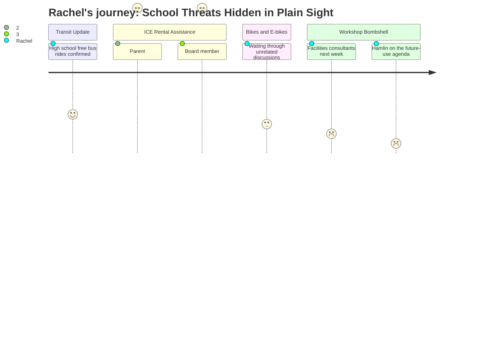

# Interpretation: Rachel (PERSONA-008)
## Meeting: City Council Regular Meeting -- March 10, 2026 -- 2026-03-10

---

### Structured Points

#### 1. "Hamlin" Listed for Future-Use Discussion — No Explanation Given
- **Fact:** The council's workshop schedule includes an item titled "Future Use of City Hall, Hamlin, & Main Library (on hold)." It was mentioned briefly during the end-of-meeting workshop schedule review and carried no further explanation, timeline, or public framing.
- **Source:** Agenda item C, Workshop Schedule Review; [03:51:40–03:56:32]
- **Emotional valence:** negative
- **Threat level:** 5
- **Open question:** true

#### 2. Design Consultants Presenting on Public Facilities at the Very Next Meeting
- **Fact:** The city manager confirmed that design consultants will present "updated information on some things that you asked for" regarding public facilities at the March 17 council meeting. The mayor stated she wants public facilities as a standing agenda item "every agenda," adding: "I'm very afraid that we are… there's so many things and so many issues that we should discuss if we want to try to keep things moving with our public facilities projects."
- **Source:** [03:54:41–03:56:10]
- **Emotional valence:** negative
- **Threat level:** 4
- **Open question:** true

#### 3. School Board Meeting From the Night Before Haunts the Room
- **Fact:** Councilor Matthews stated he watched the school board meeting the previous night (March 9) and had received texts and personal emails from community members, teachers, and ed techs. He cited the school board chair's explicit call to "be very cautious of every dime we spend" as context for his opposition to the rental assistance program. Councilor West separately invoked "those are our children" while describing the school budget situation as "grim."
- **Source:** [01:22:43–01:25:00]; [01:27:35–01:28:11]
- **Emotional valence:** negative
- **Threat level:** 4
- **Open question:** true

#### 4. Councilor Scott Explicitly Links Displaced Immigrant Families to Enrollment Loss
- **Fact:** During the rental assistance debate, Councilor Scott argued that the approximately 80 South Portland families potentially displaced by the ICE enforcement surge represent "eighty students who may not be in that school system next year," calling that enrollment loss "a much bigger financial burden than a hundred thousand dollars."
- **Source:** [01:29:36–01:30:05]
- **Emotional valence:** positive
- **Threat level:** 2
- **Open question:** false

#### 5. Testimony: ICE Spotted Near Elementary School Driveway, Children Too Scared to Attend
- **Fact:** A community member read written testimony from a South Portland parent: "My children's school was on lockdown. A neighbor told me they saw ICE agents near the elementary school driveway. My kids were too scared to go to class, and I have lost work because I could not leave them alone."
- **Source:** [01:07:58–01:08:54]
- **Emotional valence:** negative
- **Threat level:** 4
- **Open question:** true

#### 6. School Board Member Clarifies: No ICE Activity Inside Any South Portland School
- **Fact:** School board member Rosemary DeAngelis stated from the public podium: "I was kept abreast of all ICE activities near our schools, and I can safely say we did not have any ICE activities in any of our schools." She specifically stated that no children were taken from bus stops or from school grounds anywhere in South Portland.
- **Source:** [01:15:42–01:16:44]
- **Emotional valence:** positive
- **Threat level:** 2
- **Open question:** true

#### 7. High School Students Confirmed Back to Free Metro Rides
- **Fact:** After confusion during the Metro merger transition disrupted the program, school board member Rosemary DeAngelis confirmed that South Portland high school students are once again riding Metro buses at no cost using their school IDs. Metro and the high school principal met to discuss aligning bus schedules with bell times.
- **Source:** [00:35:53–00:38:20]
- **Emotional valence:** positive
- **Threat level:** 1
- **Open question:** false

---

### Journey Map

---

### Reactions

So the thing that has me completely spiraling is something they mentioned in literally the last ten minutes of a four-hour meeting. They were going through the workshop schedule and there's a line item — I wrote it down — "Future Use of City Hall, Hamlin, & Main Library." That's it. Just sitting there, labeled "on hold," no explanation. And then the city manager says in the same breath that consultants are presenting on public facilities at next week's meeting, and the mayor says she wants public facilities on the agenda every single meeting going forward. So they have consultants embedded and actively working on what to do with a school building and the answer is "not ready to tell us yet"? During a budget crisis where elementary enrollment dropped 23% in four years? "Future use" is doing a lot of heavy lifting in that sentence.

The school budget crisis kept bleeding into every other conversation all night, which was its own kind of alarm. Councilor Matthews opened his whole speech by saying he watched the school board meeting last night and his phone has been blowing up with texts from teachers and ed techs. Multiple people on the council kept referencing that the school budget is 62% of the total city budget and that the whole city is in a financial hole. Councilor West called the school situation "grim" and even brought up "those are our children" while talking about rental assistance. Nobody connected all the pieces out loud in one sentence, but I did: enrollment down, building on a future-use list, consultants already retained, next meeting already scheduled. I have been in enough of these situations to know what that sequence usually means for the kids in those buildings.

And then there was this moment during the rental assistance discussion — someone read testimony from a parent whose kids' school went on lockdown after the January raids and who said a neighbor saw ICE agents near the elementary school driveway. That her kids were too scared to go to class. I'm sitting there thinking about drop-off. Rosemary DeAngelis stood up as a school board member and said she personally tracked all ICE activity near the schools and confirmed there was nothing inside any South Portland school — which I believe her, and that matters. But "near the driveway" is close enough that it scared a kid into not going to class, so I'm not sure that fully lands as reassuring.