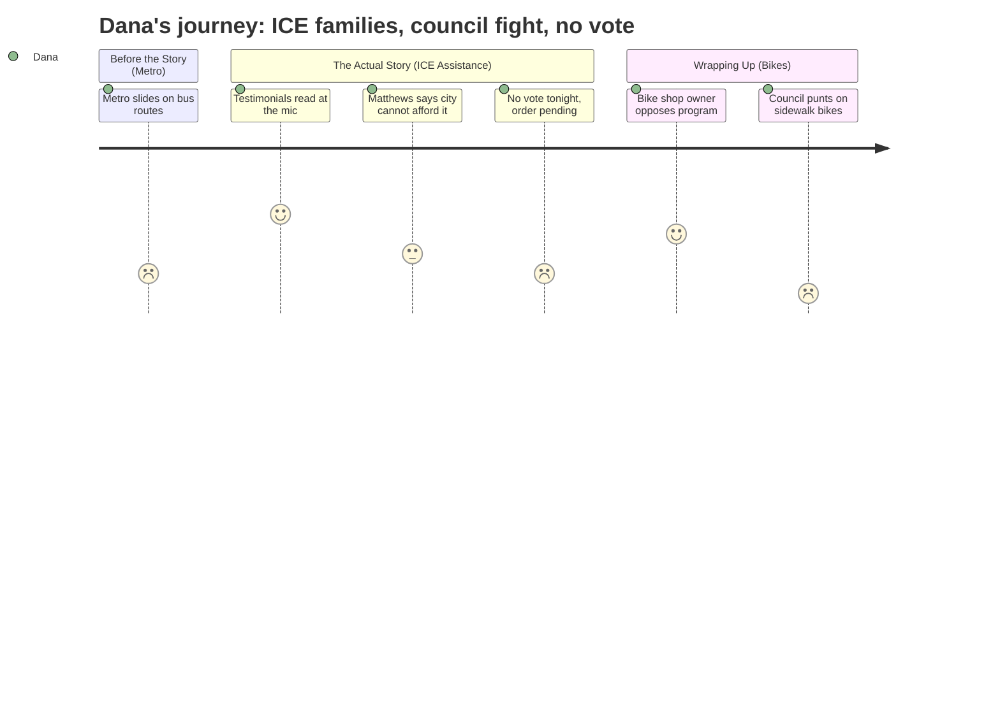

# Interpretation: Dana (PERSONA-009)
## Meeting: City Council Regular Meeting -- March 10, 2026 -- 2026-03-10

---

### Structured Points

#### 1. ICE Detention Testimonials Read Aloud at the Microphone
- **Fact:** Community advocates Margot Kralik and Emily Hansen read written statements from South Portland residents displaced by the January ICE surge. One described being held in a freezing detention room, falling due to oversized shoes, losing his job, and receiving an eviction notice. Quote on record: *"Please, South Portland, help us."*
- **Source:** [01:07:13--01:08:00]
- **Emotional valence:** negative
- **Threat level:** 5
- **Open question:** false

#### 2. Councilor Matthews Opposes Rental Relief, Cites School Budget Crisis
- **Fact:** Councilor Matthews said he could not support allocating any city funds for ICE-related rental assistance, arguing the city is "financially in big trouble right now" and explicitly tying the fiscal strain to the school department consuming 62% of the total budget. He noted Project HOME was already close to its own $500K fundraising goal from private donations.
- **Source:** [01:22:35--01:24:34]
- **Emotional valence:** negative
- **Threat level:** 4
- **Open question:** true

#### 3. Councilor Scott: "80 Families Are 80 Students Who May Not Be in That School System"
- **Fact:** Councilor Scott reframed the rental assistance ask as a school enrollment and long-term fiscal investment, arguing that keeping 80 immigrant families housed costs less than the resulting loss of per-pupil revenue, and described the federal enforcement actions as "atrocious."
- **Source:** [01:29:36--01:30:13]
- **Emotional valence:** positive
- **Threat level:** 3
- **Open question:** false

#### 4. Police Chief: Fewer Than Five People Detained in South Portland
- **Fact:** When pressed by Councilor West for specifics, Police Chief Danaher confirmed the January surge lasted four days statewide, produced approximately 220 arrests across Maine, and that he estimated "less than five" people were detained within South Portland city limits — though he emphasized that was a guess based on calls for service, not a confirmed figure.
- **Source:** [01:02:51--01:03:28]
- **Emotional valence:** neutral
- **Threat level:** 2
- **Open question:** true

#### 5. No Vote Tonight — An Order Will Come to the Next Regular Meeting
- **Fact:** After councilors named funding figures ranging from $20,000 (Councilor West) to $168,000 (Councilor Walker), the City Manager said he would average what he heard — approximately $94,000, which he'd round to $100,000 — and bring a formal order for a vote at the next regular council meeting.
- **Source:** [01:43:52--01:45:13]
- **Emotional valence:** neutral
- **Threat level:** 2
- **Open question:** true

#### 6. Local Bike Shop Owner Opposes City Bike Share Program
- **Fact:** Leah Day, owner of Lighthouse Bikes in South Portland, came to the mic to oppose the proposed 40-bike pilot, citing concern that a national third-party operator would undercut her 11-employee small business. She proposed alternatives — bike giveaway programs, police-basement bike redistribution, education classes — rather than vendor-operated docks.
- **Source:** [02:22:50--02:25:49]
- **Emotional valence:** negative
- **Threat level:** 3
- **Open question:** true

#### 7. Councilor Matthews Admits He Was Wrong About the Metro Merger
- **Fact:** Councilor Matthews, who described himself as "probably the biggest critic of the merger," told Metro executives he was now "eating pie" and expressed surprise at how smoothly service had continued since the 2024 merger, with all eight former South Portland employees still employed by Metro.
- **Source:** [00:39:51--00:40:54]
- **Emotional valence:** positive
- **Threat level:** 1
- **Open question:** false

---

### Journey Map

---

### Reactions

Okay so I sat through an hour of Metro talking about ridership charts and Scarborough bus routes — completely unusable unless we're doing a transit-access piece, which we're not. The only crumb worth pocketing: Councilor Matthews, apparently the guy who fought the merger hardest, literally said tonight he's "eating pie." That's a 10-second kicker if the bus story ever gets legs. But that's not tonight. Tonight is ICE families.

Around the one-hour mark, two women get up and read written statements from residents who were caught in the January raids. One man says he was held in a freezing room, fell because ICE gave him shoes that were too big, lost his job, and got an eviction notice from his landlord. A parent writes that she kept her kids home because someone spotted ICE near the school driveway. These aren't interviews — they're written submissions read at a public meeting — but they're on the record, on camera, and they're devastating. The city manager confirmed 80 South Portland households are currently on Project HOME's list needing an average of about $2,100 each. That's the number. That's your lede. The police chief said "less than five" people were actually detained in South Portland, which Councilor West tried to use to pump the brakes on spending — and then Councilor Scott fires back with the line that 80 families means 80 kids who might not be enrolled in South Portland schools next year. Competing soundbytes. That's a segment. Nobody voted on anything — it goes to a formal order at the next regular meeting, which is your follow-up. That's the show.

For b-roll I'm thinking: the Project HOME office, exterior shots of affordable rental housing in South Portland, and pull anything from January's ICE coverage out of the archive. The school connection Matthews keeps dragging in is actually useful framing — if we run this the same week as a school budget piece, they feed each other. Secondary story I'm flagging: Leah Day, owner of Lighthouse Bikes, showed up to oppose the city's proposed bike share pilot on the grounds that a national vendor would undercut her 11 workers. Council killed the program pretty decisively tonight. She's good TV — passionate, credible, specific — and she's sitting right in the middle of the "small business versus city hall" frame that writes itself.