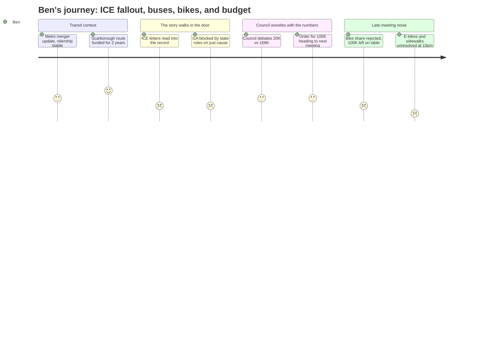

# Interpretation: Ben (PERSONA-010)
## Meeting: City Council Regular Meeting -- March 10, 2026 -- 2026-03-10

### Structured Points

#### 1. ICE Enforcement Testimonies Read Into the Record
- **Fact:** A community member named Margot Kralik read three written testimonies from South Portland residents impacted by the January ICE enforcement surge. One described being held in a freezing detention cell, injured, and then losing his job and facing eviction. A second described a parent too afraid to leave their children because they believed ICE agents were near the school. A third described a woman who used rent money to pay a lawyer after her husband was detained on his way to work.
- **Source:** Transcript [01:07:01--01:08:57]
- **Emotional valence:** negative
- **Threat level:** 4
- **Open question:** true

#### 2. State Rules Block GA Access for Families Who Missed Work Out of Fear
- **Fact:** The city's General Assistance director, Chris Pupke, confirmed that the state of Maine instructed South Portland that missing work out of fear of encountering immigration enforcement does not count as "just cause" for GA eligibility — meaning workers who lost income because they were too frightened to leave their homes may not qualify for the primary assistance program designed for exactly this situation.
- **Source:** Transcript [00:59:51--01:00:17]
- **Emotional valence:** negative
- **Threat level:** 4
- **Open question:** true

#### 3. Councilor Scott Connects Rental Assistance Directly to School Enrollment Crisis
- **Fact:** Councilor Carter Scott argued that the roughly 80 South Portland households at risk represent approximately 80 students who may leave the school system, framing the $100,000 rental assistance proposal as a cost-effective investment: "I see eighty families as being eighty students who may not be in that school system next year, and that's a much bigger financial burden than a hundred thousand dollars."
- **Source:** Transcript [01:29:46--01:30:16]
- **Emotional valence:** positive
- **Threat level:** 2
- **Open question:** false

#### 4. Council Range: $20K to $168K; City Manager Averages to ~$100K Heading to Next Meeting
- **Fact:** Council positions on rental assistance funding ranged from Councilor West's $20,000 (enough to push Project HOME over their $500K fundraising goal) to Councilor Walker's $168,000 (enough to cover all 80 known South Portland households). The city manager announced he averaged the stated positions to approximately $94,000, and an order for roughly $100,000 directed to Project HOME — on a reimbursement basis, not a lump sum — would come before council for a vote at the next regular meeting.
- **Source:** Transcript [01:27:51--01:44:52]; agenda item B.2
- **Emotional valence:** neutral
- **Threat level:** 2
- **Open question:** true

#### 5. School Budget Crisis Invoked as Reason to Limit Rental Assistance Spending
- **Fact:** Councilor Matthews cited the school board meeting from the previous night, specifically quoting the school board chair's call to "be cautious of every dime," and argued the city cannot afford to spend $150,000 on rental assistance given broader fiscal pressure. School board member Rosemary DeAngelis echoed this concern, recommending a smaller initial donation of $50,000 with the option to add more, explicitly citing "a time of financial crisis for everybody."
- **Source:** Transcript [01:22:43--01:24:06]; [01:16:42--01:17:10]
- **Emotional valence:** negative
- **Threat level:** 4
- **Open question:** true

#### 6. Council Rejects Bike Share Pilot, Leaving $100K in State Funding Unclaimed
- **Fact:** Council declined to direct staff to proceed with a proposed one-year bike share pilot — 40 bikes at 8 stations — that would have been funded with $100,000 from MaineDOT requiring only a $20,000 city match. Six councilors opposed the program; Councilor Walker was the lone supporter. The sustainability director confirmed the $100,000 in state funds designated for South Portland would return to the state if the city does not proceed.
- **Source:** Transcript [02:57:28--03:01:40]; agenda item B.3
- **Emotional valence:** negative
- **Threat level:** 3
- **Open question:** true

#### 7. New Scarborough Bus Route Fully Funded, Launching Summer 2026
- **Fact:** Metro Executive Director Glen Fenton announced a new bus route serving the Route 1/Main Street corridor through South Portland into Scarborough — including service to the VA outpatient clinic, Scarborough Downs, and downtown Portland — is fully funded for two years through $1.3 million from PAX and $3.5 million from the Maine Turnpike Authority, with a planned July–September 2026 launch. South Portland covers approximately 28% of the route's costs under the Metro cost-allocation formula.
- **Source:** Transcript [00:11:01--00:13:28]; agenda item B.1
- **Emotional valence:** positive
- **Threat level:** 1
- **Open question:** false

---

### Journey Map

---

### Reactions

Hey — I've got the piece. The rental assistance workshop is the one. Three letters got read into the record last night by a woman named Margot Kralik, and they are devastating. A man held in a freezing jail cell who fell because the shoes were too big, lost his job, can't pay rent, facing eviction. A mother too afraid to leave her kids because she heard ICE was near the school driveway. A woman whose husband was detained on his way to work, and she drained the rent account to hire a lawyer. That's your lede. That's the human story I've been trying to put a face on since January.

But the policy layer underneath it is actually what makes this worth a full piece, not just a brief. Here's the thing nobody's going to report: the city's own GA office can't help most of these families. The state of Maine told South Portland that missing work out of fear of enforcement — not because you were arrested, just because you were scared to leave your house — doesn't count as "just cause" for general assistance eligibility. So people who lost a week of income hiding in their apartments can't get the program that's literally designed for income emergencies. The city manager confirmed this at the meeting. That's the sentence that made me sit up.

The connection I keep circling is this: Councilor Carter Scott stood up and said those 80 families are probably 80 students, and losing them from the school system is a bigger financial hit than the $100K it would cost to keep them here. That's the story the district isn't telling — they're presenting the school budget crisis as a demographic problem, enrollment dropping 23% in four years, but some portion of future enrollment loss is a direct policy consequence of federal enforcement and the city's ability to respond to it. I want to call Scott, I want to call someone at Project HOME, and I want to sit with that math before the vote at the next meeting. The council's going to pass some version of this — probably around $100K to Project HOME on a reimbursement basis — but the amount debate is actually secondary to the chain of consequences nobody's connecting in print.

One more thing worth a paragraph somewhere: the council spent two hours turning down a bike share pilot that would have brought in $100,000 of state money for a $20,000 city match — and then immediately debated whether to spend $100,000 of their own depleted fund balance on rental assistance. I'm not saying one choice is wrong and the other is right. I'm saying the juxtaposition tells you something real about where the city is right now, and readers should see it.