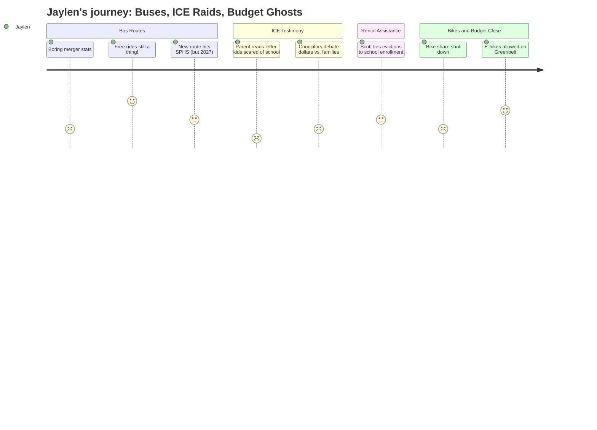

# Interpretation: Jaylen (PERSONA-012)
## Meeting: City Council Regular Meeting -- March 10, 2026 -- 2026-03-10

### Structured Points

#### 1. Free Student Bus Rides Still a Thing — and Metro Actually Met With Glenn
- **Fact:** Councilor Matthews asked directly whether students are still getting free bus rides. Metro confirmed yes, and added that they had recently met with SPHS principal Sarah Glenn specifically to discuss improving bus service to the high school — including aligning bus schedules with bell times.
- **Source:** Transcript [00:29:34–00:30:02]; public comment from Rosemary DeAngelis [00:35:40–00:36:56] corroborates, noting students are now riding free using their high school pass again after confusion during the transit merger.
- **Emotional valence:** positive
- **Threat level:** 1
- **Open question:** true — When does the improved schedule actually land? What does "incentivize more rides through the high school" mean in practice?

#### 2. The New Bus Plan Names the High School — But Won't Happen Until 2027
- **Fact:** Metro's proposed neighborhood connector route explicitly names "Highland Ave, the high school, the community center" as stops, and a Metro presenter stated these areas are "really underserved today" and called it "a really big opportunity." However, when asked about timeline, Metro said "the soonest those would roll out would be next year" — meaning 2027 at earliest.
- **Source:** Transcript [00:22:47–00:23:25]; timeline clarification [00:32:07–00:32:15]
- **Emotional valence:** negative
- **Threat level:** 2
- **Open question:** false — The answer is clear: not before Jaylen's senior year.

#### 3. A Parent's Letter Said Their Kids Were Too Scared to Go to School
- **Fact:** During public comment on rental assistance, a resident read a letter from a South Portland parent: "My children's school was on lockdown. A neighbor told me they saw ICE agents near the elementary school driveway. My kids were too scared to go to class, and I have lost work because I could not leave them alone."
- **Source:** Transcript [01:07:58–01:08:53]
- **Emotional valence:** negative
- **Threat level:** 4
- **Open question:** true — Which school? Are those kids still enrolled? Are they in Jaylen's classes?

#### 4. One Councilor Finally Said It Out Loud: Evicted Families = Fewer Students
- **Fact:** Councilor Scott explicitly connected the 80 South Portland families at housing risk to school enrollment, saying: "I see eighty families as being eighty students who may not be in that school system next year, and that's a much bigger financial burden than a hundred thousand dollars."
- **Source:** Transcript [01:29:34–01:29:54]
- **Emotional valence:** positive
- **Threat level:** 2
- **Open question:** true — If this is true, why isn't someone saying this at the school board too?

#### 5. The School Budget Crisis Was Invoked Five Times — and Never Actually Discussed
- **Fact:** Councilor Matthews referenced watching the school board meeting the night before, noting the board chair had warned councilors to be "very cautious of every dime we spend." The school budget's financial severity was cited repeatedly as a reason to limit spending — but the meeting included no discussion of what cuts would mean for students, programs, or staffing.
- **Source:** Transcript [01:22:43–01:23:00]; Matthews returns to school budget context at [01:23:06–01:23:14]
- **Emotional valence:** negative
- **Threat level:** 3
- **Open question:** true — What is actually being cut? Why was the school board meeting apparently more significant than this one, and why does no one explain this to students?

#### 6. The City Killed Bike Share — and Nobody Mentioned Students Once During That Debate
- **Fact:** The council voted down a one-year bike share pilot that would have provided 40 bikes across 8 stations, partly funded by $100,000 in state money. The sustainability director had specifically cited SMCC students as an example use case; no one mentioned high school students as potential users.
- **Source:** Transcript [03:01:00–03:03:00] (council reactions); SMCC example at [02:43:27–02:43:52]
- **Emotional valence:** negative
- **Threat level:** 1
- **Open question:** true — Would any of those stations have been near SPHS or along routes students actually use?

#### 7. E-Bikes Are Getting Allowed on the Greenbelt — for Real This Time
- **Fact:** Council reached consensus to allow at least Class 1 and Class 2 e-bikes on the Greenbelt, with several councilors pushing for Class 3 as well. An ordinance will come forward. The city's park ranger presented data showing e-bikes travel at an average speed of 10.15 mph on the Greenbelt — barely faster than regular bikes at 9.25 mph — and the parks department receives about one complaint per year about e-bikes.
- **Source:** Transcript [03:12:52–03:19:00]; speed data from park ranger Sydney Raftery [03:13:28–03:14:07]
- **Emotional valence:** positive
- **Threat level:** 1
- **Open question:** false — This one is actually moving forward.

---

### Journey Map

---

### Reactions

Okay so I actually watched chunks of this council meeting — my mom had it on and I ended up getting pulled in. The thing I needed to know first: free bus passes. Still a thing. A councilor literally just asked "are we still providing students free rides?" and Metro said yes. And more than that — they actually already had a meeting with Glenn, our principal, about making the bus schedule line up with our actual bell times. Which — okay, that would be huge? Because right now if you stay after for rehearsal you're basically walking home. So that part was genuinely good news.

The thing that got me was the rental assistance discussion. These two women came up and read letters from families in South Portland — like, they were reading other people's words because those people couldn't be there — and one letter was from a parent who said their kids' school went on lockdown after the January ICE thing and a neighbor saw agents near the school driveway. Their kids were "too scared to go to class." I know people at my school whose home situation got messed up in January. Nobody in that room said anything about high schoolers specifically, but that's real. That's in my building. And then this one councilor — Councilor Scott — said something I actually wrote down: she said those 80 families at risk of getting evicted are basically 80 students who might not be in the school system next year. That's the first time I heard someone in one of these meetings connect the policy stuff to what it means for kids who actually go here. I'll be honest, it hit.

Here's the thing that's still messing with me though: the school budget crisis came up like five different times in this meeting — every time someone wanted to argue against spending money, they'd bring up how bad the school budget is. But nobody at this meeting actually talked about the school budget. No one said what's being cut, what teachers are at risk, whether AP classes or theater survive. It's like there's this huge thing happening to my school that everyone knows about and keeps referencing, but the actual conversation about it is happening somewhere else, probably in a room I'm not allowed in. I have no vote. I've testified once. And the meeting that actually decides what my senior year looks like isn't this one, and nobody's told me when or where it is.