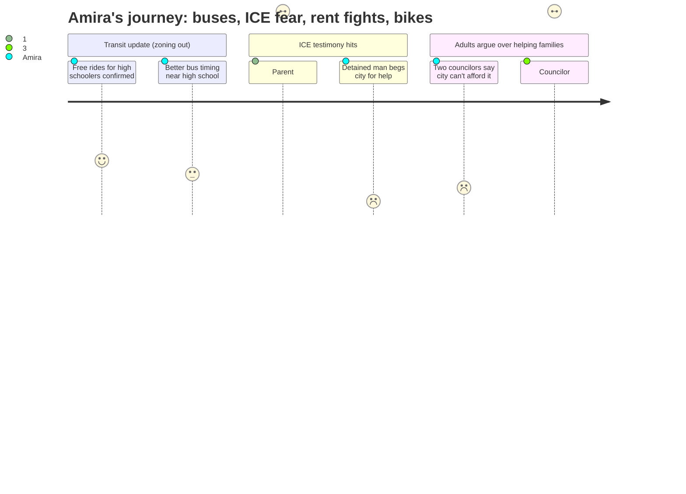

# Interpretation: Amira (PERSONA-013)
## Meeting: City Council Regular Meeting -- March 10, 2026 -- 2026-03-10

### Structured Points

#### 1. A Parent Said Her Kids Were Too Scared to Go to Class
- **Fact:** A public commenter read a letter from a South Portland parent who wrote: "I was terrified to send my children to school. Following the Catch of the Day operation, my children's school was on lockdown... My kids were too scared to go to class, and I have lost work because I could not leave them alone."
- **Source:** Transcript [01:07:58–01:08:20], public comment by Margot Kralik
- **Emotional valence:** negative
- **Threat level:** 5
- **Open question:** true

#### 2. A Man Was Detained, Fell in a Freezing Room, and Begged the City for Help
- **Fact:** The same commenter read a letter from a man detained by ICE who described being kept in a freezing room, falling because his shoes were too large, having his injury ignored, and losing his job upon release. His family faced eviction. He wrote: "Please, South Portland, help us."
- **Source:** Transcript [01:07:17–01:07:54], public comment by Margot Kralik
- **Emotional valence:** negative
- **Threat level:** 5
- **Open question:** true

#### 3. High School Students Can Still Ride Buses for Free
- **Fact:** Councilor Matthews asked if students still receive free rides, and Metro confirmed yes. A community speaker elaborated that after some confusion during the transit merger, the program was restored — high school students can now ride using their school ID pass.
- **Source:** Transcript [00:29:34–00:30:04], [00:36:24–00:36:29]
- **Emotional valence:** positive
- **Threat level:** 1
- **Open question:** true

#### 4. One Councilor Said Those 80 Families Are Also 80 Students
- **Fact:** Councilor Scott argued in favor of rental assistance by pointing out that the 80 South Portland households in need of help represent "eighty students who may not be in that school system next year," calling $100,000 a small investment to keep those families from leaving the city.
- **Source:** Transcript [01:29:46–01:30:01]
- **Emotional valence:** positive
- **Threat level:** 2
- **Open question:** false

#### 5. Two Councilors Said the City Can't Afford to Help Families — and Blamed the School Budget
- **Fact:** Councilor Matthews declined to support any rental assistance, citing the school board chair's call to be "cautious of every dime." Councilor West said the ICE surge lasted only four days and fewer than five people were arrested in South Portland, and proposed giving only $20,000.
- **Source:** Transcript [01:22:43–01:22:57], [01:25:29–01:27:54]
- **Emotional valence:** negative
- **Threat level:** 4
- **Open question:** true

#### 6. Broadway Is Still Too Dangerous for Kids to Bike — and the Council Couldn't Decide What to Do
- **Fact:** Multiple speakers testified that Broadway is too dangerous for cyclists, including a Bike Ped committee member who said his girlfriend is "terrified of Broadway" and needs to ride the sidewalk just to reach the Greenbelt. An 80-year-old e-bike rider said he would not ride Broadway between the bridge and Cottage Road. The council discussed whether to allow bikes on sidewalks for over 40 minutes and ended with no decision, asking staff to research further.
- **Source:** Transcript [03:11:52–03:11:58], [03:42:10–03:42:15], [03:51:20–03:51:40]
- **Emotional valence:** neutral
- **Threat level:** 2
- **Open question:** true

#### 7. Better Bus Service Near the High School Is Coming — Eventually
- **Fact:** Metro's presentation identified the high school and community center as areas "really underserved today" with "a lot of potential need for transit." Metro said it met with South Portland High School's principal to align bus timing with bell schedules. However, the new route restructuring would not be implemented until 2027 at the earliest.
- **Source:** Transcript [00:22:22–00:23:18], [00:29:52–00:30:04], [00:32:07–00:32:12]
- **Emotional valence:** positive
- **Threat level:** 1
- **Open question:** true

---

### Journey Map

---

### Reactions

Okay, Hooyo, so it wasn't really about the school budget like you asked — most of that meeting was about buses and bikes. But someone did bring it up. One of the councilors said he watched the school board meeting the night before and that the chair of the board said they have to be "cautious of every dime." So yeah, that's real. I don't know what it means for band yet but it's there.

What I actually couldn't stop thinking about were these letters. This woman came up and read them out loud — real letters from real people in South Portland. One was from a parent who said her kids were "too scared to go to class" after the January ICE thing. Like, that's our school. I kept thinking — were those kids at Memorial? Were they in my grade and I just didn't know? And then there was a letter from a man who actually got arrested and they kept him in a freezing room and he fell because his shoes were the wrong size and nobody helped him, and when he got out he lost his job and his family was about to lose their apartment. He literally ended the letter with "Please, South Portland, help us." Some councilors heard that and still said they couldn't afford to help because of the school budget. I don't know how you hold those two things in your head at the same time. One councilor said something that actually made sense though — she said those 80 families who need help are also 80 kids who might not be in our schools next year if they get evicted. I had never thought about it that way before. That ICE and the school losing kids — it's connected.

The bike stuff was also something I care about because I actually do try to ride to school sometimes and Broadway is genuinely terrifying. Turns out basically everyone agrees about that, even the councilors. But they argued about sidewalk rules for forever and couldn't decide anything. The mayor basically said "we'll figure it out later." And then someone mentioned the school budget again and "cautious of every dime" and now I'm just thinking about those families from the letters and whether they're still in their apartments, and whether the kids in those letters are going to show up to school on Monday, and whether my school is going to look the same next year.