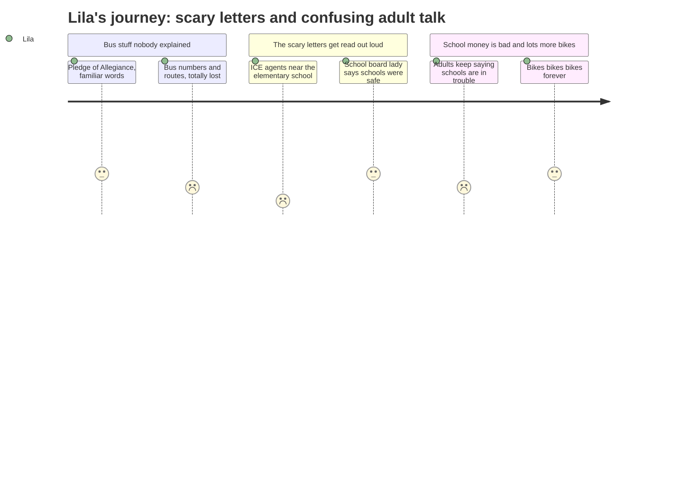

# Interpretation: Lila (PERSONA-014)
## Meeting: City Council Regular Meeting -- March 10, 2026 -- 2026-03-10

### Structured Points

#### 1. Someone said ICE was near an elementary school driveway
- **Fact:** A public commenter read a letter from a South Portland parent who said their children's school was on lockdown, that a neighbor saw ICE agents near the elementary school driveway, and that the children were too scared to go to class.
- **Source:** Transcript [01:08:00--01:08:20], public comment from Margot Kralik reading a resident letter
- **Emotional valence:** negative
- **Threat level:** 5
- **Open question:** true

#### 2. A dad got taken away and his family lost everything
- **Fact:** A second letter read aloud described a husband detained by ICE on his way to work. His wife used money saved for rent to pay for a lawyer and didn't know how to keep the apartment for the rest of the month.
- **Source:** Transcript [01:09:40--01:08:56], public comment letter read by Margot Kralik
- **Emotional valence:** negative
- **Threat level:** 4
- **Open question:** true

#### 3. The school board lady said no ICE came to the schools
- **Fact:** Rosemary DeAngelis, identified as a school board member, stated she was kept informed of ICE activity near South Portland schools and said she could confirm there were no ICE activities at any South Portland school and no children were taken from bus stops.
- **Source:** Transcript [01:15:52--01:16:40], public comment, Rosemary DeAngelis
- **Emotional valence:** positive
- **Threat level:** 1
- **Open question:** false

#### 4. Grown-ups at the meeting said the school money is really bad
- **Fact:** Councilor West said "I did listen to the school board last night… those are our children… we have a situation that is grim with our school budget." Councilor Matthews noted "school department is sixty-two percent of the entire budget" and repeated the school board chair's call to "be very cautious of every dime."
- **Source:** Transcript [01:27:35--01:27:43] (Councilor West); [01:22:44--01:24:35] (Councilor Matthews)
- **Emotional valence:** negative
- **Threat level:** 4
- **Open question:** true

#### 5. Someone said eighty kids might not be in school next year
- **Fact:** Councilor Scott argued for the rental assistance program in part by saying: "I see eighty families as being eighty students who may not be in that school system next year, and that's a much bigger financial burden than a hundred thousand dollars."
- **Source:** Transcript [01:29:46--01:29:57], Councilor Scott
- **Emotional valence:** negative
- **Threat level:** 3
- **Open question:** true

#### 6. The city voted to try to help families who can't pay rent
- **Fact:** The council reached agreement to bring forward an order at their next meeting to allocate money (discussed amounts ranged from $20,000 to $168,000) through a nonprofit called Project HOME to help South Portland families who lost income because of the ICE enforcement actions.
- **Source:** Transcript [01:44:32--01:45:05], City Manager summarizing council will; Agenda Item B.2
- **Emotional valence:** positive
- **Threat level:** 1
- **Open question:** false

#### 7. Kids can still ride the bus for free
- **Fact:** A question about whether students still receive free bus rides was answered with confirmation that they do, and that Metro had recently met with the South Portland High School principal to better align bus schedules with bell times.
- **Source:** Transcript [00:29:34--00:30:04], Q&A between Councilor Matthews and Metro Executive Director
- **Emotional valence:** positive
- **Threat level:** 1
- **Open question:** false

---

### Journey Map

---

### Reactions

My mom came home really late after that meeting and she looked tired and kind of sad. She told me someone read letters out loud, like from real people who live here. One letter was from a mom who said her kids were at an elementary school that went on lockdown and someone saw those government police people — ICE — right near the school driveway. And her kids were too scared to even go to class. I kept thinking about that, like, is that a school like mine? Is that like Dyer? What if that happened when I was just trying to walk in? I couldn't stop thinking about it. And then there was another letter about a dad who got taken away when he was just going to work. He wasn't doing anything. And his wife had to spend all the money for rent on a lawyer. What happened to their kids? Are they still at school? Do they have to move now?

My mom said most of the meeting was really long and boring and about buses and bikes and stuff I don't know about. I didn't really understand any of it. But she said some important people at the meeting kept talking about the school and how the school money is like — she used the word "grim." That's a scary word. I asked if that's why Dyer is closing and she did that thing where she takes a long breath. Someone at the meeting said that like eighty kids might not even be in school next year. Eighty kids! I don't know who they are or why. Are some of them from Dyer? Are they in my grade? What happened to make them have to leave?

The one okay part was that the school board lady — I think she's on the school board — she said out loud that no ICE people actually came to any of our schools. And no kids got taken from bus stops. So that part was better. But I still don't totally feel better because the kids in that letter were scared even before anyone showed up, and I kind of understand that. And the money stuff is still really bad. Everything feels like it's getting smaller and I don't know which part stays and which part goes away.