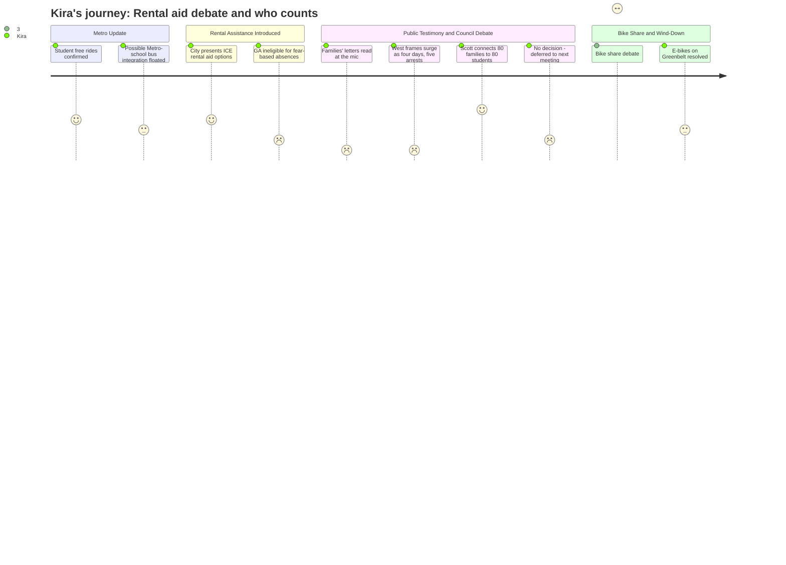

# Interpretation: Kira (PERSONA-015)
## Meeting: City Council Regular Meeting -- March 10, 2026 -- 2026-03-10

### Structured Points

#### 1. High School Students Still Riding Free — And a Bigger Idea Floated
- **Fact:** Metro confirmed students continue to ride at no cost using their high school pass, and school board member Rosemary DeAngelis flagged a pending conversation between Metro and the district's facilities director about potentially having high school students use Metro for their school bus route — a change that would have cost implications for the school budget.
- **Source:** [00:29:17--00:30:26] and [01:27:07--01:27:58]
- **Emotional valence:** neutral
- **Threat level:** 2
- **Open question:** true

#### 2. General Assistance Cannot Help Families Who Stayed Home Out of Fear
- **Fact:** Social services director Chris Pupke confirmed that under state guidance, missing work specifically out of fear of encountering immigration enforcement does not constitute "just cause" for GA eligibility — meaning employed families who kept their children home and stayed off the streets during the surge were likely ineligible for the one municipal program designed to help them.
- **Source:** [00:58:50--01:00:00]
- **Emotional valence:** negative
- **Threat level:** 4
- **Open question:** true

#### 3. Affected Families' Firsthand Accounts Read Aloud
- **Fact:** Two community members read letters from South Portland residents: a man detained by ICE who lost his job and received an eviction notice after release; a parent who kept children home from a school that went on lockdown, forfeiting wages; a woman whose detained husband was the family's sole earner, who spent their rent savings on a lawyer.
- **Source:** [01:06:44--01:09:27]
- **Emotional valence:** negative
- **Threat level:** 5
- **Open question:** false

#### 4. Councilor West Frames the Surge as "Four Days, Less Than Five Arrests" in South Portland
- **Fact:** Drawing on police chief testimony, Councilor West argued that the surge lasted only four days statewide, with fewer than five estimated arrests in South Portland, and that people of color who continued working and paying rent during the surge should also be considered — using this framing to advocate for a $20,000 contribution rather than a larger amount.
- **Source:** [01:02:51--01:03:28] and [01:25:58--01:26:24]
- **Emotional valence:** negative
- **Threat level:** 4
- **Open question:** true

#### 5. Councilor Scott Connects 80 Families to 80 Students — and Budget Math
- **Fact:** Councilor Scott explicitly argued that the roughly 80 South Portland households needing assistance represent 80 students who may leave the district, calling $100,000 a "small investment" to keep those families in South Portland and contributing to the school system and tax base — and called the surge "absolutely atrocious" regardless of the arrest count.
- **Source:** [01:28:44--01:30:15]
- **Emotional valence:** positive
- **Threat level:** 2
- **Open question:** false

#### 6. School Board Member Holds Two Competing Urgencies in One Public Comment
- **Fact:** School board member Rosemary DeAngelis, speaking as a public commenter, cited the school board chair's directive to "be cautious with every dime we spend" given the budget crisis — while simultaneously recommending an initial $50,000 donation to Project HOME with potential for more, and noting she is "sensitive to the financial responsibilities on everyone right now."
- **Source:** [01:16:31--01:17:50]
- **Emotional valence:** neutral
- **Threat level:** 3
- **Open question:** true

#### 7. No Funding Amount Decided Tonight — Matter Deferred to Next Regular Meeting
- **Fact:** After council members offered individual positions ranging from $0 to $168,000, the city manager averaged suggestions to approximately $94,000–$100,000 and said he would bring a formal order to the next meeting. No money was committed, no check will be cut until at least the next council session.
- **Source:** [01:43:51--01:45:44]
- **Emotional valence:** negative
- **Threat level:** 4
- **Open question:** true

### Journey Map

### Reactions

Okay, I stayed up until almost midnight watching that meeting and the part I cannot get out of my head is when Councilor West cited the police chief saying "less than five arrests in South Portland, four-day surge" like that was supposed to settle something. I have kids in my caseload at two different buildings whose parents didn't come to work for two weeks after January. Two weeks. Which meant those kids weren't coming in, which meant they were falling further behind on the interventions we'd barely gotten them into in the first place. Four days of operations. Weeks of disruption. None of that shows up in arrest numbers, and it drives me up a wall when someone with a spreadsheet tells me what I'm not seeing in my own buildings.

What actually made me exhale was Councilor Scott. She said something I've been saying in every planning period since January: those 80 families on Project HOME's list aren't just 80 rent situations — they are 80 kids. Our district enrollment is already down more than 300 students in four years. If 80 more families get evicted or just quietly pull back from the community, that's lost per-pupil funding on top of the positions we're already cutting. She connected those two things out loud in a City Council meeting, and it landed. The $100,000 isn't charity work. It is literally cheaper than the downstream cost of losing those students from the system, and anyone who has watched enrollment decline in real time knows it.

The thing still eating at me is the GA piece. Chris Pupke confirmed that if you stayed home because you were terrified — if you did the responsible thing and didn't expose yourself to risk — the state says that's not "just cause" for missing work, so you don't qualify for General Assistance. The families who were doing everything right, who were employed and paying rent and sending their kids to schools where I work every day — those are exactly the families the system leaves out. And tonight ended without a number on the table. The council agreed something should happen, and then deferred it to the next meeting. I don't know what I'm supposed to say to the family I know at one of my buildings who is already weeks behind on rent. They don't have a next meeting.