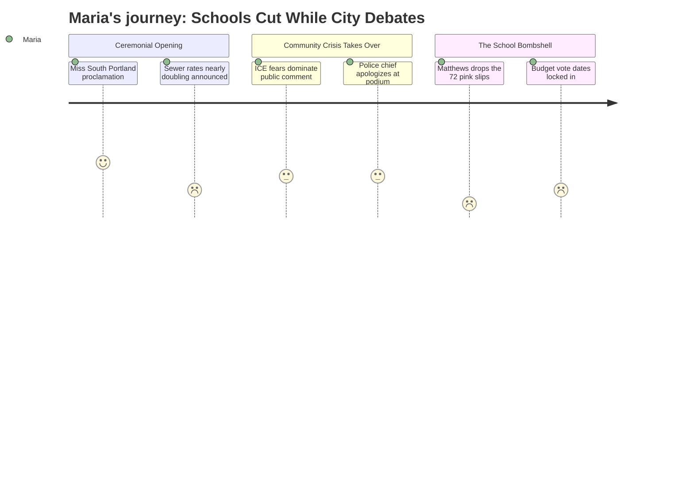

# Interpretation: Maria (PERSONA-001)
## Meeting: City Council Regular Meeting -- March 19, 2026 -- 2026-03-19

### Structured Points

#### 1. Budget timeline is locked: school vote May 5, referendum June 9
- **Fact:** The council unanimously approved a consent calendar order setting April 7 as the public hearing date for the FY27 budget. The agenda specifies the school budget workshop for April 14, council vote on the school portion for May 5, and the public referendum for June 9, 2026.
- **Source:** Consent Calendar, ORDER #161-25/26; transcript [04:39]
- **Emotional valence:** negative
- **Threat level:** 4
- **Open question:** true

#### 2. Seventy-two school staff received pink slips the day before this meeting
- **Fact:** Councilor Matthews stated, while arguing against the $100,000 Project HOME appropriation: "72 people in the school department got their pink slips yesterday. 72. Your school department has an $8.4 million deficit... 72 is just the first wave of people." He also referenced the possibility of "closing schools."
- **Source:** Transcript [01:37:20]
- **Emotional valence:** negative
- **Threat level:** 5
- **Open question:** true

#### 3. Forty-two teachers are among 78 positions proposed for elimination district-wide
- **Fact:** The FY27 proposed budget eliminates 78 total positions — 12% of all staff — including 42 teachers and 16 educational technicians, driven by a $7.2M structural gap between current costs and available revenue under the council's 6% tax-increase ceiling.
- **Source:** FY27 Budget Fiscal Context
- **Emotional valence:** negative
- **Threat level:** 5
- **Open question:** true

#### 4. Sewer rates will rise 22% per year for three years — on top of any tax increase
- **Fact:** Finance Director Ellen Sanborn and CDM Smith consultant Adam Simonson presented a revenue bond plan requiring approximately 22% annual sewer fee increases for FY27, FY28, and FY29, adding roughly $9.70/month in FY27 and an additional $11.80/month in FY28 for the average residential customer, entirely separate from property tax increases.
- **Source:** Transcript [48:17]–[01:12:00]; Agenda, Memo — Sewer Revenue Bond, Finance Director Sanborn
- **Emotional valence:** negative
- **Threat level:** 3
- **Open question:** false

#### 5. State funding covers only 20% of school costs — roughly half what it should
- **Fact:** State aid to South Portland schools funds approximately 20% of actual per-pupil costs, while the statutory formula is designed to cover approximately 55%. This funding shortfall is cited as a primary structural driver of the district's deficit.
- **Source:** FY27 Budget Fiscal Context
- **Emotional valence:** negative
- **Threat level:** 4
- **Open question:** true

#### 6. Council voted 6–1 to approve $100,000 in rental assistance, with school cuts as the lone dissent's argument
- **Fact:** The council approved $100,000 from the city's undesignated fund balance for Project HOME rental assistance to residents affected by ICE enforcement. Councilor Matthews cast the sole no vote, explicitly citing the 72 school pink slips and the $8.4M school deficit as his reason. No other councilor addressed the school budget in response.
- **Source:** Transcript [01:28:47]–[01:40:29]
- **Emotional valence:** neutral
- **Threat level:** 2
- **Open question:** true

#### 7. South Portland's per-pupil cost is the highest among comparable districts, while elementary enrollment fell 23%
- **Fact:** South Portland's per-pupil expenditure is $26,651 — the highest among comparable regional districts. Elementary enrollment dropped 23% in four years (from 1,401 to 1,080 students), while district staffing grew by 82 positions over the same period. Both figures are being used to justify the scale of cuts.
- **Source:** FY27 Budget Fiscal Context
- **Emotional valence:** neutral
- **Threat level:** 3
- **Open question:** true

---

### Journey Map

---

### Reactions

So I went to city council tonight — not the school board, the *city* council — because I needed to see where things stood on the budget calendar, and I wanted to be in the room when they voted on anything that touched school funding. And I sat through forty-five minutes of stormwater compliance and another half hour of sewer infrastructure diagrams, which, fine, the infrastructure needs to get fixed, I get it. But then they tell us our sewer bill is going up 22% a year for the next three years. Twenty-two percent. On top of whatever property taxes end up doing. We are getting squeezed from every direction at the exact same moment they're cutting 42 teachers.

Here's the part I can't stop thinking about. They were voting on the $100,000 for Project HOME — the rental assistance for families affected by ICE — and Councilor Matthews stands up to vote no, and the reason he gives is the schools. He said, and I wrote this down because I couldn't believe it came out of a city councilor's mouth like it was a footnote: *"72 people in the school department got their pink slips yesterday. 72. Your school department has an $8.4 million deficit."* And then he mentioned *closing schools*. Just said it. And the rest of the council voted yes, six to one, and nobody — not a single person at that table — said anything further about the 72 people. I'm not saying the rental assistance was wrong. Those families are real and they needed help. But the way he used the schools as his throwaway argument, and then nobody pushed back on what that actually *means*, that's what I can't shake. Nobody asked: which schools are closing? Which teachers? What happens to kids who need the ed tech support?

The only thing I got out of tonight that I can actually use is the calendar. The public hearing is April 7. The school budget workshop — where they actually present the details — is April 14. Council votes on the school portion May 5. The referendum is June 9. Six weeks from now, we vote. I'm putting all of this in the parent group chat and the neighborhood Facebook group tonight because I guarantee most parents in this district do not know those dates yet. April 14 is our real window — that's when they present the school budget and we can ask what "42 teachers" actually means in terms of class sizes and specialists and whether my kids' art teacher still has a job. If we show up in numbers at that workshop, it matters. If we wait until May 5, the math is already done.