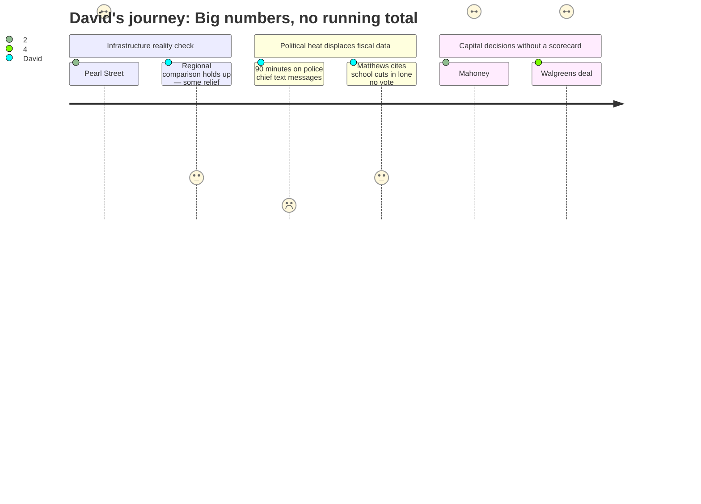

# Interpretation: David (PERSONA-002)
## Meeting: City Council Regular Meeting -- March 19, 2026 -- 2026-03-19

### Structured Points

#### 1. School Budget Calendar Now Has Hard Dates
- **Fact:** Consent calendar Order #161-25/26 set April 7 as the FY27 budget public hearing date. The full schedule embedded in the agenda specifies Budget Workshop #1 on April 14 (School is the first department listed), Workshop #2 on April 28, council vote on the school budget May 5, and the school budget referendum June 9, 2026.
- **Source:** City Council Agenda — 2026-03-19, Consent Calendar Item E.5 (Order #161-25/26); Transcript [04:39]
- **Emotional valence:** neutral
- **Threat level:** 1
- **Open question:** false

#### 2. Sewer Rates Headed for 22% Annual Increases — Three Years Running
- **Fact:** The Pearl Street Pump Station replacement ($38.9M total project cost) and sludge dewatering upgrade ($12.8M) require $51.68M in revenue bonds. CDM Smith's feasibility study projects 22% annual rate increases for FY27, FY28, and FY29 — on top of a 4% annual operating increase — roughly doubling the monthly residential sewer bill from ~$7.38 to ~$14.76. Revenue bonds carry a 1.25x debt service coverage covenant and a ramp-up to 365 days cash on hand.
- **Source:** Transcript [45:55]–[48:17], Pearl Street Pump Station presentation (Fred Dillon, Ellen Sanborn, Adam Simonson)
- **Emotional valence:** negative
- **Threat level:** 3
- **Open question:** true

#### 3. The Regional Sewer Rate Comparison Actually Holds Up
- **Fact:** CDM Smith's analysis shows that even after three years of 22% increases, South Portland's sewer rate will remain roughly competitive with neighboring communities — because Westbrook, Gorham, and others face similar infrastructure investment cycles. South Portland currently has the lowest rate in the region; the model shows it ending up near the middle of the pack, not at the top.
- **Source:** Transcript [61:30]–[62:18], Adam Simonson comparative rate presentation
- **Emotional valence:** positive
- **Threat level:** 1
- **Open question:** false

#### 4. One Councilor Tried to Articulate the Cumulative Fiscal Picture — and Got Outvoted 6-1
- **Fact:** When the $100,000 Project HOME appropriation came to a vote, Councilor Matthews cast the lone dissent, explicitly citing "72 people in the school department got their pink slips yesterday," an "$8.4 million" school deficit, the prospect of sewer rate increases, and the general fund tax burden. No other councilor engaged substantively with the cross-budget math. The motion passed 6-1.
- **Source:** Transcript [137:20]–[138:58]
- **Emotional valence:** neutral
- **Threat level:** 2
- **Open question:** true

#### 5. Mahoney Price Tag Is $70–76M Even After Stripping It Down
- **Fact:** SMRT architect Craig Piper reported that the scaled-down Mahoney renovation — library removed, police station removed, third floor left vacant — still carries a total project cost of $70–76M ($52–56M construction plus indirect costs). By contrast, a new standalone city hall would cost approximately $38–45M and yield more usable square footage per dollar. Council consensus was to delay any referendum to at least November 2027, but no scope, financing model, or RFP direction was formally adopted.
- **Source:** Transcript [148:17]–[156:07], Mahoney workshop, Craig Piper (SMRT)
- **Emotional valence:** negative
- **Threat level:** 3
- **Open question:** true

#### 6. Walgreens Site Purchase Is Cleanly Financed
- **Fact:** The city accepted a $2.525M offer for 279 Main Street (former Walgreens), funded with $1.5M in police asset forfeiture funds and $1M in previously earmarked TIF funds. No property tax increase required. The test-fit study from SMRT confirms the site can accommodate a police station. Council voted unanimously to authorize the purchase and sale agreement.
- **Source:** City Council Agenda — 2026-03-19, Order #168-25/26; Transcript [220:47]; Agenda position paper (City Manager)
- **Emotional valence:** positive
- **Threat level:** 1
- **Open question:** false

#### 7. The Meeting Handled Three Major Capital Commitments With No Integrated Taxpayer Impact Analysis
- **Fact:** In a single evening, the council addressed $51.7M in sewer revenue bonds (22% rate increases for 3 years), a likely Mahoney bond in 2027 (still undefined, $70–76M range discussed), and a public safety bond referendum in November 2026 (construction cost still being estimated). These were siloed agenda items with no aggregated analysis of concurrent household impact — even as the school budget, per the fiscal context provided, already faces a structural gap that would require an 18–19% property tax increase to simply roll forward.
- **Source:** Agenda Items C.2 (Pearl Street), H.1 (Mahoney), I.5 (Walgreens/public safety); Fiscal Context (structural gap and 6% tax ceiling); Transcript [137:20] (Matthews dissent)
- **Emotional valence:** negative
- **Threat level:** 4
- **Open question:** true

---

### Journey Map

---

### Reactions

So the short version is: your sewer bill is going to roughly double over the next three years. Not a typo. They had a whole presentation — CDM Smith did the financial feasibility study, and the number they kept saying was 22% per year for FY27, FY28, and FY29, plus 4% operating on top of that. The Pearl Street Pump Station alone is $38.9M, there's a dewatering upgrade for another $12.8M, total north of $51M in revenue bonds. The one silver lining is they showed a chart where even after all that, we'd still be somewhere in the middle of Greater Portland sewer rates by FY29 — because Westbrook and Gorham and everyone else has the same aging infrastructure problem. So it's bad, but it's bad everywhere. Still — $9.70/month in year one, $11.80/month in year two. Mark it in your budget.

Here's what actually got me though: nobody in that room tried to add it all up. Same night they approved the sewer bond path, they spent two hours on a Mahoney building that — even scaled down with the library stripped out and the third floor left vacant — is going to cost $70 to $76 million. A new city hall from scratch would run $38 to $45 million. They're going to defer that decision to a 2027 referendum. And separately, they're putting a public safety bond on the ballot this November — cost still being estimated. So you've got sewer rates doubling, a school tax that's going to spike hard in June, and two more bond asks in the queue, and no one presented a single slide showing what all of this looks like on one household's property tax bill simultaneously. That's the thing that would actually help people make decisions.

One moment I did appreciate: Councilor Matthews voted no on the $100K Project HOME appropriation — lone dissent — and specifically said "72 people in the school department got their pink slips yesterday" and referenced an $8.4M school deficit. That number doesn't match the $7.2M figure I've been tracking from other sources, so I want to figure out where the discrepancy is. But the point he was making is the right question to ask: how much can the general fund absorb when it's already stretched? Nobody else on the council touched that math. Six to one. I'm not saying he was right to vote no — there are legitimate arguments either way on the rental assistance — but he's the only one who said out loud that all these buckets are connected. That's the conversation the city needs to be having, and this meeting spent maybe thirty seconds on it.