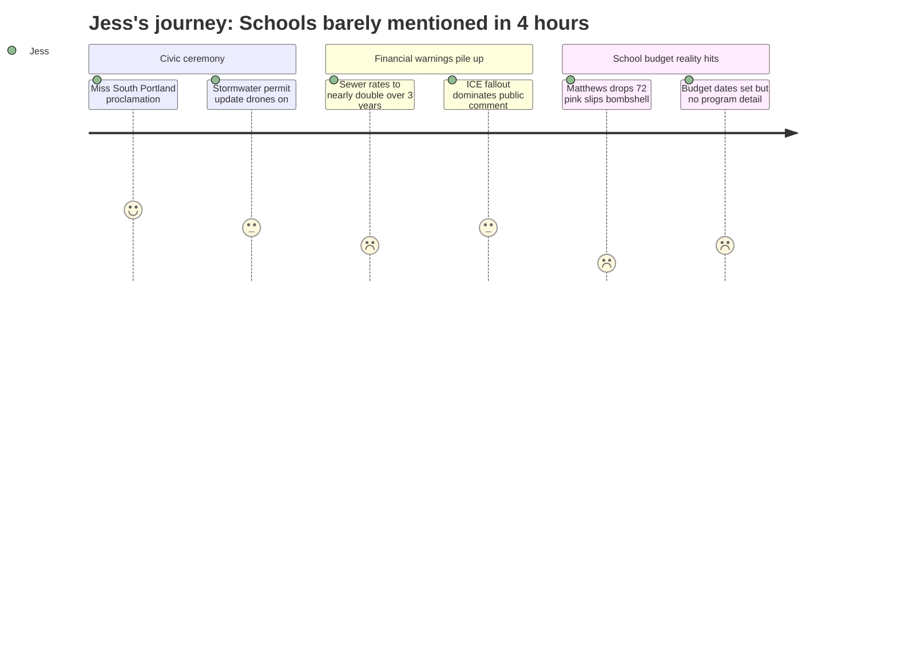

# Interpretation: Jess (PERSONA-003)
## Meeting: City Council Regular Meeting -- March 19, 2026 -- 2026-03-19

### Structured Points

#### 1. 72 School Employees Received Pink Slips the Day Before
- **Fact:** Councilor Matthews, while voting against the $100,000 rental assistance appropriation, disclosed that 72 people in the school department received layoff notices the previous day and cited an $8.4 million school deficit.
- **Source:** Transcript [~137:20--138:58]
- **Emotional valence:** negative
- **Threat level:** 5
- **Open question:** true

#### 2. School Budget Vote and Referendum Dates Are Now Set
- **Fact:** The council voted to set April 7, 2026 as the FY27 budget public hearing date. The school budget vote is scheduled for May 5, 2026, with the public referendum on June 9, 2026.
- **Source:** Agenda item E5, ORDER #161-25/26; confirmed in transcript [~04:39]
- **Emotional valence:** neutral
- **Threat level:** 2
- **Open question:** true

#### 3. Schools Are First Up at the April 14 Budget Workshop -- But Tonight Had No School Discussion
- **Fact:** Per the City Manager's position paper on the budget hearing order, the first budget workshop on April 14 leads with the School department. However, aside from Councilor Matthews' passing remark, no councilor, presenter, or member of the public raised schools or school programming at this four-hour-plus meeting.
- **Source:** Agenda item E5 position paper (budget workshop schedule); full transcript absence of substantive school discussion
- **Emotional valence:** negative
- **Threat level:** 4
- **Open question:** true

#### 4. Sewer Rates Will Increase Roughly 22% Per Year for Three Consecutive Years
- **Fact:** Finance Director Ellen Sanborn and consultant Adam Simonson presented a financial feasibility analysis showing that sewer user fees must increase approximately 22% annually in FY27, FY28, and FY29 to fund the Pearl Street Pump Station and sludge dewatering projects -- equivalent to roughly $9.70 more per month in FY27 and another $11.80 per month in FY28.
- **Source:** Transcript [~48:17--50:39]
- **Emotional valence:** negative
- **Threat level:** 3
- **Open question:** false

#### 5. Property Tax Burden Also Expected to Rise Sharply
- **Fact:** Councilor Matthews explicitly linked the school deficit and sewer increases together, stating: "Our tax rate is gonna go way up between the city and the school department needs."
- **Source:** Transcript [~138:06]
- **Emotional valence:** negative
- **Threat level:** 4
- **Open question:** true

#### 6. Community Showed Up in Force -- But Not About Schools
- **Fact:** Citizen Discussion Part I drew at least eight speakers, spending the majority of the public comment time on immigration enforcement, the police chief's text messages, and community trust. No speaker addressed school cuts, enrollment, or programming.
- **Source:** Transcript [~73:13--103:20]
- **Emotional valence:** neutral
- **Threat level:** 1
- **Open question:** true

#### 7. The $100,000 Rental Assistance for Families Affected by ICE Passed 6-1
- **Fact:** The council approved $100,000 from the undesignated fund balance to Project Home for rental assistance to approximately 50 South Portland households affected by federal immigration enforcement. The sole dissenting vote was Councilor Matthews, who cited the school department's layoffs and deficit as reasons to protect the general fund.
- **Source:** Transcript [~130:20--140:29]
- **Emotional valence:** positive
- **Threat level:** 1
- **Open question:** false

### Journey Map

### Reactions

Okay so I watched basically four hours of the city council meeting tonight and I need to tell you what happened because I cannot stop thinking about it. Someone — one of the councilors, the one who votes no on everything — just casually dropped that the school department handed out 72 pink slips YESTERDAY. Seventy-two. As in, while I was giving Emma a bath, dozens of teachers and staff were getting laid off. And he said it in passing, to make a point about why they shouldn't spend a hundred thousand dollars on something else. That was literally the only time anyone mentioned the schools in the entire four-hour meeting. No one asked what programs are being cut. No one said whether kindergarten is going to look different. Nothing. I have no idea if the teacher Emma would've had is still going to have a job.

And the worst part is I've been trying to figure out if this is the kind of thing where they just haven't decided yet, or if it's already decided and nobody's telling families like us. There IS a school budget vote on May 5th and a referendum on June 9th — so at least I know when to watch — but tonight gave me nothing about what's actually on the chopping block. I checked the agenda, and the April 14th budget workshop is supposed to cover the schools first. So maybe that's when we find out? But it also feels like decisions are already being made right now, like those 72 people found out yesterday, and by the time regular parents tune in it's going to be too late to do anything about it.

Oh, and the sewer rates are going up something like 22% a year for three years, which apparently is on top of whatever the property tax increase is going to be from the school crisis. One of the councilors literally said "our tax rate is gonna go way up between the city and the school department needs." So I'm sitting here thinking — the schools are falling apart, my bill for literally flushing the toilet is going to double, and the city is also trying to figure out where to build a police station and whether to renovate some old school building for $70 million. I don't even know how to explain to people who don't have young kids why this feels so different when it's your child's future and not just an abstract budget number.