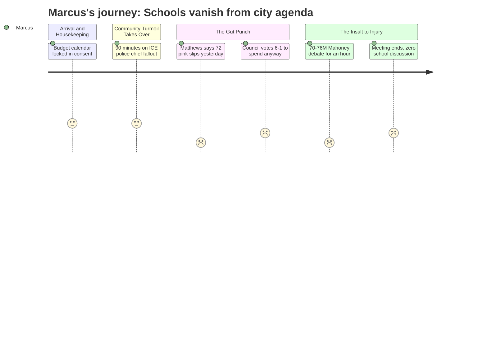

# Interpretation: Marcus (PERSONA-004)
## Meeting: City Council Regular Meeting -- March 19, 2026 -- 2026-03-19

---

### Structured Points

#### 1. The Clock Is Now Running on the School Budget
- **Fact:** The City Council set April 7 as the FY27 budget public hearing date. The agenda's budget workshop schedule places "School" as the first item on April 14. The council votes on the school budget May 5, with a referendum June 9.
- **Source:** City Council Agenda, Order #161-25/26; Agenda item E.5 position paper
- **Emotional valence:** neutral
- **Threat level:** 3
- **Open question:** true — Will the April 14 workshop be a real opportunity to push back on proposed cuts, or just a presentation of a fait accompli?

#### 2. "72 People Got Their Pink Slips Yesterday"
- **Fact:** During the debate over $100,000 in rental assistance, Councilor Matthews stated: "72 people in the school department got their pink slips yesterday. 72. Your school department has an $8.4 million deficit." He added, "72 is just the first wave."
- **Source:** Transcript [137:20]
- **Emotional valence:** negative
- **Threat level:** 5
- **Open question:** true — If 72 is the first wave, how many more are coming? And what's the criteria for who got the pink slips — which departments, which positions?

#### 3. The General Fund Spent $100,000 Tonight — Over a School Budget Objection
- **Fact:** The council voted 6-1 to appropriate $100,000 from undesignated fund balance to Project HOME for immigrant residents facing eviction. Councilor Matthews cast the sole dissent explicitly citing the school budget: "I in good conscience cannot support using money from the general fund when they're talking about closing schools."
- **Source:** Transcript [137:20–140:29]
- **Emotional valence:** negative
- **Threat level:** 3
- **Open question:** true — What is the current balance of the undesignated fund balance, and how much remains available as a buffer before the school vote?

#### 4. The City Spent Four Hours on a $70–76 Million Building While Schools Cut Positions
- **Fact:** The council held an extended workshop on the Mahoney project, which the design team estimated would cost $70–76 million even in its scaled-down form. A new City Hall at a different site was estimated at $38–45 million. The school system, which is eliminating positions, received zero substantive discussion at this meeting.
- **Source:** Transcript [148:17–149:03]; City Council Agenda, Workshop item H.1
- **Emotional valence:** negative
- **Threat level:** 4
- **Open question:** false — The contrast speaks for itself.

#### 5. Sewer Rates Are Doubling — and That Hits the Referendum Math
- **Fact:** The Finance Director and CDM Smith presented a plan requiring approximately 22% annual sewer rate increases for three years, adding roughly $9.70/month in FY27 and $11.80/month in FY28. This comes on top of whatever property tax increase the school referendum will require.
- **Source:** Transcript [48:17–51:25]; City Council Agenda, Petition C.2
- **Emotional valence:** negative
- **Threat level:** 3
- **Open question:** true — If voters are already absorbing sewer rate increases, how does that affect their appetite for a school budget referendum in June?

#### 6. No One at This Meeting Spoke Up for the 72
- **Fact:** The school budget — and the people receiving pink slips — came up only as a rhetorical counterpoint in a debate about something else. No councilor, administrator, or member of the public addressed the substance of the school cuts, the positions at risk, or the impact on students. The school system's crisis was a footnote.
- **Source:** Transcript [137:20–140:29]; review of full 4-hour transcript showing no other school budget discussion
- **Emotional valence:** negative
- **Threat level:** 4
- **Open question:** true — Is anyone on the city council prepared to advocate for the school budget in May, or will the board face this alone?

#### 7. The Referendum Is June 9 — With No Cushion
- **Fact:** The school budget referendum is set for June 9, 2026. The city's position paper for Order #161 confirms the council votes May 5. Given that the fund balance is effectively depleted and the board has set a 6% tax ceiling, voters will be asked to weigh in on a budget shaped by cuts, not choices.
- **Source:** City Council Agenda, Order #161-25/26 position paper; Fiscal Context
- **Emotional valence:** negative
- **Threat level:** 4
- **Open question:** true — What does the union's public communications plan look like between now and June 9?

---

### Journey Map

---

### Reactions

So I sat through four and a half hours of city council last night, and you know what the school budget got? One sentence. One. Councilor Matthews said it during the vote on the $100,000 rental assistance — "72 people in the school department got their pink slips yesterday, 72, your school department has an $8.4 million deficit" — and then the conversation moved right along. Lost 6-1. And I get it, I understand what's happening with our immigrant neighbors and I'm not heartless, but that was the only moment anyone said anything about the 78 people who just found out their jobs might be gone. One sentence, and it was used as a political argument, not because anyone actually cared about following up.

And then — and I need you to hear this — they spent a solid hour on the Mahoney building. You know, the old high school. The renovation estimate came in at $70 to $76 million. Seventy to seventy-six million dollars. For a building with a vacant floor and no plan for what goes in it. And they went around and around about whether to do a November referendum on it, or a 2027 referendum, or maybe bring in a developer, or maybe use the library building for back-office city staff... I'm sitting there thinking, I know colleagues who got pink slips yesterday, and this council is doing an hour on square footage costs for a building nobody can afford. The new City Hall option — without the fancy stuff — is $38 to $45 million. Just to put that next to "we need $7.2 million in cuts to our school budget."

Here's what's actually keeping me up: the referendum is June 9. May 5 the council votes. April 14 is the first budget workshop, and they put the schools first on that agenda — which could be a good sign or could just mean they want to get it out of the way early. The public hearing is April 7. That's our window, and it's tight. I need to know what the union's plan is between now and then, because this council went four and a half hours last night and the school cuts were background noise. If we don't show up loud and organized at that April 7 hearing, this is going to sail through and we're going to spend the rest of the year teaching 30-kid classes wondering what happened.