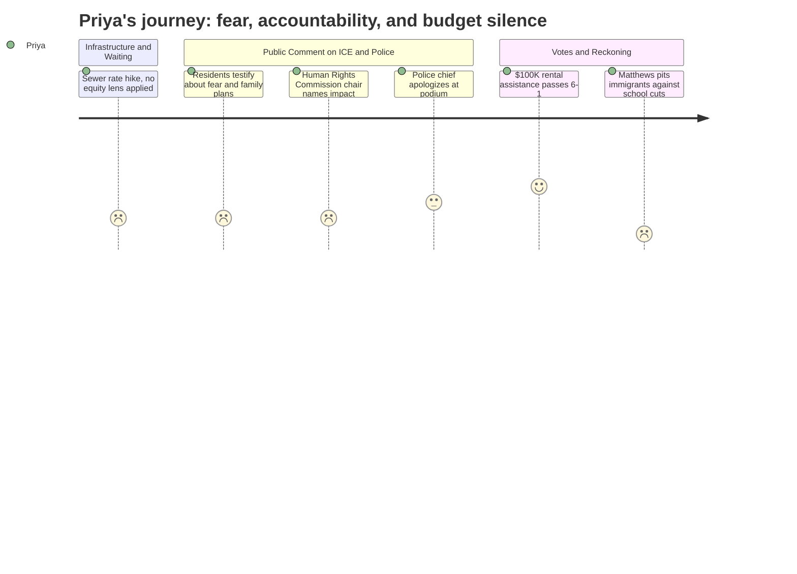

# Interpretation: Priya (PERSONA-005)
## Meeting: City Council Regular Meeting -- March 19, 2026 -- 2026-03-19

### Structured Points

#### 1. Human Rights Commission Chair Testifies His Own Family Planned for Detentions
- **Fact:** Pedro Vasquez, speaking as chair of the South Portland Human Rights Commission, testified in his private capacity that his own family had carried documentation and discussed contingency plans for detention during the ICE surge — and that two months later, community members were still withdrawing from work, school, and civic life.
- **Source:** Transcript [92:38–95:51]
- **Emotional valence:** negative
- **Threat level:** 4
- **Open question:** true

#### 2. $100,000 Rental Assistance for Immigration-Impacted Residents Passes 6–1
- **Fact:** The council voted 6–1 to appropriate $100,000 from undesignated fund balance to Project Home, a Quality Housing Coalition program, for rental assistance to South Portland residents impacted by immigration enforcement. City staff estimated it would assist approximately 50 households through direct payments to landlords.
- **Source:** Transcript [129:34–140:29]; Order #167-25/26 (agenda item I.4)
- **Emotional valence:** positive
- **Threat level:** 2
- **Open question:** true

#### 3. Police Chief Acknowledges He Did Not Push Back on Racist Text from Federal Agent
- **Fact:** Chief Ahern publicly acknowledged at the podium that when the HSI agent's text included a racial slur about immigrants being deported to "their s\*\*\*\*\*\*e countries," he did not push back — calling it a "missed opportunity" and saying "I can do better than that."
- **Source:** Transcript [103:45–110:07]
- **Emotional valence:** negative
- **Threat level:** 3
- **Open question:** true

#### 4. Lone "No" Vote Frames Immigrant Rental Aid as Competing with School Budget
- **Fact:** Councilor Matthews cast the sole vote against the $100,000 appropriation, citing the 72 school staff who received pink slips the day before and the district's $8.4M deficit, framing the rental assistance as taking taxpayer money at a time of school budget crisis.
- **Source:** Transcript [137:20–138:58]
- **Emotional valence:** negative
- **Threat level:** 4
- **Open question:** true

#### 5. School Budget Crisis: 78 Positions Cut, No Disaggregated Impact Data in Evidence
- **Fact:** The fiscal context provided for this meeting shows 78 positions proposed for elimination — including 42 teachers and 16 ed techs — representing 12% of district staff. The school budget was not on tonight's agenda, and no discussion in this meeting addressed which schools, programs, or student populations bear the greatest burden of these cuts.
- **Source:** Fiscal Context; Councilor Matthews reference to "72" pink slips at transcript [137:20]
- **Emotional valence:** negative
- **Threat level:** 5
- **Open question:** true

#### 6. Sewer Rate Increase of 22% Annually for Three Years — No Low-Income Mitigation Discussed
- **Fact:** The council received a detailed presentation projecting sewer user fee increases of approximately 22% per year for FY27, FY28, and FY29 to support $51.7M in revenue bonds for infrastructure. Neither the presentation nor councilor questions addressed rate assistance programs or the disproportionate burden on lower-income households.
- **Source:** Transcript [40:26–63:03]; Agenda item C.2 (Sewer Revenue Bond memo)
- **Emotional valence:** negative
- **Threat level:** 3
- **Open question:** true

#### 7. Community Withdrawal From Work and School Explicitly Named as Governance Failure
- **Fact:** Pedro Vasquez framed persistent community fear as not just a humanitarian concern but an economic and governance concern, stating: "When people begin to withdraw from work, from school, and from civic life, that tells us something important about how our systems are being experienced." He cited neighbors still afraid two months after the January surge.
- **Source:** Transcript [92:38–95:51]
- **Emotional valence:** negative
- **Threat level:** 4
- **Open question:** true

---

### Journey Map

---

### Reactions

So I was there for almost the whole thing, and the moment that I keep coming back to is Pedro Vasquez at the podium. He's the chair of the Human Rights Commission, but he specifically said he was speaking as a private citizen — and then he told us his family had carried their documentation with them. They had sat down and talked through what would happen if one of them got detained. That's not abstract policy. That's a family in South Portland in 2026 running through detention scenarios. And then he named it exactly right: this isn't only a human rights concern, it's an economic concern, it's a governance concern. People are not going to work. People are not going to school. Two months later. And the council mostly nodded along but didn't really wrestle with what that means structurally — what services those families have stopped accessing, what that looks like for the schools, for public health.

The $100,000 vote passing 6-1 is real and it matters — fifty households, direct payments to landlords, no conditions, through an organization that actually knows how to move money fast. That's something. But I was watching Councilor Matthews' "no" vote closely. The argument was: we can't give away taxpayer money when 72 school staff just got pink slips. That framing is doing a lot of work. It positions immigrants as a drain on a city already stretched thin, it pits two vulnerable groups against each other, and it completely ignores the question of who those 72 eliminated school positions served. Forty-two teachers and sixteen ed techs. Do we know which schools? Do we know what programs? Does anyone in that room know what happens to ELL students, to kids with IEPs, when that many adults disappear from buildings? Not one person asked that question all night.

What's going to keep me up is the school budget piece. That fiscal context is haunting — enrollment down 23%, 78 positions proposed for elimination, the fund balance gone — and this meeting had basically nothing to say about equity in those cuts. Who absorbs a 12% staffing reduction? Not the schools with parent booster clubs and well-resourced PTAs. The sewer rate presentation was two-plus hours of charts about bond covenants and nobody once said, "What does a 66% increase over three years do to families already one paycheck from eviction?" These aren't separate issues. The same people that Project Home is writing checks to right now are going to get hit by that sewer bill. I need to pull the demographic breakdowns on which neighborhoods have the oldest wastewater infrastructure and whether those maps overlap with where our immigrant neighbors and our lowest-income families actually live. That's the story nobody is telling at that dais.