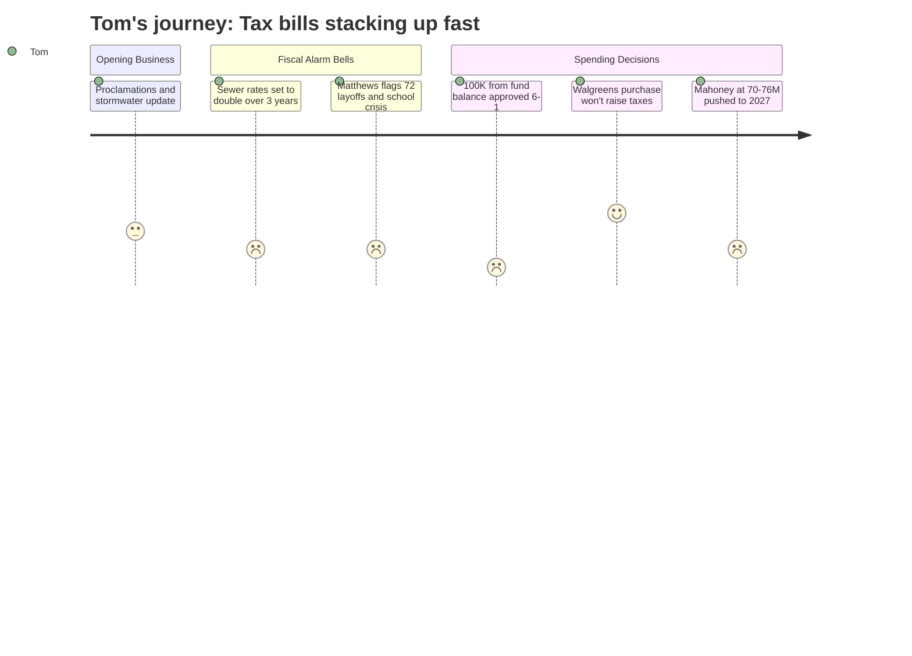

# Interpretation: Tom (PERSONA-006)
## Meeting: City Council Regular Meeting -- March 19, 2026 -- 2026-03-19

### Structured Points

#### 1. Sewer Bill on Track to Double Over Three Years
- **Fact:** The city is financing $51.7 million in wastewater infrastructure through revenue bonds, requiring approximately 22% annual sewer rate increases for three years on top of regular 4% operating increases. The FY27 impact alone is estimated at $9.70/month ($116/year), with an additional $11.80/month ($141/year) projected in FY28.
- **Source:** Transcript [40:26--72:25]; Memo - Sewer Revenue Bond - Finance Director Sanborn.pdf
- **Emotional valence:** negative
- **Threat level:** 4
- **Open question:** true

#### 2. $100,000 from City Savings Approved for Rental Assistance -- No Voter Input
- **Fact:** The council voted 6-1 to appropriate $100,000 from the city's undesignated fund balance for Project Home to assist residents affected by federal immigration enforcement. Councilor Matthews was the lone dissenter, explicitly citing the school department's $8.4 million deficit and 72 recent layoff notices.
- **Source:** Transcript [129:34--140:29]; Order #167-25/26
- **Emotional valence:** negative
- **Threat level:** 3
- **Open question:** false

#### 3. School Budget Crisis Surfaced Mid-Meeting
- **Fact:** Councilor Matthews stated on the record that 72 school employees received pink slip notices the day before this meeting and that the school department carries an $8.4 million deficit -- framing the $100,000 appropriation as fiscally irresponsible given simultaneous layoffs and potential school closures.
- **Source:** Transcript [137:20--138:06]
- **Emotional valence:** negative
- **Threat level:** 4
- **Open question:** true

#### 4. Mahoney Project: $70-76 Million Even After Cutting the Library
- **Fact:** The city's design firm SMRT reported that a scaled-down Mahoney renovation -- excluding the library and police station -- still carries an estimated construction cost of $52-56 million, totaling $70-76 million with indirect costs. The council chose not to pursue a November 2026 referendum and is targeting 2027 instead.
- **Source:** Transcript [144:24--207:00]; 260319 SoPo City Facilities Council Meeting Draft.pdf
- **Emotional valence:** negative
- **Threat level:** 3
- **Open question:** true

#### 5. Walgreens Property Purchase Won't Raise Property Taxes -- Yet
- **Fact:** The council unanimously authorized the purchase of 279 Main Street (former Walgreens) for $2.525 million using police asset forfeiture funds and TIF funds previously earmarked for city facilities. The city manager confirmed no property tax increase required for the purchase itself.
- **Source:** Transcript [214:31--220:47]; Order #168-25/26
- **Emotional valence:** positive
- **Threat level:** 2
- **Open question:** true

#### 6. Police and Fire Bond Still Coming to Voters in November 2026
- **Fact:** The Walgreens site is intended for a new police station, and the council previously directed staff to pursue a public safety bond referendum this November covering both the new police station and a rebuilt Central Fire Station. Construction cost estimates are still being developed.
- **Source:** Order #168-25/26 position paper; Transcript [220:47]
- **Emotional valence:** negative
- **Threat level:** 3
- **Open question:** true

#### 7. Four Separate Cost Pressures Are Compounding on the Same Taxpayer
- **Fact:** In a single meeting the council discussed a school budget requiring a property tax increase capped at 6% (fiscal context: roll-forward would be 18-19%), sewer rates projected to double, a $2.5M property acquisition, and a $70-76M city center project potentially heading to a 2027 bond referendum -- all drawing from the same households.
- **Source:** Fiscal context; Transcript throughout; Agenda items C2, H1, I4, I5
- **Emotional valence:** negative
- **Threat level:** 5
- **Open question:** true

---

### Journey Map

---

### Reactions

Frank, you shoulda been at that council meeting last night. I was there till almost midnight. Here's the number I kept thinking about on the drive home: 22%. That's how much your sewer bill is going up. Not once -- three years in a row. They need to replace the Pearl Street pump station. Fifty-two million dollars just for that part. They're financing it with revenue bonds, and the only way to pay those off is to raise your rates. Right now you're paying around $56 a month. By 2028 or 2029, you're looking at close to $90. They showed a chart and said, "Don't worry, you'll still be cheaper than Cape Elizabeth." I don't know about you, but that's not actually making me feel better.

And then same night, after we just heard about the sewer rates going up, they voted six to one to take $100,000 out of the city's rainy-day fund and hand it to a nonprofit for rental assistance. For people affected by the ICE situation back in January. I understand people had a hard time, but here's what Councilor Matthews said -- and she was the only one who voted no -- she said 72 people at the school department got pink slips the day before. Seventy-two. The school budget has an eight-point-four-million-dollar hole in it. And the response from the other six was basically, well, this money goes to landlords so it's fine. Nobody asked me. Nobody asked you. That's taxpayer money and they just decided.

Oh, and Mahoney. They stripped out the library, stripped out the police station, scaled it way back -- still seventy to seventy-six million dollars. They're not doing a referendum this fall, at least, but they want to bring it back to voters in 2027. So here's where we are: school taxes going up, sewer bill going up, public safety bond coming in November, Mahoney bond coming next year. That's not one big hit, that's four separate bites out of the same people. I keep waiting for somebody up there to stand at the podium and add it all up -- not just one piece at a time, but the total. On my house. What does all of this actually cost me? Nobody did that last night, and that's the number that keeps me up.