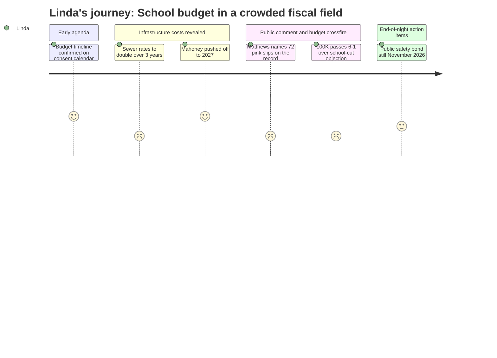

# Interpretation: Linda (PERSONA-007)
## Meeting: City Council Regular Meeting -- March 19, 2026 -- 2026-03-19

### Structured Points

#### 1. Budget process timeline confirmed on consent calendar
- **Fact:** Order #161-25/26 set the FY27 budget public hearing for April 7, 2026. The school budget is slated for Budget Workshop #1 on April 14, council vote on May 5, and school budget referendum on June 9, 2026.
- **Source:** Agenda, Consent Calendar Item E.5 (Order #161-25/26); transcript [04:39]
- **Emotional valence:** positive
- **Threat level:** 1
- **Open question:** false

#### 2. Sewer rates projected to double over three years — directly competing with June referendum
- **Fact:** CDM Smith presented analysis projecting 22% annual sewer rate increases in FY27, FY28, and FY29 to finance the $38M Pearl Street Pump Station and $12M dewatering upgrades, taking the average residential bill from roughly $56/month to over $112/month. Finance Director Sanborn confirmed these are conservative estimates with no growth assumptions baked in.
- **Source:** Transcript [60:43]–[63:04]; Agenda item C.2, Memo from Finance Director Sanborn
- **Emotional valence:** negative
- **Threat level:** 4
- **Open question:** true

#### 3. Councilor Matthews names 72 pink slips on the public record
- **Fact:** During deliberations on the $100,000 Project Home appropriation, Councilor Matthews stated: "72 people in the school department got their pink slips yesterday. 72. Your school department has an $8.4 million deficit." This is the first time the scale of school layoffs was named aloud in a city council proceeding.
- **Source:** Transcript [137:20]–[138:06]
- **Emotional valence:** negative
- **Threat level:** 3
- **Open question:** true

#### 4. Matthews' lone dissent on $100K vote previews the validation-vote argument
- **Fact:** The council voted 6-1 to appropriate $100,000 from the undesignated fund balance to Project Home for rental assistance to residents impacted by immigration enforcement. Matthews was the sole dissent, stating he could not "in good conscience" draw on the general fund while schools face an $8.4M deficit and 72 layoffs. The motion carried, but the argument is now on the record.
- **Source:** Transcript [137:20]–[140:29]
- **Emotional valence:** negative
- **Threat level:** 3
- **Open question:** true

#### 5. Mahoney project pushed to 2027 — one fewer competing bond ask this November
- **Fact:** After the workshop presentation revealing a scaled-down Mahoney project would still cost $70–76M, the council reached informal consensus that a November 2026 referendum is not feasible. Multiple councilors explicitly supported targeting 2027, and the city manager summarized the guidance: no November 2026 Mahoney referendum, library back in consideration, design team work to continue.
- **Source:** Transcript [172:25]–[206:42]; Agenda item H.1
- **Emotional valence:** positive
- **Threat level:** 1
- **Open question:** false

#### 6. Public safety bond still on track for November 2026 — competing narrative in an already-tight fiscal year
- **Fact:** The council unanimously authorized the city manager to execute a purchase and sale agreement for 279 Main Street (former Walgreens) at $2.525M for a new police station. The November 2026 public safety bond referendum — covering the police station and Central Fire Station rebuild — remains on schedule, per prior council guidance referenced in the staff memo.
- **Source:** Transcript [214:31]–[220:47]; Agenda item I.5 (Order #168-25/26)
- **Emotional valence:** neutral
- **Threat level:** 3
- **Open question:** true

#### 7. City undesignated fund balance being drawn down — school board's cushion is already gone
- **Fact:** The $100,000 Project Home appropriation was drawn from the city's undesignated fund balance. The Pearl Street financing analysis also noted the wastewater fund's existing reserves are insufficient to meaningfully offset project costs. The school fiscal context confirms the district's own fund balance is essentially depleted.
- **Source:** Transcript [130:20]–[131:05] (Project Home order read); [56:04]–[57:36] (CDM Smith on fund reserves); fiscal context summary
- **Emotional valence:** negative
- **Threat level:** 2
- **Open question:** false

---

### Journey Map

---

### Reactions

The timeline is set and that part went fine — April 7 hearing, May 5 council vote, June 9 referendum. Order 161 sailed through on the consent calendar without a word. Nobody batted an eye, which is exactly how it should go. But everything else that happened tonight made the picture around that referendum harder to explain to voters.

The sewer presentation was the thing I was tracking most carefully. Fred Dillon and CDM Smith laid out 22% annual rate increases for three straight years — just for Pearl Street and the dewatering upgrade. That takes the average residential bill from $56 to over $112 a month. I understand the infrastructure case, the pump station is nearly fifty years old and DEP has it in their CSO plan, and the regional comparison data is actually not terrible — Sanborn made the point that we're still in reasonable shape even after the increases. But the timing is brutal for us. Residents are going to be voting on the school budget in June while simultaneously being told their sewer bill is about to double. We're already sitting at 61% of the property tax bill. That's the room we're walking into.

Then Matthews said it on the record during the Project Home debate: "72 people in the school department got their pink slips yesterday." That's now a public statement in the City Council minutes. He voted no on the $100,000, alone, and his argument was essentially: we can't spend from the general fund while schools are cutting 72 people. The motion passed 6-1, and I'm not saying the $100,000 was the wrong call — Project Home runs a tight operation, it goes directly to landlords, it keeps people housed, and the community need is real. But that exact frame — "why did the city spend money on X while cutting teachers?" — is the argument we are going to hear in June. We need a clear, factual answer for it, and we need it before April 7. The one genuinely good news item tonight: Mahoney is off the November ballot. The council effectively agreed there's no path to a November 2026 referendum on the city center — they're aiming for 2027. That's one fewer bond ask competing with our narrative this fall. The public safety bond is still tracking for November, and they approved the Walgreens purchase unanimously tonight, so that's moving forward. I just want to make sure our finance committee is modeling what the cumulative tax-increase picture looks like to an average South Portland homeowner by the time they walk into the voting booth in June — sewer up, school budget up, public safety bond looming in the fall. That's the environment we're validating in.