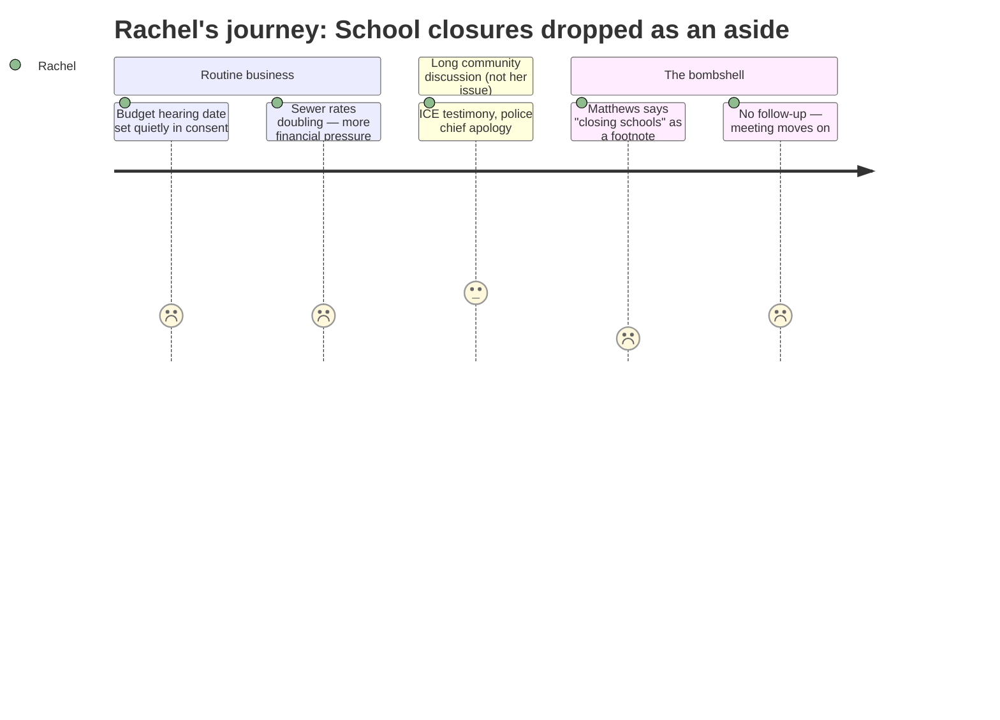

# Interpretation: Rachel (PERSONA-008)
## Meeting: City Council Regular Meeting -- March 19, 2026 -- 2026-03-19

---

### Structured Points

#### 1. "Closing Schools" Said Out Loud — As a Throwaway Line
- **Fact:** Councilor Matthews, explaining why he would not vote for the $100,000 Project Home rental assistance appropriation, stated: "I in good conscience cannot support using money from the general fund when they're talking about closing schools." This is the first and only explicit mention of school closures at the entire meeting — not on the agenda, not explained, not followed up on by any other councilor.
- **Source:** [137:20]–[137:39] transcript
- **Emotional valence:** negative
- **Threat level:** 5
- **Open question:** true — Who is "talking" about closing schools? Which schools? On what timeline? What criteria? No one asked.

#### 2. 72 School Staff Got Pink Slips the Day Before This Meeting
- **Fact:** Councilor Matthews stated that "72 people in the school department got their pink slips yesterday" (March 18, 2026), and explicitly called it "just the first wave." He cited an $8.4 million school department deficit.
- **Source:** [137:20]–[138:06] transcript
- **Emotional valence:** negative
- **Threat level:** 4
- **Open question:** true — How many more waves are coming? Which schools lost the most staff? Are these cuts distributed evenly, or concentrated in certain buildings?

#### 3. The Budget Decision Clock Is Running — Fast
- **Fact:** The consent calendar quietly set April 7 as the date for the FY27 budget public hearing. The school department budget workshop is scheduled for April 14. The full council votes on the school budget May 5, 2026, and the school budget referendum goes to voters on June 9, 2026.
- **Source:** ORDER #161-25/26, Consent Calendar, read at [04:39]–[05:25] transcript; agenda document
- **Emotional valence:** negative
- **Threat level:** 3
- **Open question:** false — The timeline is clear. But it is very compressed: roughly eleven weeks from tonight to a vote on the school budget, with no structural decisions yet made public.

#### 4. Enrollment Is Down 23% in Four Years — The Number That Gets Schools Closed
- **Fact:** The fiscal context provided for this meeting states that elementary enrollment has fallen 23% in four years — from 1,401 to 1,080 students — while staffing grew by 82 positions. This is the precise type of enrollment data administrators use to build a case for school consolidation or closure.
- **Source:** Fiscal context (FY27 budget background documentation)
- **Emotional valence:** negative
- **Threat level:** 4
- **Open question:** true — Which elementary buildings are underenrolled? Is one school disproportionately affected? Is there a consolidation scenario already drafted that the public hasn't seen?

#### 5. No Councilor Asked a Single Question About Which Schools
- **Fact:** After Councilor Matthews mentioned school closures and 72 pink slips, zero follow-up questions were posed by any other councilor or member of the public about which schools, which grades, or what criteria would be used. The council moved immediately to the vote on Project Home. The topic was dropped entirely.
- **Source:** [137:20]–[140:29] transcript
- **Emotional valence:** negative
- **Threat level:** 4
- **Open question:** true — The silence is itself alarming. Either council already knows more than they're saying publicly, or they didn't think to ask. Neither is reassuring.

#### 6. Sewer Rates May Double — On Top of the School-Driven Property Tax Crunch
- **Fact:** Finance Director Sanborn and CDM Smith presented a plan in which sewer user fees would increase approximately 22% per year for three years starting in FY27, equating to roughly $9.70 more per month in the first year and an additional $11.80 per month in the second year. This comes on top of whatever property tax increase results from the school budget crisis — a roll-forward school budget alone would require an 18–19% property tax increase.
- **Source:** [48:17]–[63:04] transcript, Pearl Street Pump Station financial presentation; fiscal context
- **Emotional valence:** negative
- **Threat level:** 2
- **Open question:** false — The financial pressure is real and cumulative. It doesn't directly threaten school placement, but it narrows everyone's margin and may intensify political pressure to cut school costs faster.

#### 7. School Budget Is First Up at the April 14 Workshop — But Tonight There Was Nothing
- **Fact:** The FY27 budget workshop schedule listed in the agenda places "School" as the first item on April 14, 2026 — the earliest workshop slot. This confirms that school budget decisions are imminent, but tonight's meeting provided no preview of what will be presented: no scenarios, no options, no school names.
- **Source:** ORDER #161-25/26 position paper, agenda document; fiscal context
- **Emotional valence:** neutral
- **Threat level:** 3
- **Open question:** true — Will the April 14 workshop be the first time the public sees specific school consolidation or closure scenarios? Is there time to organize a response before the May 5 council vote?

---

### Journey Map

---

### Reactions

*So how was the meeting? Oh my God. I don't even know where to start. I sat through three and a half hours of stormwater permits and the police chief apologizing and a sushi restaurant getting a liquor license, and then — right at the end of a vote about rental assistance for immigrant families — Councilor Matthews just casually says, "I can't vote for this when they're talking about closing schools." That's it. That's all he said. Closing schools. And then they voted and moved on. Nobody asked which schools. Nobody asked who's talking. Nobody asked anything. I almost fell out of my chair.*

*They set the budget public hearing for April 7th — that's in three weeks. The school budget workshop is April 14th. Council votes May 5th, referendum June 9th. And tonight, the only thing we got was a throwaway line from Matthews. He also said 72 people in the school department got pink slips yesterday — YESTERDAY — and that it's "just the first wave." Forty-two of them are teachers. Do you understand what that means for class sizes? For the teachers our kids actually have relationships with? And nobody on the council even blinked. They just... kept going.*

*I need to find out which schools they're looking at. The enrollment numbers are down 23% across elementary schools in four years — that's the kind of statistic that ends up in a PowerPoint justifying why two buildings need to become one. I guarantee there's a consolidation scenario sitting in someone's desk drawer right now. The April 14th workshop is the moment they're going to show us, and by May 5th the council votes. That's three weeks to show up, make noise, and actually change anything. I'm texting the other school parents tonight. We need to be at that April 7th public hearing, we need to pack the April 14th workshop, and someone needs to be asking these board members directly: which schools are you looking at? Say it out loud. Stop hiding it in budget line items.*