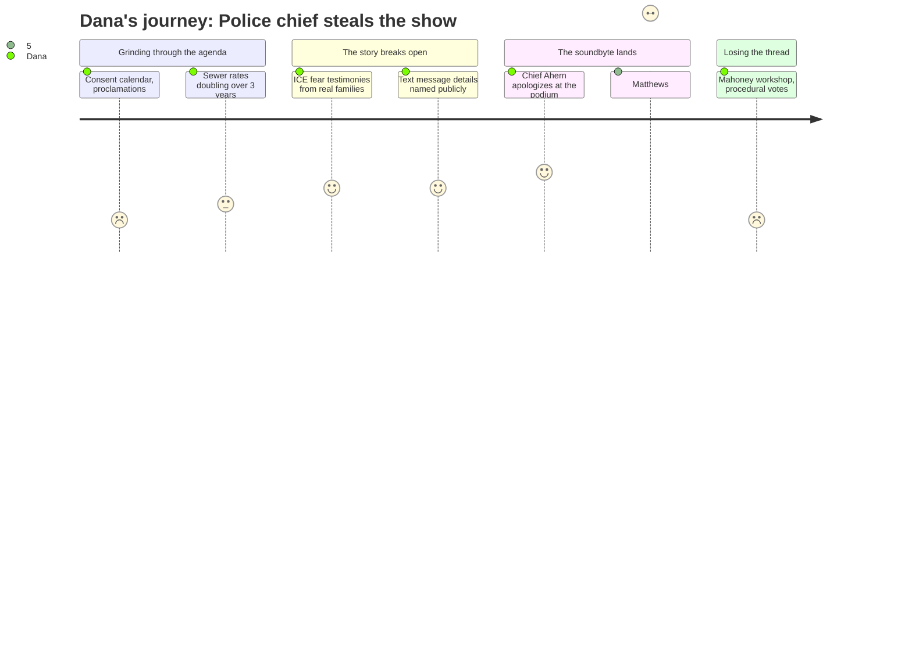

# Interpretation: Dana (PERSONA-009)
## Meeting: City Council Regular Meeting -- March 19, 2026 -- 2026-03-19

### Structured Points

#### 1. Police Chief Delivers Public Apology From the Podium
- **Fact:** Chief Dan Ahern voluntarily addressed the council and audience, admitting he failed to push back when a federal HSI agent sent racist text messages during January's ICE surge. He said "I missed there. I can do better than that" and "This was on me" -- then asked the community not to blame his officers for his personal conduct.
- **Source:** Transcript [103:45--110:07]
- **Emotional valence:** positive
- **Threat level:** 5
- **Open question:** true -- Can she get Ahern on camera before the story goes cold? And does his apology actually satisfy the community, or is this the beginning of a longer accountability story?

#### 2. The Dissenting Vote That Writes Itself
- **Fact:** Councilor Matthews was the lone vote against the $100,000 Project Home allocation, saying "72 people in the school department got their pink slips yesterday. 72. Your school department has an $8.4 million deficit. I in good conscience cannot support using money from the general fund." He named school closures and sewer rate increases in the same breath.
- **Source:** Transcript [137:20--138:58]
- **Emotional valence:** negative
- **Threat level:** 4
- **Open question:** true -- Are those 72 pink slips the story she should have been covering yesterday instead of being here?

#### 3. Community Members Describe Living in Fear -- By Name, On the Record
- **Fact:** Multiple residents gave public comment detailing how their families personally prepared for potential ICE detention -- carrying documentation, making contingency plans, not leaving home. Pedro Vasquez, chair of the South Portland Human Rights Commission, said on the record: "My own family experienced that fear. We had conversations about what we would do if one of us was detained."
- **Source:** Transcript [93:28--95:51]
- **Emotional valence:** negative
- **Threat level:** 3
- **Open question:** false -- These are quotable on camera. She has what she needs from the public comment record.

#### 4. Text Messages That Set It All Off
- **Fact:** Multiple public commenters referenced a March 12 Portland Press Herald article revealing text exchanges between Chief Ahern and a federal HSI agent who wrote "They're going back to their s******e countries" -- with Ahern responding "Appreciate working with you. Stay safe going forward." Ahern did not dispute the texts at the podium.
- **Source:** Transcript [80:18--82:38]; [83:24--85:46]
- **Emotional valence:** negative
- **Threat level:** 4
- **Open question:** true -- The Press Herald already broke this. What angle does she have that they don't?

#### 5. Council Votes 6-1 to Spend $100,000 on Rental Assistance for ICE-Affected Residents
- **Fact:** The council approved appropriating $100,000 from undesignated fund balance to Project Home for rental assistance to South Portland residents impacted by January's federal immigration enforcement surge. The money goes to landlords on a reimbursement basis and is projected to help approximately 50 households.
- **Source:** Transcript [129:34--140:29]; Agenda Item I-4
- **Emotional valence:** positive
- **Threat level:** 2
- **Open question:** false -- Clean 6-1 vote with a named dissenter and a clear dollar figure. This is a usable fact for the lede.

#### 6. Sewer Rates Set to Roughly Double Over Three Years
- **Fact:** The city's finance director and a consultant from CDM Smith presented preliminary projections showing sewer user fees may need to increase approximately 22% per year for FY27, FY28, and FY29 to finance $51.7 million in wastewater infrastructure projects. For a typical residential customer, FY27 means about $9.70 more per month -- $116 per year -- with an additional $11.80 per month projected in FY28.
- **Source:** Transcript [40:26--72:25]; Agenda Item C-2
- **Emotional valence:** negative
- **Threat level:** 2
- **Open question:** true -- This story is coming back in June when the council actually sets rates. Worth flagging for the budget season calendar.

#### 7. The Bigger Story Is Still Offstage: 78 Positions Cut, Schools in Crisis
- **Fact:** Councilor Matthews mentioned that 72 school department employees received pink slips the day before this meeting. The fiscal context for the meeting documents a $7.2M structural gap, an 18-19% property tax increase if nothing changes, and 78 positions proposed for elimination -- including 42 teachers. This received no formal agenda time at tonight's city council meeting.
- **Source:** Transcript [137:20--138:06]; meeting fiscal context header
- **Emotional valence:** negative
- **Threat level:** 5
- **Open question:** true -- This is the real story she may be underweighting. The school board is where this is actually playing out. When's their next meeting?

---

### Journey Map

---

### Reactions

Okay so here's the pitch. The chief of police stood up at a city council meeting tonight and publicly apologized for not pushing back when a federal agent sent him racist texts during the ICE raids. He said -- on the record, into a microphone, in front of a room full of people -- "I missed there. I can do better than that." That's our soundbyte. That is the whole segment. We get him on camera tomorrow, we've got something nobody else has, because the Press Herald already broke the texts but they don't have him saying that. If he won't sit down with us, we've got the public record from tonight and we've got six people who spoke before him who will absolutely talk on camera -- including the chair of the city's own Human Rights Commission saying his family made contingency plans in case someone got detained.

The council also voted 6-1 to spend $100,000 in city funds on rental assistance for residents affected by the ICE surge -- which is a clean, concrete thing to put in the lede. But here's the counter-narrative that makes this a real story and not just a press release: the one guy who voted no, Councilor Matthews, said that 72 school department workers got their pink slips the day before this meeting. He named sewer rates going up, he named the school deficit, and he basically said why are we handing out city money right now. That's your two-sided story. Council does something, one guy says we can't afford it, and the reason we can't afford it is the schools are hemorrhaging.

The school angle is what's going to keep giving all spring. I need to find out when the school board meets next, because the real fiscal disaster is happening over there -- 78 positions on the chopping block, 42 teachers, and a property tax increase that could hit 18-19% if they don't cut enough. That's every homeowner in South Portland. Tonight was mostly city council, but Matthews basically handed us a bridge to the school story. I want to know if there's a teacher or an ed tech who got that pink slip yesterday who will talk to us. That's the human story for the next segment.