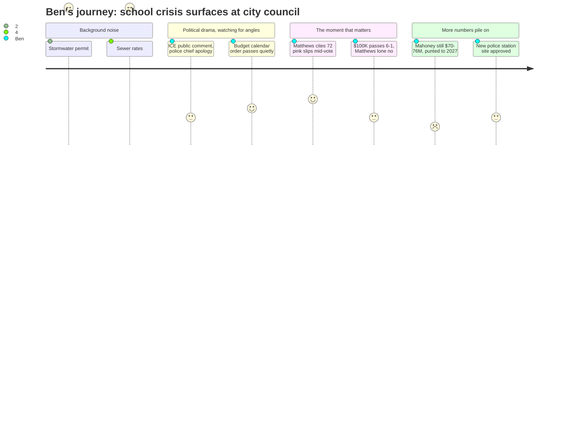

# Interpretation: Ben (PERSONA-010)
## Meeting: City Council Regular Meeting -- March 19, 2026 -- 2026-03-19

---

### Structured Points

#### 1. Matthews links 72 pink slips to $100K immigration fund vote
- **Fact:** During the vote on $100,000 for Project Home rental assistance, Councilor Matthews cast the lone no vote and explicitly cited the school crisis as her reason: "72 people in the school department got their pink slips yesterday. 72. Your school department has an $8.4 million deficit." She called using general fund money irresponsible given school closures and layoffs are imminent.
- **Source:** [137:20–138:06]
- **Emotional valence:** negative
- **Threat level:** 4
- **Open question:** true — The fiscal context document cites 78 positions and a $7.2M gap; Matthews said 72 and $8.4M. Which figures are current? Were the notices issued March 18, and does "first wave" mean more are coming?

#### 2. Sewer rates set to roughly double over three years
- **Fact:** Finance Director Ellen Sanborn and CDM Smith presented projections showing sewer user rates must increase approximately 22% per year for three consecutive years (FY27–FY29) to service $51.7M in wastewater infrastructure debt, on top of a 4% annual operating increase. For a typical residential customer, that means roughly $9.70/month more in FY27 and another $11.80/month in FY28.
- **Source:** [60:43–61:30]; Agenda item C.2, Finance Director memo
- **Emotional valence:** negative
- **Threat level:** 4
- **Open question:** true — The presentation explicitly excluded potential TIF offsets and a pending $12M federal earmark request. The final rate picture won't be known until bids come back in late April. How much lower could it actually be?

#### 3. Budget calendar confirmed — school vote May 5, referendum June 9
- **Fact:** The consent calendar included Order #161-25/26 setting the FY27 budget public hearing for April 7, and the agenda position paper spelled out the full workshop schedule: school department presents April 14, council votes on the school budget May 5, and the school budget referendum goes to voters June 9.
- **Source:** Agenda item E.5; [04:39]
- **Emotional valence:** neutral
- **Threat level:** 1
- **Open question:** false — This is the clearest, most actionable information in the meeting for Ben's reporting calendar.

#### 4. Council allocates $100K from fund balance for immigration rental assistance
- **Fact:** On a 6-1 vote (Matthews opposing), the council appropriated $100,000 from the undesignated fund balance to Project Home for rental assistance to South Portland residents impacted by January's federal immigration enforcement surge. The funds are disbursed on a reimbursement basis, expire June 1, and are estimated to help approximately 50 households.
- **Source:** [130:20–140:29]
- **Emotional valence:** neutral
- **Threat level:** 2
- **Open question:** true — How much remains in the undesignated fund balance after this draw? The school fiscal context notes the fund balance is "essentially depleted" on the school side, but the city side is a separate pool. How thin is the city cushion?

#### 5. Mahoney scaled-down project still costs $70–76M; council punts to 2027
- **Fact:** SMRT architect Craig Piper presented cost estimates showing that even the reduced Mahoney scope — city services, theater, gym, no library, no police station — runs $52–56M in construction, $70–76M total project cost. The council reached informal consensus to abandon any November 2026 referendum and target November 2027, with the library now potentially back in scope.
- **Source:** [148:17–149:03]; [205:50–206:42]
- **Emotional valence:** negative
- **Threat level:** 3
- **Open question:** true — A new city hall on a different site runs $38–45M by comparison. If the council eventually asks voters for a 2027 Mahoney bond on top of a 2026 public safety bond, what does the combined annual debt service look like per household?

#### 6. The compounding household cost story — school + sewer + possible Mahoney bond
- **Fact:** No single speaker at this meeting added up the three simultaneous pressures on South Portland residents, but the pieces were all present: the school tax (61% of property taxes) will rise significantly to close a $7.2M structural gap; sewer rates are headed toward doubling by FY29; and a Mahoney bond referendum — potentially $70M+ — is now targeted for November 2027. A new public safety bond (police station at 279 Main Street, rebuilt fire station) is already planned for November 2026.
- **Source:** Fiscal context; Agenda items C.2, E.5, H.1, I.5
- **Emotional valence:** negative
- **Threat level:** 5
- **Open question:** true — What does the all-in annual cost look like for a median South Portland homeowner if the school tax goes up 6%, sewer rates increase 22% annually, and one or more bond referenda pass? No one has assembled that number.

#### 7. April 14 budget workshop is the first substantive school budget hearing
- **Fact:** The school department is first on the April 14 Budget Workshop #1 agenda. This is the first opportunity for the public — and the press — to hear the school district present its FY27 budget proposal to the full city council, including the proposed cuts to close the structural gap.
- **Source:** Agenda item E.5, position paper of the city manager
- **Emotional valence:** positive
- **Threat level:** 1
- **Open question:** false — This is the confirmed date of Ben's next key meeting to attend or watch.

---

### Journey Map

---

### Reactions

So here's what I've got. The whole night was a council meeting — stormwater permits, sewer infrastructure, the ICE controversy, Mahoney — and the school budget barely showed up. But Matthews handed me the connective thread I've been looking for. She voted no on the $100,000 for immigrant rental assistance and the reason she gave was that 72 school employees got pink slips *the day before*. That's the lede. The council is making real-time choices between two legitimate community crises — immigrant families who can't pay rent because they're afraid to leave the house, and teachers who are about to lose their jobs — and both of those draws are coming out of a city that's already stretched thin. That's not a gotcha story, that's just what's happening. Six votes for it, one against, and the one against is making a reasonable fiscal argument that I think a lot of readers will recognize.

The sewer rate presentation is the other thing I can't get out of my head. Twenty-two percent a year for three years. So by fiscal year 2029, the average resident is paying almost double their current sewer bill. The finance team compared South Portland to surrounding communities and said we're starting from the lowest point in the region, which is true — and that framing is the district's preferred framing. But if you're a homeowner whose school tax is 61% of their property tax bill, and that's going up, and now your sewer bill is also going up 22% a year, and there's a $70-million Mahoney referendum potentially coming in 2027 on top of the public safety bond this November — nobody in that room added all of that up and said, "here's what hits a typical household." That's the piece I want to write before the school referendum. I need the business office and city finance to give me some help with the math.

The school budget workshop is April 14. That's my calendar. This meeting basically confirmed the schedule and told me nothing new about what's actually in the budget — I've got Matthews' number of 72 pink slips and an $8.4 million deficit figure, which don't quite match what I've seen elsewhere (78 positions, $7.2M gap), so I need to make a call to the superintendent's office before I write anything. My guess is 72 is a specific batch of notices and more come later, but I want that on record. The April 7 public hearing is probably going to be a lot of prepared statements. April 14 is where the school department actually walks council through the cuts. That's where I'll be.