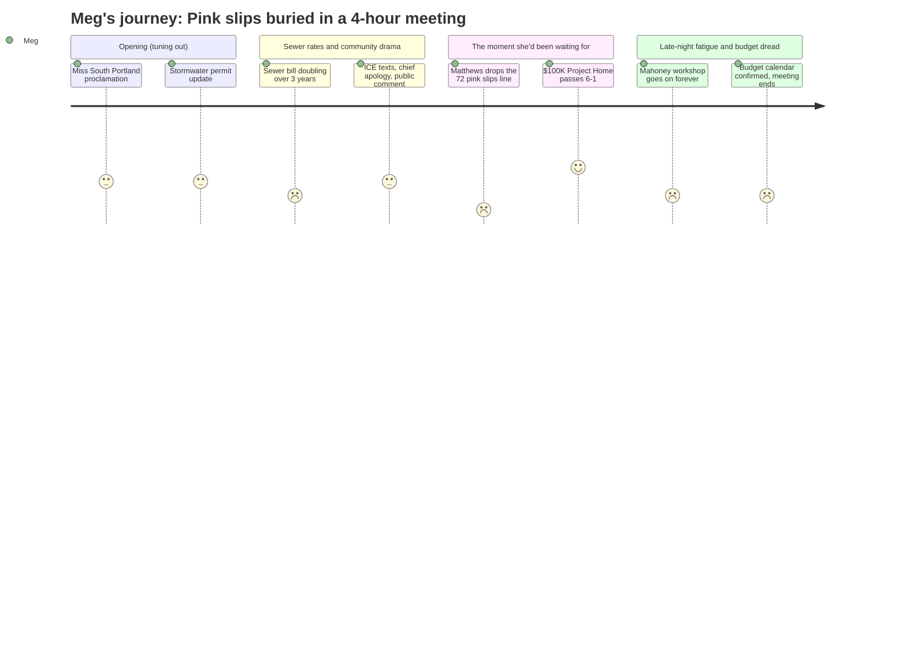

# Interpretation: Meg (PERSONA-011)
## Meeting: City Council Regular Meeting -- March 19, 2026 -- 2026-03-19

---

### Structured Points

#### 1. Councilor Matthews confirms 72 school staff got pink slips the day before
- **Fact:** During the Project Home vote discussion, Councilor Matthews stated on the record: "72 people in the school department got their pink slips yesterday. 72." He added, "72 is just the first wave of people." He cited this directly as the reason he was voting against appropriating $100,000 from the general fund.
- **Source:** Transcript [137:20–138:06]
- **Emotional valence:** negative
- **Threat level:** 5
- **Open question:** true — Which schools lost which positions? Are the 42 teachers named in the fiscal background among the 72, or is this a separate, larger number?

#### 2. The number Matthews cited ($8.4M deficit) doesn't match the $7.2M figure circulating elsewhere
- **Fact:** Councilor Matthews stated the school department has "an $8.4 million deficit." The fiscal context summary provided to council references a $7.2M structural gap requiring elimination of 78 positions. These two figures do not match.
- **Source:** Transcript [137:20–138:06]; Fiscal Context summary
- **Emotional valence:** negative
- **Threat level:** 4
- **Open question:** true — Has the gap grown since the initial proposal, or is Matthews using a different accounting basis? This is exactly the kind of discrepancy Meg needs to resolve before posting.

#### 3. The school budget calendar is now locked: April 14 workshop, May 5 council vote, June 9 referendum
- **Fact:** The council unanimously approved ORDER #161-25/26 setting April 7 as the FY27 budget public hearing date. The consent calendar position paper confirms: school budget workshop is April 14, council votes on the school portion May 5, and the voter referendum is June 9.
- **Source:** Agenda, ORDER #161-25/26 position paper; Consent Calendar
- **Emotional valence:** neutral
- **Threat level:** 3
- **Open question:** false — The dates are set; this is actionable information for her networks.

#### 4. The lone "no" vote on immigrant rental assistance was explicitly tied to the school cuts
- **Fact:** Matthews voted against the $100,000 appropriation to Project Home (the final vote was 6–1), stating: "In good conscience I cannot support using money from the general fund when they're talking about closing schools, and 72 is just the first wave." He also cited the sewer rate increase and expected property tax spike as compounding pressures on taxpayers.
- **Source:** Transcript [137:20–140:29]
- **Emotional valence:** negative
- **Threat level:** 3
- **Open question:** true — If the general fund is already under pressure from the school deficit, are there other competing draws on that balance that could affect school budget options?

#### 5. Sewer rates are going up roughly 22% per year for three years, starting this fall
- **Fact:** Finance Director Ellen Sanborn and CDM Smith presented a feasibility study projecting sewer user fee increases of approximately 22% annually in FY27, FY28, and FY29 to service new revenue bonds for the Pearl Street Pump Station and sludge dewatering projects. For the average residential customer, FY27 = ~$9.70/month more ($116/year); FY28 = an additional ~$11.80/month ($141/year).
- **Source:** Transcript [48:17–51:25]; Agenda, Pearl Street Pump Station position paper
- **Emotional valence:** negative
- **Threat level:** 2
- **Open question:** false — Numbers are preliminary but sourced; final rates confirmed in June when bids come back.

#### 6. Police Chief Ahern publicly apologized for his ICE text exchange and took personal responsibility
- **Fact:** Chief Ahern addressed the council and public directly, saying: "If I've disappointed you and the community, I'm truly deeply sorry for that." He acknowledged he did not push back on unprofessional language in the text thread, said "I missed there. I can do better than that," and repeatedly stated that his officers had no involvement and did not cooperate with ICE. He distinguished maintaining a professional federal law enforcement relationship from cooperating on immigration enforcement.
- **Source:** Transcript [103:45–110:07]
- **Emotional valence:** positive
- **Threat level:** 2
- **Open question:** true — Several community members asked what specific accountability steps the council is taking; the council's answer was largely that they have no evidence the chief violated the non-cooperation directive and they accept his word.

#### 7. City Council confirmed it is NOT going to November 2026 referendum on Mahoney — now aiming for 2027
- **Fact:** Through workshop discussion, the council reached consensus to abandon a November 2026 bond referendum on the Mahoney City Center project. Councilor West stated she made "a mistake" by previously supporting the removal of the library from the project and argued for bringing it back. The council agreed to slow the process, explore public-private partnerships, and target a 2027 referendum instead.
- **Source:** Transcript [171:37–206:42]
- **Emotional valence:** neutral
- **Threat level:** 1
- **Open question:** false — For Meg's purposes this is background city government noise; not school-related.

---

### Journey Map

---

### Reactions

Ok I have to share this because I sat through almost four and a half hours of this meeting and the most important thing for our kids happened in about 45 seconds during the *wrong* agenda item. When they were voting on the $100,000 for rental assistance, Councilor Matthews said he was voting no because — and I'm quoting from my notes — "72 people in the school department got their pink slips *yesterday*. 72. And 72 is just the first wave." He said this on the record. This was not at a school board meeting. This was city council, during a completely different discussion. So if you've been waiting for official confirmation that the layoff notices went out, there it is. He also cited the school deficit as $8.4 million, which is higher than the $7.2M number I've been tracking — I'm going to dig into that discrepancy before I say more about it, but either way, the number is big and the notices are real.

For everyone asking what happens next: the dates are now set. April 14 is the first budget workshop where school gets discussed before the city council — that's your first public window to see the details. City council votes on the school portion of the budget on **May 5**. Voter referendum is **June 9**. Write those down. There will be a public hearing on the overall FY27 budget on April 7. And separately — your sewer bill is going up. The city is financing $50M in wastewater infrastructure through revenue bonds, and rates are projected to increase about 22% per year for three years. Year one is roughly $10 more per month, year two is another $12. Not school-related but it's real and it hits everyone.

One other thing worth knowing from tonight: Chief Ahern showed up and gave a public apology for the ICE text messages that were reported in the Press Herald. He stood at the podium and said he missed an opportunity to push back on unprofessional language, took full personal responsibility, and specifically asked that criticism not be directed at the officers who had nothing to do with it. Whether you find that sufficient is your call — a lot of people at the meeting didn't — but it happened, on camera, and the $100K for immigrant rental assistance did pass 6 to 1. Those are the facts. I'll post the timestamp from SPC-TV when I have it.