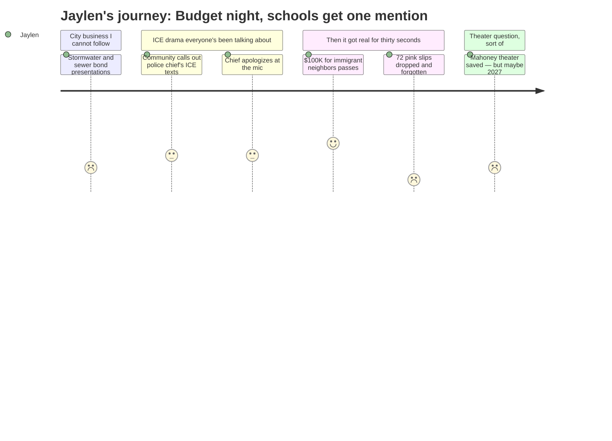

# Interpretation: Jaylen (PERSONA-012)
## Meeting: City Council Regular Meeting -- March 19, 2026 -- 2026-03-19

### Structured Points

#### 1. 72 school staff pink slips dropped as a side point
- **Fact:** Councilor Matthews, voting against the $100,000 immigrant rental assistance fund, stated: "72 people in the school department got their pink slips yesterday. 72. Your school department has an $8.4 million deficit." The remark was made as an argument about fiscal priorities, not as a standalone agenda item, and the meeting moved on within seconds.
- **Source:** [137:20]
- **Emotional valence:** negative
- **Threat level:** 5
- **Open question:** true — Which positions were cut? Are any at SPHS? Does this include theater directors, AP teachers, coaches? Nobody said.

#### 2. School budget vote timeline officially set
- **Fact:** The consent calendar (passed unanimously) established the following schedule: April 7 public hearing on the FY27 budget, May 5 council vote on the school portion, June 9 school budget referendum. The timeline for decisions that will determine what Jaylen's senior year looks like is now locked in.
- **Source:** Agenda item E.5, Order #161-25/26; [04:39]
- **Emotional valence:** neutral
- **Threat level:** 3
- **Open question:** true — Will there be a public process where students can speak before May 5? Is there a school board meeting in between where programs get named?

#### 3. Police chief publicly apologizes for not pushing back on racist ICE texts
- **Fact:** After multiple community members spoke about fear, family emergency plans, and loss of trust following news that Chief Ahearn exchanged supportive texts with an HSI agent who made derogatory remarks about immigrants, the chief came to the podium and said: "I missed there. I can do better than that," and explicitly took personal responsibility, separating his conduct from the department's.
- **Source:** [103:45]–[110:07]
- **Emotional valence:** neutral
- **Threat level:** 1
- **Open question:** false

#### 4. $100,000 for immigrant neighbors passes 6-1
- **Fact:** The council voted 6-1 to appropriate $100,000 from the undesignated fund balance to Project Home for rental assistance to South Portland residents impacted by immigration enforcement. Councilor Matthews was the sole no vote, citing the school deficit. The fund is projected to help approximately 50 households.
- **Source:** [140:29]
- **Emotional valence:** positive
- **Threat level:** 1
- **Open question:** false

#### 5. Mahoney theater and gym are in the vision — but it's not Jaylen's school
- **Fact:** During the Mahoney workshop, Councilor West described the project's original vision: "a gathering place for performances, lectures, and large meetings, a community art space, continue to provide a space for indoor youth athletics." The council decided to keep the theater and gym in the plan — but also decided not to pursue a November 2026 referendum, pushing any bond measure to at least 2027.
- **Source:** [172:25]; [205:56]
- **Emotional valence:** negative
- **Threat level:** 2
- **Open question:** true — If the community theater at Mahoney is still years away, and SPHS programs are being cut now, what actually exists for students right now?

#### 6. SPHS auditorium mentioned — as a venue for a city water quality film
- **Fact:** The stormwater coordinator announced that a film about water quality will screen on April 17 at "the high school auditorium," with an open house at the wastewater plant the following morning. This is the only moment the high school appears in the meeting — as a city event venue, not as a subject of budget discussion.
- **Source:** [37:17]
- **Emotional valence:** neutral
- **Threat level:** 1
- **Open question:** false

---

### Journey Map

---

### Reactions

Okay so I stayed up way too late watching this city council meeting and honestly the first hour was about sewers and stormwater permits and I almost gave up. But then the public comment started and people were going off about the police chief and the ICE raids from January. The whole thing is that Chief Ahearn was texting with a federal agent while ICE was in town and the agent used slurs about immigrants — like actually said it — and Ahearn just responded "appreciate working with you, stay safe." Didn't push back at all. So people are at the microphone talking about their families carrying documents everywhere, planning for what to do if someone gets detained, saying they're scared to come speak in public. And then the chief actually walked up to the podium and said he messed up, said it was on him and only him, took the whole thing personally. I respect that he stood up and said it. But also the whole reason people don't trust institutions is moments like that original text, and saying sorry doesn't just erase it.

Then the council voted on this $100,000 to help immigrants who couldn't pay rent because of the raids. Six to one. And the one no vote — Councilor Matthews — his reason was basically: the school department just sent pink slips to 72 people yesterday, we have an $8.4 million deficit, I can't support spending money right now. And then the meeting just kept going. He dropped that 72 people in the school department lost their jobs and it was just a point in an argument about something else. Nobody stopped. Nobody said which positions. Nobody said which schools. Forty-two of those 78 total cuts are teachers. Is my theater director one of them? My AP lit teacher? My cross-country coach? I have no idea. That information exists somewhere and nobody said it out loud, not even once, in a four-hour meeting.

The weirdest part was the hour they spent on this old building called Mahoney — it's a former school — and the council kept talking about saving the theater and the gym, making it a "community arts space," space for "indoor youth athletics." And I genuinely thought for a second they were talking about SPHS. They're not. It's a completely different building and they can't even agree on what to do with it — they just decided to punt the whole thing to 2027 at the earliest. So there's this big vision for community theater and arts space in a building nobody's figured out yet, while at my actual school they already sent out the pink slips, the vote on our budget is May 5th, and the referendum is June 9th. My senior year is getting decided and I wasn't in that room.