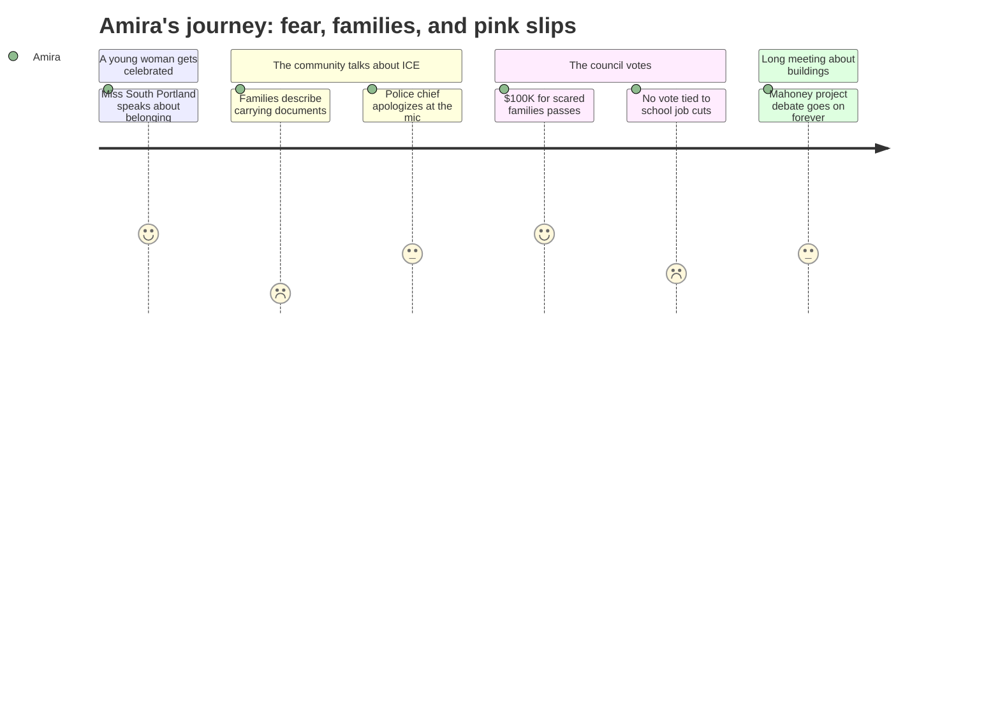

# Interpretation: Amira (PERSONA-013)
## Meeting: City Council Regular Meeting -- March 19, 2026 -- 2026-03-19

### Structured Points

#### 1. A young woman is celebrated in front of everyone
- **Fact:** The council opened by presenting a proclamation to Savannah Johnson, Miss South Portland, and heard from both her and Miss Maine. Savannah talked about struggling to feel seen after COVID, finding community in the Miss America organization, and running a service initiative for people with disabilities inspired by her brother.
- **Source:** [03:52--17:50]
- **Emotional valence:** positive
- **Threat level:** 1
- **Open question:** false

#### 2. People came to the microphone and described being afraid to leave their homes
- **Fact:** Multiple community members gave public testimony describing the fear that spread through South Portland during the January ICE surge. Pedro Vasquez, identified as chair of the South Portland Human Rights Commission, said his own family carried their documents everywhere and "had conversations about what we would do if one of us was detained." Chelsea Bien described reading the police chief's texts and feeling "dread" for her naturalized-citizen husband.
- **Source:** [93:28--99:01]
- **Emotional valence:** negative
- **Threat level:** 5
- **Open question:** true

#### 3. The police chief stood up and apologized, but also said it was only his fault — not his officers'
- **Fact:** Police Chief Dan Ahearn came to the podium after public comment and said, "If I've disappointed you and the community, I'm truly deeply sorry for that." He acknowledged he didn't push back when a federal agent made inappropriate comments in a text exchange, and he accepted full personal responsibility — repeatedly insisting the community's frustration "belongs with me and only me, not our police department."
- **Source:** [103:45--110:52]
- **Emotional valence:** neutral
- **Threat level:** 2
- **Open question:** true

#### 4. The council voted 6 to 1 to give $100,000 to help families who couldn't pay rent
- **Fact:** The council passed Order #167-25/26 appropriating $100,000 from the city's fund balance to Project Home for rental assistance to South Portland residents impacted by federal immigration enforcement. The funding is estimated to help approximately 50 households.
- **Source:** [140:29]
- **Emotional valence:** positive
- **Threat level:** 1
- **Open question:** false

#### 5. One council member voted no on the $100,000, and said it was because teachers are already losing their jobs
- **Fact:** Councilor Matthews cast the sole vote against the rental assistance, saying: "72 people in the school department got their pink slips yesterday. 72. Your school department has an $8.4 million deficit. I in good conscience cannot support using money from the general fund when they're talking about closing schools."
- **Source:** [137:20--138:06]
- **Emotional valence:** negative
- **Threat level:** 4
- **Open question:** true

#### 6. Even a councilor's grandchildren came home from school scared
- **Fact:** Councilor West, while explaining why he was voting yes on the $100,000, said: "Even my own grandchildren, who have nothing to fear given their cultural background, came home from school scared. That's how much it permeated our community."
- **Source:** [136:34]
- **Emotional valence:** negative
- **Threat level:** 3
- **Open question:** false

#### 7. No one at the meeting talked about what kids at school actually experienced during any of this
- **Fact:** Over four hours of public testimony and council discussion addressed the ICE surge and its community impact. Speakers included a human rights commission chair, neighbors, residents, and council members — but no student voices were heard, and no one asked what the surge felt like inside South Portland schools during those days.
- **Source:** [73:13--140:29] (full public comment and council discussion period)
- **Emotional valence:** negative
- **Threat level:** 3
- **Open question:** true

---

### Journey Map

---

### Reactions

Okay so I actually watched part of it and Mom, the first part was kind of nice? There was this girl Savannah who's Miss South Portland, she's in college at SMCC, and she talked about feeling invisible after COVID and then finding this community and now she runs this program for people with disabilities because of her brother. That part I liked. But then it got really heavy really fast.

People kept coming up to talk about what happened in January with the immigration agents and Mom I kept thinking about us. There was this man, Pedro, he said his own family was carrying their documents everywhere and they were making plans in case someone got detained. He said they had those conversations. We had those conversations too. And then the police chief came up — he actually walked up to the microphone in front of everybody and said he was sorry. He said the community's anger belonged with him and not with the rest of the police department. I don't know, I felt something watching that. Like he actually had to stand there and say it. One lady in the audience said she came specifically because she was hoping he would speak, and he did. The council voted 6 to 1 to give $100,000 to help families who couldn't pay rent because they were scared to leave their houses. That part felt good. Like they actually did something.

But here's the thing I can't stop thinking about: the one person who voted no said she couldn't support it because 72 people at the school department got pink slips the day before. Seventy-two. She said the school has an $8 million problem and they're talking about closing schools. And she said that's why she couldn't vote yes on helping families. I don't understand why it's one or the other. And I don't understand which 72 people. Is it teachers? Is it like the people who work in my building? Nobody at that meeting said anything about what happens to students when their teachers leave, or what kids at school were going through when ICE was in town. They talked for four hours and nobody asked.