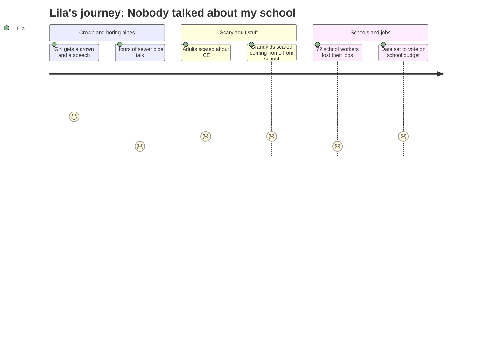

# Interpretation: Lila (PERSONA-014)
## Meeting: City Council Regular Meeting -- March 19, 2026 -- 2026-03-19

### Structured Points

#### 1. A Girl Got a Crown and a Speech
- **Fact:** The Council opened by recognizing Savannah Johnson as Miss South Portland with a signed proclamation. Savannah gave a speech about feeling invisible and scared after COVID, and how finding a community changed her.
- **Source:** [03:52–17:50]
- **Emotional valence:** positive
- **Threat level:** 1
- **Open question:** false

#### 2. They Talked About Sewers and Pipes for a Really Long Time
- **Fact:** Two back-to-back presentations covered a stormwater permit update and a plan to spend $51.7 million fixing underground sewer infrastructure, with a projected 22% annual rate increase for the next three years. The presentations lasted well over an hour.
- **Source:** [18:38–72:25]
- **Emotional valence:** neutral
- **Threat level:** 1
- **Open question:** false

#### 3. Lots of Adults Were Scared About Something Called ICE
- **Fact:** Multiple community members came to the microphone to describe how afraid people in South Portland had been during a surge of federal immigration enforcement in January. One speaker, Pedro Vasquez, said his own family had conversations about what to do if someone was detained, and that they carried their documents with them everywhere.
- **Source:** [93:28–96:00]
- **Emotional valence:** negative
- **Threat level:** 3
- **Open question:** true — What is ICE, and why were people so scared? Is it still happening?

#### 4. Even the Kids at School Were Scared
- **Fact:** Councilor West said that even his own grandchildren, who "have nothing to fear given their cultural background," came home from school frightened. He said the fear "permeated our community."
- **Source:** [136:34]
- **Emotional valence:** negative
- **Threat level:** 2
- **Open question:** true — Were kids at Dyer scared too? Did something happen at school?

#### 5. Seventy-Two People From School Lost Their Jobs
- **Fact:** Councilor Matthews, while voting against the $100,000 rental assistance fund, stated: "72 people in the school department got their pink slips yesterday. 72. Your school department has an $8.4 million deficit." He said he could not support spending city money while schools were cutting so many workers.
- **Source:** [137:20–138:58]
- **Emotional valence:** negative
- **Threat level:** 5
- **Open question:** true — Is my teacher one of those 72 people? Will she still be at school next year?

#### 6. They Set a Date to Vote on School Stuff
- **Fact:** The Council approved Order #161-25/26, scheduling a public budget hearing for April 7, a Council vote on the school portion of the budget for May 5, and a community-wide school budget referendum for June 9, 2026.
- **Source:** Agenda item E.5; [04:39]
- **Emotional valence:** negative
- **Threat level:** 4
- **Open question:** true — Is this when they decide if Dyer closes for real?

#### 7. Nobody Said Dyer's Name Even Once
- **Fact:** The City Council meeting ran for over four hours and covered sewer pipes, a building renovation project, a police station purchase, marijuana licenses, and immigration concerns. Dyer Elementary, the school reconfiguration plan, and the proposed elementary school closures were never mentioned.
- **Source:** Full meeting transcript [00:01–262:00]
- **Emotional valence:** negative
- **Threat level:** 3
- **Open question:** true — Does nobody at the City Council know that Dyer is closing? Does anyone there care?

---

### Journey Map

---

### Reactions

*My mom came home from watching the city council meeting and I asked her what happened and she said "a lot." But the first thing I heard about was that a girl named Savannah got a crown because she's Miss South Portland, and they read this whole paper about how she's going to help kids with disabilities. I thought that was pretty cool. She talked about feeling invisible, like I kind of know that feeling. But then they talked about pipes and sewer stuff for SO LONG. Like, forever. I didn't understand any of it. I kept waiting for someone to talk about Dyer but nobody did.*

*Some people were really upset about something called ICE. Not ice cream, ICE. People who come and take you away. One man said his whole family had to make a plan in case someone got taken, and they had to carry papers everywhere. It made my stomach feel bad. And then one of the council people said that even his grandkids came home from school scared. I don't know if that was at Dyer or a different school. I wanted to ask my mom but she looked tired.*

*The worst part was when one of the people on the council said 72 people from school got pink slips. That means they're losing their jobs. Seventy-two! I couldn't stop thinking about it. What if my teacher got one? She's been with me for two years because of the looping class. She knows everything about me. And I heard them say there's going to be a big vote about school on June 9th, but nobody at the whole meeting ever said Dyer. Not even once. Four hours and they never said it. I don't get it. It's like we don't exist to them.*