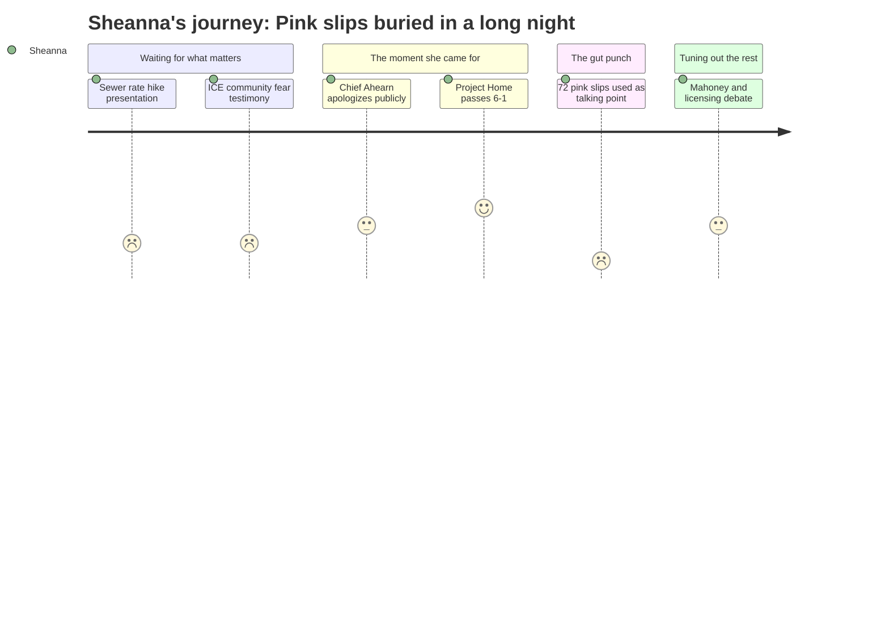

# Interpretation: Sheanna (PERSONA-015)
## Meeting: City Council Regular Meeting -- March 19, 2026 -- 2026-03-19

### Structured Points

#### 1. 72 pink slips dropped as a rhetorical aside
- **Fact:** Councilor Matthews, voting against the $100,000 Project Home rental assistance, stated: "72 people in the school department got their pink slips yesterday. 72. Your school department has an $8.4 million deficit. We, I in good conscience cannot support using money from the general fund when they're talking about closing schools."
- **Source:** Transcript [137:20–138:06]
- **Emotional valence:** negative
- **Threat level:** 5
- **Open question:** true — Which 72 positions? Were traveling specialists, interventionists, or ed techs included in the first wave? If itinerant positions are cut, the cross-building equity gaps she documents daily get materially worse, not better.

#### 2. School budget public hearing officially set — the clock is running
- **Fact:** The consent calendar set the FY27 school budget public hearing for April 7, 2026, with the council vote on the school portion scheduled for May 5, 2026, and the school budget referendum on June 9, 2026.
- **Source:** Consent Calendar, ORDER #161-25/26; Transcript [04:39–05:25]
- **Emotional valence:** neutral
- **Threat level:** 3
- **Open question:** true — The official timeline is now locked. Every week between now and May 5 is a week where programming decisions are being made that affect the students on her caseload across three buildings.

#### 3. "School" leads the April 14 budget workshop — but no details yet
- **Fact:** The consent calendar agenda for Budget Workshop #1 on April 14, 2026, lists "School" as the first department to present, before Police, Fire, Library, and all other city departments.
- **Source:** Consent Calendar, ORDER #161-25/26 position paper
- **Emotional valence:** neutral
- **Threat level:** 3
- **Open question:** true — The workshop is where program-level cuts get examined. Sheanna does not yet know whether specialist staffing, intervention services, or cross-building positions are part of the proposed reductions she'll be watching that day.

#### 4. Pedro Vasquez describes community fear that Sheanna sees in her buildings every day
- **Fact:** Pedro Vasquez, chair of the South Portland Human Rights Commission, testified: "members of our community have been afraid... afraid to go to work, afraid to leave their homes... My own family experienced that fear. We had conversations about what we would do if one of us was detained. We carried our documentation with us." He also noted that community members are withdrawing from school and economic life.
- **Source:** Transcript [93:28–95:51]
- **Emotional valence:** negative
- **Threat level:** 4
- **Open question:** false — Sheanna already knows this is happening. She sees attendance irregularities, hears from families, and watches the effects on multilingual learners across her three schools. This testimony confirmed what she already knows operationally.

#### 5. $100,000 for Project Home passes 6-1 — direct relief for families on her caseload
- **Fact:** The council voted 6-1 to appropriate $100,000 from undesignated fund balance to Project Home for rental assistance to South Portland residents impacted by federal immigration enforcement. Project Home estimates this will assist approximately 50 South Portland households.
- **Source:** Transcript [129:34–140:29], ORDER #167-25/26
- **Emotional valence:** positive
- **Threat level:** 1
- **Open question:** false — This is a concrete action with a named delivery mechanism. For Sheanna, 50 households means children who can stay in stable housing and stay enrolled. That matters directly to her work.

#### 6. Police Chief's apology on ICE texts — accountability acknowledged, but community trust damage is real
- **Fact:** Chief Ahearn addressed the council directly, acknowledging he "missed" by not pushing back on racist language from an HSI agent in their text exchange, and stated: "I can do better than that." He maintained that the department did not cooperate with ICE on immigration enforcement.
- **Source:** Transcript [103:45–110:07]
- **Emotional valence:** negative
- **Threat level:** 3
- **Open question:** true — The families of multilingual learners Sheanna works with make decisions about whether to engage with institutions based on exactly this kind of moment. An apology matters, but what changes in practice? She doesn't know yet.

#### 7. Sewer rates doubling over three years — another household squeeze on the families she serves
- **Fact:** The council was presented with projections showing sewer user fees increasing approximately 22% annually in FY27, FY28, and FY29, representing roughly $116/year more in FY27 and an additional $141/year in FY28 for the average residential customer.
- **Source:** Transcript [48:17–50:39]; Agenda, Section C.2 position paper
- **Emotional valence:** negative
- **Threat level:** 2
- **Open question:** false — Not directly her issue to solve, but she notes it: the families of her multilingual learners, many of them renters already squeezed by January's enforcement disruption, are getting hit from multiple directions simultaneously.

---

### Journey Map

---

### Reactions

I sat through almost four hours of that meeting and I keep coming back to one moment. Councilor Matthews votes against $100,000 for families who couldn't pay rent because they were terrified to leave their homes — and the reason he gives is *72 pink slips*. Not as a call to action. Not as a "we need to fix this." As a rhetorical move. Like my colleagues' jobs are a number you deploy in an argument and then move on. Those aren't abstractions. Those are people I work with in three different buildings. Those might be me. And nobody at that council table said, "Okay, but also — what are we going to do about the 72 pink slips?" The vote passed 6-1 and they moved on to Mahoney.

The Project Home money is real and I'm glad it passed. Pedro Vasquez said it plainly — families are withdrawing from work, from school, from public life. I know that. I see it in attendance across my buildings. I see it in which kids stopped coming in January and how slowly some of them are coming back. So yes, 50 households getting rental assistance matters. The chief apologizing publicly matters, even if it's not enough, even if the community trust repair is going to take a lot longer than one night at a podium. These things matter to real families I work with every day. I'm not dismissing them.

But here's what's going to keep me up tonight: I still don't know which 72 positions. The school budget workshop isn't until April 14. The hearing is April 7. I've got six weeks before this council decides which positions survive, and I have no idea whether the traveling specialist positions — the ones that serve kids at multiple schools, the ones where cuts make equity gaps *worse*, not better — are on that list. Every year I go to these budget cycles with data about how uneven access is across buildings, how kids at some schools wait months for MTSS while kids at others get in same week, how much instructional time I lose driving between buildings. Every year. And now we're in the most serious budget crisis I've seen in this district, and those are exactly the positions that look "inefficient" on a spreadsheet. I need to be in that April 14 room. I need to be prepared.