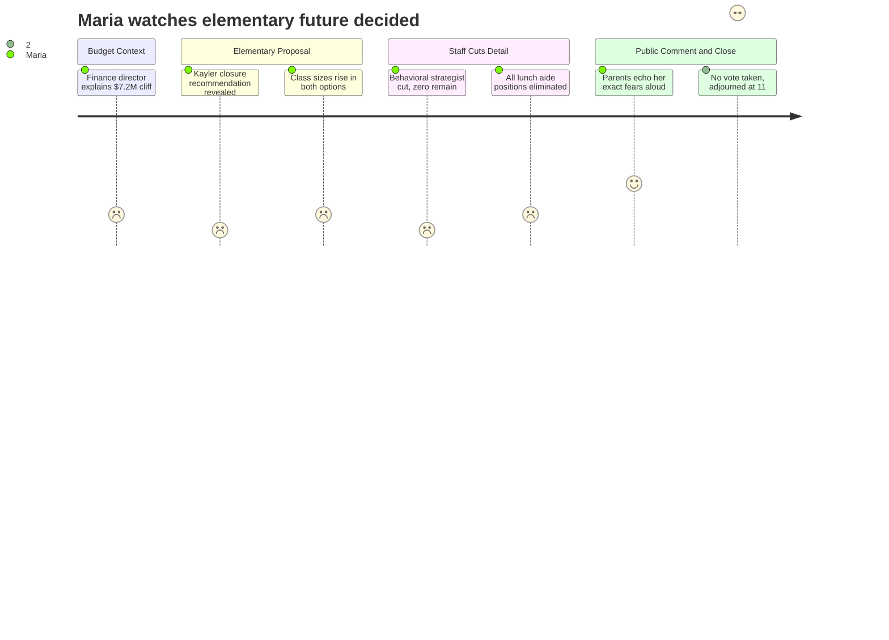

# Interpretation: Maria (PERSONA-001)
## Meeting: School Board Budget Workshop -- March 23, 2026 -- 2026-03-23

---

### Structured Points

#### 1. Kayler Elementary is the recommended school to close
- **Fact:** After evaluating all five buildings, district leadership formally recommended closing Kayler School for the 2026-27 school year, citing safety factors (dead-end street with limited egress), facility layout, and the smaller student population that would be displaced compared to Dyer. The board did not vote on this recommendation at this meeting.
- **Source:** Transcript [35:12--35:59]; Presentation Slides 15-17 ("Elementary Proposal 3.23.26")
- **Emotional valence:** negative
- **Threat level:** 4
- **Open question:** true

#### 2. Class sizes will increase in both Option A and Option B
- **Fact:** Principal Bethany Connelly presented average class size data for all schools and confirmed plainly: "in both options, class sizes increase." District policy caps K-2 at 20 and grades 3-4 at 24. The slides show current averages already near or at those ceilings in several buildings; redistribution of Kayler's students pushes averages higher across remaining schools regardless of which configuration is chosen.
- **Source:** Transcript [38:20--39:55]; Presentation Slide 20 ("Average Class Size Ranges")
- **Emotional valence:** negative
- **Threat level:** 3
- **Open question:** true

#### 3. All lunch aide positions across the district are eliminated
- **Fact:** The FY27 budget removes all seven lunch aide positions district-wide -- a $64,000 savings. These are non-union, part-time roles (2 hours per day, 175 student days). The presentation noted some positions were already vacant, but active positions at Kayler, Brown, and Dyer are cut. The district cited the need to "focus our resources on instructional outcomes" and indicated students would rely on programs like the Locker Project in lieu of a second meal period that is also being eliminated.
- **Source:** Transcript [29:39--30:27] and [56:38--57:00]; Presentation Slide 34; Budget Book Row 2657 (Brown) and comparable rows showing $0 for lunch aide lines in FY27
- **Emotional valence:** negative
- **Threat level:** 3
- **Open question:** true

#### 4. The only regular education behavioral strategist is cut -- none remain
- **Fact:** One regular education behavioral strategist position is proposed for elimination. The reduction slide's parenthetical notation explicitly states "none full time" will remain after the cut. This position supports classroom teachers in managing student behavior in general education settings -- a role distinct from special education case managers and MTSS staff. The budget is also increasing class sizes and redistributing higher-needs students from Kayler into remaining schools.
- **Source:** Presentation Slide 37 ("Teachers Association (SPTA)" -- "1 Regular Education Behavior Strategist (none full time)")
- **Emotional valence:** negative
- **Threat level:** 5
- **Open question:** true

#### 5. Four MTSS (math and literacy support) positions at elementary are eliminated
- **Fact:** Four Multi-Tiered Systems of Support positions -- two focused on math, two on literacy -- are proposed for elimination at the elementary level. Eight MTSS positions will remain district-wide. These are the specialists who identify struggling readers and math students early and provide targeted intervention before kids fall further behind. The cuts come simultaneously with larger class sizes and fewer classroom aides.
- **Source:** Presentation Slide 37 ("4 Multi Tiered Systems of Support Roles (2 math and 2 literacy) (8 remain)")
- **Emotional valence:** negative
- **Threat level:** 4
- **Open question:** true

#### 6. Option A would split families with multiple elementary-age children across two different schools
- **Fact:** Option A reorganizes the four remaining schools into two "primary" buildings (Pre-K through grade 1) and two "intermediate" buildings (grades 2 through 4). Multiple public commenters and at least one board member raised the direct logistics problem: families with, for example, a kindergartner and a third grader would have children at different school buildings with potentially conflicting arrival and dismissal times. One parent speaker described her family as "looking at three different elementary schools and a daycare with the same arrival time." No transportation solution was presented at this meeting; the district said it is waiting for a board decision before modeling routes.
- **Source:** Transcript [44:46--45:35]; [173:08--173:55] (Samantha Coatsir public comment); [123:55] (Dr. Holman question on transportation modeling)
- **Emotional valence:** negative
- **Threat level:** 4
- **Open question:** true

#### 7. The board adjourned at 11:15 p.m. without voting on any of the three key decisions
- **Fact:** The agenda called for three votes: school closure authorization, selection of Option A or Option B, and adoption of the FY27 budget. The board chair announced at approximately 11:15 p.m. that she would not hold votes that night and adjourned the meeting. The next scheduled meeting is Monday, March 30. The budget must reach City Council by April 7. A board member specifically asked whether additional meetings could be scheduled this week; the chair said she would explore it, but no commitment was made before adjournment.
- **Source:** Transcript [299:00--307:24]; Presentation Slide 9 ("Timeline")
- **Emotional valence:** neutral
- **Threat level:** 2
- **Open question:** false

---

### Journey Map

---

### Reactions

I didn't get home until almost 11:30. The kids were already asleep. Here's what happened: they want to close Kayler, they're proposing two different ways to reorganize the four remaining elementary schools, and they did not vote on any of it. So we wait until next Monday, and the board chair couldn't even promise there'd be an earlier meeting this week. Meanwhile the City Council deadline is April 7th. I've been refreshing the city website every hour since I got home.

The part that scared me most wasn't even the school closure. It was buried in the staffing slides -- the one teacher position whose whole job is handling behavior in regular education classrooms? Gone. And the slide literally said "none full time" remaining after the cut. Think about what that means. They're simultaneously cutting that person, adding students from Kayler into every other school, and growing class sizes in every building -- both options, they confirmed it right there on the slide. More kids per class, more disruption as hundreds of students land somewhere new, and the one person in the whole district who specifically exists to help regular ed teachers manage it all is eliminated. I looked at that slide three times because I couldn't believe it said what it said. And then I looked over at the board and some of them were asking questions about snow plowing contracts. I wanted to scream.

And then there's the lunch aides. All seven of them, cut. Sixty-four thousand dollars. That's the number the finance director put on it. Someone at public comment talked about the lunch aide at Kayler -- a woman named Barbara who's been there since 2014, volunteers essentially a second career worth of time on top of her two paid hours -- and the union president, Connie, said it plainly: how do you cut the lowest-paid workers making minimum wage while leaving administration largely intact? She's right. I'm going to share that clip in the elementary parents group tomorrow because I don't think half the people who weren't there understand what's actually in this budget. It's not just teachers. It's the whole web of people who make a school day actually function for a six-year-old. I keep thinking about what Option A would mean for families with kids in multiple grades: your kindergartner is at Small or Dyer, your third grader is at Brown or Skillen, and now you've got two drop-offs and two pickup times and no plan yet for transportation or before-care. A woman named Samantha stood up and said her family is looking at three different schools and a daycare with the same arrival time. That is my life in two years if we have another kid and go with Option A. I'm not saying Option B is better. I genuinely don't know. But nobody seems to have the answer to that yet, and they want us to live with whatever they decide before August.