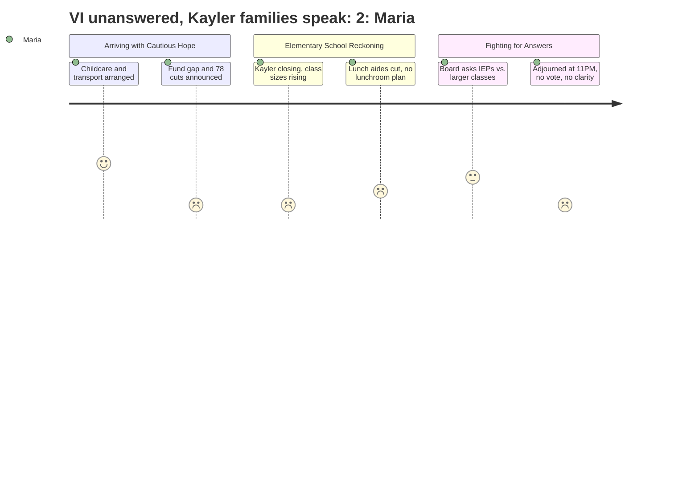

# Interpretation: Maria (PERSONA-001)
## Meeting: School Board Budget Workshop -- March 23, 2026 -- 2026-03-23

### Structured Points

#### 1. Kayler Recommended for Closure, Two Reconfiguration Options on Table
- **Fact:** The district formally recommended closing Kayler Elementary School, and presented two options for restructuring the remaining four schools: Option A (primary schools PreK-1 at Dyer and Small; intermediate grades 2-4 at Brown and Skillen) and Option B (each school keeps full K-4 grade bands). Leadership stated the district ran its analysis twice and both times pointed to Kayler, citing safety egress, building layout, and proximity to other facilities as key factors.
- **Source:** [35:12–35:59] and [36:45–37:33]
- **Emotional valence:** negative
- **Threat level:** 5
- **Open question:** true

#### 2. Class Sizes Increase in Both Options — Policy Caps Still Apply, But Averages Go Up
- **Fact:** The finance director and Skillen principal Bethany Connolly confirmed that in both Option A and Option B, average class sizes increase across all four remaining schools. District policy caps K-2 at 20 and grades 3-4 at 24, but Connolly acknowledged that "in both options, class sizes increase" and that the averages used don't account for uneven enrollment by grade level — meaning some classrooms could land at or near the policy ceiling.
- **Source:** [38:20–40:46]
- **Emotional valence:** negative
- **Threat level:** 4
- **Open question:** true

#### 3. All Seven Lunch Aide Positions Eliminated
- **Fact:** The budget eliminates all lunch aide positions district-wide — seven roles, each two hours per day, already running at roughly 50% vacancy over the last four years. The district cited cost pressure and noted that some food needs can be met through the Locker Project. The operations director separately mentioned that bus drivers would be asked to rotate into lunchroom support on a one-in-five-day basis.
- **Source:** [29:39–30:27] and [56:38–57:25] and [80:18–81:04]
- **Emotional valence:** negative
- **Threat level:** 3
- **Open question:** true

#### 4. Pre-K Seats Expanding Despite Budget Cuts
- **Fact:** Despite not adding local dollars, the district announced a net gain of 40 pre-K seats for four-year-olds through partnerships: 8 seats funded by Child Development Services, a new United Way classroom off-site, and 16 Head Start seats funded through an in-kind classroom donation. The locally funded 64-seat pre-K program is maintained.
- **Source:** [31:14–32:49]
- **Emotional valence:** positive
- **Threat level:** 1
- **Open question:** false

#### 5. Board Member Raises IEP Concentration vs. Class Size — Gets a Partial Answer
- **Fact:** Board Member Richardson explicitly asked whether the district could adopt a class size policy that accounts for the number of IEPs in a classroom, noting that larger classes are being filled while support staff is being cut. Assistant Superintendent Prince responded that the board could factor in student need, but that doing so under the current budget would require either cutting elsewhere or exceeding the 6% tax cap — no immediate path was identified.
- **Source:** [116:13–118:34]
- **Emotional valence:** positive
- **Threat level:** 2
- **Open question:** true

#### 6. Title VI Question Raised About Kayler's Demographics — Not Answered
- **Fact:** A Kayler parent identified as Jess Elsner noted publicly that Kayler is approximately 45% BIPOC and 30-35% multilingual learners, and asked what specific steps were taken to ensure the closure recommendation did not violate Title VI of the Civil Rights Act. Board Chair DeAngelis acknowledged the question but stated no one present had a legal answer, and it was deferred without a timeline for response.
- **Source:** [163:01–163:47] and [300:26–300:42]
- **Emotional valence:** negative
- **Threat level:** 4
- **Open question:** true

#### 7. Fund Balance Gone — No Financial Cushion Remains
- **Fact:** Finance Director Abigail Ketchem confirmed that the district's fund balance is effectively depleted. When asked what happens if there are unexpected costs next year (snowstorms, litigation), she stated the district would have to draw from the city's fund balance and repay it through future tax increases. Seeding a new fund balance is not part of the FY27 budget — it was described as "too dire" for this year.
- **Source:** [98:24–99:09] and [103:48–104:36]
- **Emotional valence:** negative
- **Threat level:** 3
- **Open question:** true

#### 8. No Vote Taken; Next Meeting Scheduled for March 30
- **Fact:** After more than five hours — including board Q&A and extended public comment — the meeting adjourned without any board vote on school closure, reconfiguration option, or budget adoption. The next scheduled meeting is Monday, March 30. A board member publicly urged exploring an earlier meeting, but the chair stated nothing else was on the calendar and motion to adjourn was made and carried.
- **Source:** [299:39–307:24]
- **Emotional valence:** negative
- **Threat level:** 2
- **Open question:** true

---

### Journey Map

---

### Reactions

Okay so I was there for five hours and I still don't know what school my kid is going to next year. That's where we are. They laid out two options — Option A where you'd have little kids at one set of schools and older elementary kids at another, or Option B where schools stay K-4 but Kayler closes and those families just get absorbed. And then they said the board needs to decide, and then they... adjourned. At 11:15 at night. Without a vote. I can't.

What I can't stop thinking about is the class sizes. They put it right up on the screen — in *both* options, class sizes go up. They kept saying "well, we're still within policy limits" like hitting the ceiling is somehow reassuring. My daughter's teacher already has 22 kids. And now they're cutting the behavioral strategist — the one person you call when a kid is having a really hard moment — while the classrooms get more crowded. One board member actually asked about that, whether the class size policy could account for how many IEPs are in a room, and the answer was basically: "yes, we could do that, but then something else has to get cut." So, great. Nobody's got an answer.

And then there's the Kayler thing. That school is 45% BIPOC, 30-something percent multilingual learners — a parent stood up and said that — and she asked whether closing Kayler might violate civil rights law. The board chair said she didn't have a legal answer. That's the answer we got at 11 PM. I don't care if you're on one side of this reconfiguration debate or the other — you cannot just not answer that question. I left that room thinking: somebody is going to be at that next Monday meeting asking the exact same thing, and if the answer is still "we don't know," that's a five-alarm problem. Also — the lunch aides are gone. Seven people who watch kids eat lunch, who make sure the cafeteria doesn't descend into chaos, who at Kayler apparently also delivered the fruit and veggie snacks and helped teachers prep their classrooms — gone. The district's answer is the bus drivers will rotate in once every five school days. My kid's lunch period is supervised by someone whose actual job is driving a bus. Cool. That's where we are.