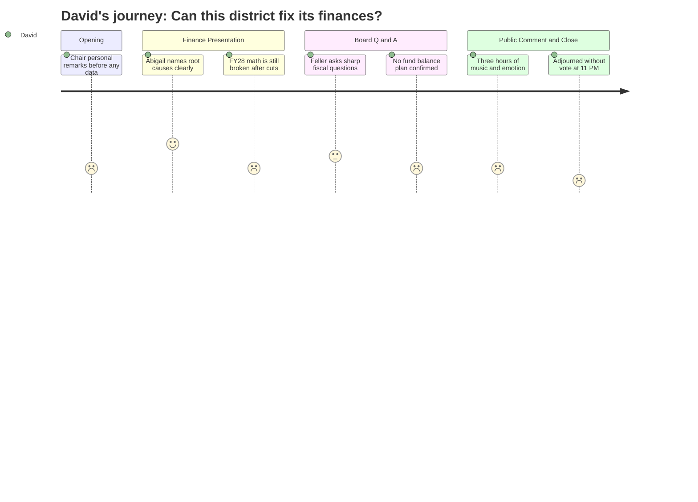

# Interpretation: David (PERSONA-002)
## Meeting: School Board Budget Workshop -- March 23, 2026 -- 2026-03-23

### Structured Points

#### 1. Finance Director Names the Actual Causal Chain
- **Fact:** Finance Director Abigail Ketchem offered an unusually candid structural diagnosis: enrollment declined while staffing didn't adjust, COVID funds elevated headcount and then expired, fund balance was used as operating revenue masking the gap, there was no minimum threshold policy on savings, and leadership turnover -- she is the seventh finance director in six years -- prevented course correction.
- **Source:** Transcript [14:49--17:55]
- **Emotional valence:** positive
- **Threat level:** 2
- **Open question:** false

#### 2. FY28 Is Structurally Unsolvable at 6% Without Further Cuts
- **Fact:** Ketchem stated explicitly that labor costs alone, with no staffing changes, increase faster than 6% per year, making a balanced budget under the tax cap "mathematically impossible." She also flagged at least $300K in new debt service in FY28 (athletic field bond moving from one interest payment to two plus principal), a potential Skillen boiler bond, and utility increases running 13--14% annually.
- **Source:** Transcript [21:01--22:36]
- **Emotional valence:** negative
- **Threat level:** 4
- **Open question:** true

#### 3. No Plan to Rebuild the Fund Balance in FY27
- **Fact:** When Board Member Feller asked directly how the district would seed the fund balance, Ketchem confirmed there is no fund balance restoration built into the FY27 budget. Her answer: "This year is too dire." Member Richardson followed up to clarify that the only mechanism to rebuild reserves is to ask taxpayers for additional money in future years -- or hope for a windfall.
- **Source:** Transcript [98:24--109:17]
- **Emotional valence:** negative
- **Threat level:** 4
- **Open question:** true

#### 4. Total Budget Increase Is 3.3% -- Lowest in Years
- **Fact:** The proposed FY27 budget represents a 3.3% overall increase, described as the lowest in many years. The 6% local tax increase is met. Per-taxpayer impact is approximately $257 additional per year. The non-tax revenue line is negative 5% because last year's fund balance contribution is gone.
- **Source:** Transcript [24:11--25:47]
- **Emotional valence:** positive
- **Threat level:** 1
- **Open question:** false

#### 5. Full Debt Service Picture Was Not Surfaced Proactively
- **Fact:** The cumulative debt service cost center (line 8,000,099) totaling FY27 payments was referenced only in response to a board question, not foregrounded in the finance presentation. Ketchem noted the district carries "several layers" of bonds with "a variety of principal and interest payments" -- the athletic field bond alone adds roughly $330K next year. The full multi-year amortization schedule was never shown.
- **Source:** Transcript [101:29--102:15]
- **Emotional valence:** neutral
- **Threat level:** 3
- **Open question:** true

#### 6. State Funding Formula Change Is a Known Unknown
- **Fact:** Board Member Holman asked about LD 2666, the pending legislation that would revise Maine's school funding formula. Ketchem noted the bill has nine provisions, but only two have been modeled. The outcome for South Portland is genuinely uncertain -- the district could receive more or less state aid under the revised formula, and the legislature has not completed its analysis.
- **Source:** Transcript [122:24--123:09]
- **Emotional valence:** neutral
- **Threat level:** 3
- **Open question:** true

#### 7. Grant Tracking Is Ad Hoc With No Formal System
- **Fact:** When Board Member Richardson asked whether the district maintained a list of pending grants, Ketchem acknowledged there is no formal process. Small grants surface "more ad hoc." The only material outstanding application is a Department of Maine community school expansion grant for up to $100K -- two $50K applications -- whose outcome is unknown.
- **Source:** Transcript [104:36--105:22] and [118:34--119:20]
- **Emotional valence:** negative
- **Threat level:** 2
- **Open question:** true

---

### Journey Map

---

### Reactions

The finance director -- Ketchem, who's only been there nine months -- was actually the most useful person in the room. She laid out exactly how the district got here: enrollment fell by 300 students over four years, staffing didn't adjust, COVID money propped up headcount, and then when the money ran out they just drew from reserves instead of cutting positions. And because they had no minimum fund balance policy, nobody triggered an alarm. She said she's the seventh finance director in six years, which tells you everything about why nobody caught it earlier. I genuinely appreciated that she didn't dress it up. She called it cause and effect, not excuses. That's the first time I've heard someone at that podium give a structural account instead of just a budget number.

What I'm actually worried about is FY28. She was very clear: labor costs, when you hold everyone's position constant, increase faster than 6% every single year. That's baked into the contracts. So even after they've cut 78 positions, closed a school, and reset the budget, they're already pointed back at the same wall. Add in at least $330K in new debt service on the athletic field bond, utilities running up 13--14% a year, and the Skillen boiler as an open question, and you've got a district that just did the hardest thing they've ever done and it still doesn't solve the core problem. She said it herself: "FY27 wipes out the balance, but that doesn't solve your core problems." And when Feller asked what the plan was to rebuild the reserve fund, the answer was essentially: not this year, maybe next, only by asking taxpayers for more. There's no safety net right now. None.

The five hours of public comment -- look, I get it, people are upset, and a few speakers made genuinely substantive points. The speech about the occupational therapists was actually a real fiscal argument: cut two OTs now, end up paying more for contracted out-of-district placements later. That's the kind of cost-shifting logic the board should be tracking. But the percussion ed tech got mentioned probably a dozen times, the same points on a loop. The meeting just... dissolved at 11:15 with no vote, a half-answered question log, and the board agreeing to meet again March 30th. Which is a week from now. And they still owe the City Council a presentation on April 7th. I don't think most people in that room realized that the FY28 math is the scarier number.