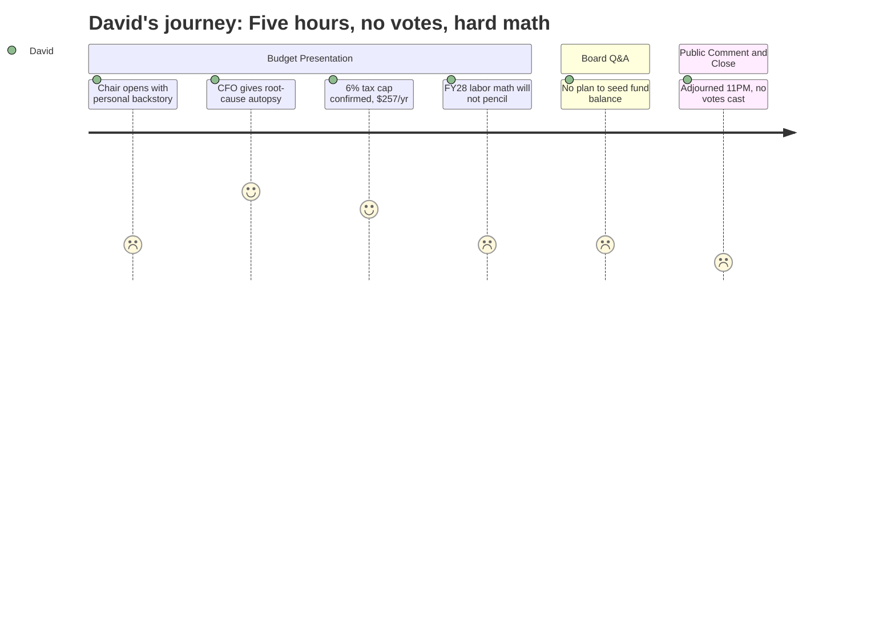

# Interpretation: David (PERSONA-002)
## Meeting: School Board Budget Workshop -- March 23, 2026 -- 2026-03-23

### Structured Points

#### 1. Finance Director Delivers an Honest Root Cause Analysis
- **Fact:** Finance Director Abigail Ketchem — the seventh to hold the role in six years — identified three systemic causes of the fiscal crisis without hedging: enrollment-staffing misalignment masked by COVID funds, the absence of a minimum fund balance threshold policy as a "guardrail," and leadership instability in both finance and administration. She framed these explicitly as cause and effect, not excuses.
- **Source:** [14:49–17:55], Budget Presentation Slide 4
- **Emotional valence:** positive
- **Threat level:** 1
- **Open question:** true (The diagnosis is sound — but will she stay long enough to implement the corrective policies she's describing? She is, by her own acknowledgment, the seventh finance director in six years.)

#### 2. FY27 Resets the Path but Doesn't Solve the Structural Problem
- **Fact:** Ketchem explicitly warned that FY27 is like "wiping out the credit card balance" without fixing the underlying behavior. She identified four compounding pressures for FY28 and beyond: labor costs that auto-escalate above 6% per year through contract step and lane adjustments, utility costs rising 13–14% annually, a minimum $300,000 increase in debt service for the athletic field bond, and a potential additional debt obligation for the Skillen boiler.
- **Source:** [19:29–23:23], Budget Presentation Slide 6
- **Emotional valence:** negative
- **Threat level:** 4
- **Open question:** true (No multi-year financial projection was presented to the board or the public. Has anyone modeled what a balanced FY28 budget actually requires, given labor and debt constraints?)

#### 3. The 6% Tax Target Is Met — One Genuinely Reassuring Data Point
- **Fact:** The proposed FY27 budget delivers exactly the 6% local tax increase the City Council set as a ceiling, translating to approximately $257 per year for the average South Portland homeowner (based on a $514,000 assessed value). The overall budget growth is 3.3%, described as the lowest year-over-year increase in recent memory.
- **Source:** [24:58–25:47], Budget Presentation Slide 8
- **Emotional valence:** positive
- **Threat level:** 1
- **Open question:** false

#### 4. Transportation Budget Rises 17.5% While Services Are Being Cut
- **Fact:** The FY27 transportation budget is $3,326,606, up from $2,830,679 in FY26 — a nearly $500,000 increase — even as the district plans to reduce evening shuttle routes and reassign bus drivers to midday custodial duties. The budget book shows driver and clerk benefits jumping from $610,175 to $904,217, a $294,000 increase that appears to reflect health insurance growth, but no line-item explanation was offered in the presentation.
- **Source:** Budget Presentation Slide 7 (Cost Center 8); Budget Book Rows 2910–2970; [79:31–82:39]
- **Emotional valence:** negative
- **Threat level:** 3
- **Open question:** true (The benefits surge is visible in the budget document but was never connected to the health insurance projection in any public-facing explanation. What is the district's plan to manage benefits cost growth if health insurance continues rising at 12% per year?)

#### 5. No Plan to Replenish the Fund Balance
- **Fact:** When Board Member Feller asked directly about the plan to rebuild the fund balance — reserves drawn down over four years to cover operating costs — Ketchem confirmed there is no seeding plan in FY27: "This year is too dire." Board Member Richardson followed up to confirm that with no fund balance, any unexpected expenditure (litigation, weather, emergency repair) would require drawing on the city's fund balance and repaying it through a future tax increase.
- **Source:** [98:24–99:17]; [103:36–103:52]
- **Emotional valence:** negative
- **Threat level:** 4
- **Open question:** true (Ketchem identified the missing fund balance threshold policy as a primary "guardrail" failure. When does the board commit to a minimum reserve target and a timeline to reach it?)

#### 6. Nutrition Transfer Was Systematically Under-Budgeted Last Year
- **Fact:** Ketchem disclosed that in FY26, the district budgeted $202,000 for the nutrition fund transfer but the actual deficit was "several hundred thousand dollars" — a significant unexplained variance. The FY27 budget corrects this to a more realistic figure, but Ketchem flagged it as a key area of concern representing prior under-reporting.
- **Source:** [27:21–28:06], Budget Presentation Slide 12
- **Emotional valence:** negative
- **Threat level:** 3
- **Open question:** true (If nutrition was under-budgeted by this magnitude in FY26, what other line items were similarly understated? No full FY26 variance analysis was presented to the board.)

#### 7. No Votes Were Taken — the Timeline Is Now Critical
- **Fact:** After more than five hours of presentation and public comment, the board adjourned at approximately 11:15 PM with zero votes cast. Three action items were on the formal agenda: authorization to file a school closing report, selection of a grade configuration model (Option A or B), and adoption of the FY27 budget proposal. The next scheduled meeting is March 30, with the City Council budget presentation on April 7.
- **Source:** [299:39–307:24]; Budget Presentation Slide 9 (Timeline); Agenda Item 2.1, 2.2, 2.3
- **Emotional valence:** negative
- **Threat level:** 3
- **Open question:** true (Can the board hold a decision-quality meeting on March 30 — one week after an emotionally exhausting five-hour session — and still produce a coherent, defensible budget package for the April 7 City Council presentation?)

---

### Journey Map

---

### Reactions

The most useful twenty minutes of a five-hour meeting came from the finance director. Abigail Ketchem — who is, by the way, the seventh person to hold that job in six years, which alone tells you something about this district — stood up and gave an actual autopsy. Enrollment fell, staffing didn't follow, COVID money papered over the gap, they spent down reserves with no policy requiring a minimum on hand, and the constant turnover in finance leadership meant nobody was watching the whole picture long enough to say stop. She called it cause and effect, not excuses. That's the clearest, most accountable explanation I've heard from anyone in this district. I genuinely appreciated it — and I immediately started wondering whether she'd still be here in eighteen months to implement any of this.

Here's what doesn't get fixed by this budget though: the structural math. Labor costs auto-escalate more than 6% per year just through step and lane adjustments that are already written into the contracts. The City Council's tax cap is 6%. Those two facts in the same sentence should be keeping every board member up at night, because it means every single year you're starting from a structural deficit before you even open the utility bills. Utilities are up 13 to 14 percent annually. FY28 debt service is going up at least $300,000 for the athletic field bond. And when Feller asked about rebuilding the fund balance — the reserves they spent down to cover operations for four years — Ketchem just said there's no plan this year, it's too dire. So we have no cushion, no plan to build one back, and a compounding structural cost problem that a 6% tax cap cannot mathematically absorb. The budget book also shows transportation going up 17.5% from last year while they're cutting shuttle routes, and nobody explained that in the presentation — the benefits line for drivers jumped by $300,000, which I'm guessing is health insurance, but that connection was never made explicit for the board or the public.

And then they adjourned at 11:15 at night without voting on anything. Three action items on the agenda, zero decisions. The next meeting is Monday, City Council gets the budget April 7. I understand people were exhausted and the room was emotional — there was a lot of public comment, some of it genuinely substantive, some of it less so — but the board needed to call the vote. The timeline was already compressed and now it's worse. I'll be at March 30.