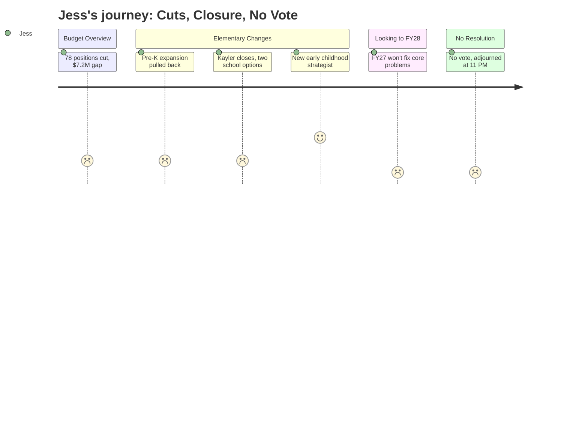

# Interpretation: Jess (PERSONA-003)
## Meeting: School Board Budget Workshop -- March 23, 2026 -- 2026-03-23

---

### Structured Points

#### 1. Pre-K Expansion Was Planned -- Then Pulled Back
- **Fact:** The district originally intended to expand locally-funded pre-K seats in FY27 but reversed course. The budget maintains 64 locally-funded seats (no growth), while adding 40 additional seats through outside partnerships: 8 via state CDS funding for special education-eligible children, 16 through a United Way classroom (off-site), and 16 through Head Start (on-site, pending). Total pre-K capacity grows from 80 to 120, but the district's own funded expansion was withdrawn.
- **Source:** [31:14--32:49]; Presentation Slide 14 (Elementary Proposal 3.23.26, Pre-K Changes table)
- **Emotional valence:** negative
- **Threat level:** 3
- **Open question:** true

#### 2. Enrollment Has Fallen 23% in Four Years -- and Is Still Declining
- **Fact:** Elementary enrollment dropped from 1,401 to 1,080 students over four years -- a 23% decline -- and the district projects continued decline. This contraction is identified as a root cause of the current financial crisis, and the finance director explicitly stated it reduces state funding going forward.
- **Source:** Fiscal Context document; [14:49--15:36]; Presentation Slide 4
- **Emotional valence:** negative
- **Threat level:** 4
- **Open question:** true

#### 3. The District Has Had Seven Finance Directors in Six Years
- **Fact:** Finance Director Abigail Ketchem disclosed that she is "the seventh finance director in six years," and explicitly connected that leadership revolving door to financial disarray, poor planning, and audit findings -- calling it a cause, not an excuse, for the current crisis.
- **Source:** [16:25--17:10]
- **Emotional valence:** negative
- **Threat level:** 4
- **Open question:** true

#### 4. FY27 Cuts Do Not Fix the Underlying Problem
- **Fact:** Ketchem warned that FY27 "resets our financial path but does not solve our core problems," listing specific FY28 structural pressures: labor costs automatically increasing faster than 6% per year, utility rates rising 13-14% annually, at least $300,000 in new debt service from the athletic field, a possible Skillen boiler replacement requiring new debt, and continued enrollment-driven state revenue decline.
- **Source:** [19:29--22:36]; Presentation Slide 6
- **Emotional valence:** negative
- **Threat level:** 4
- **Open question:** true

#### 5. A New Early Childhood Strategist Role Is Being Created
- **Fact:** The budget includes a new Early Childhood Strategist position -- a special education-certified role embedded in the SPTA that will specifically support pre-K and kindergarten transitions, manage CDS partnerships, and provide continuity for off-campus pre-K locations.
- **Source:** [64:34--65:20]; Presentation Slide 48
- **Emotional valence:** positive
- **Threat level:** 1
- **Open question:** false

#### 6. Class Sizes Will Increase Under Both Elementary Options
- **Fact:** Regardless of whether the board chooses Option A (primary/intermediate grade-band split) or Option B (K-4 model), average class sizes will rise above current levels. The presentation showed K-2 classes approaching the district cap of 20 students under both configurations, with 3-4 grades reaching up to 24 -- the district policy ceiling, and still below state maximums.
- **Source:** [38:20--39:55]; Presentation Slide 20
- **Emotional valence:** negative
- **Threat level:** 3
- **Open question:** true

#### 7. The Board Adjourned at 11:15 PM Without Taking Any Vote
- **Fact:** Despite being scheduled as a Special Meeting with three action items on the agenda -- school closure authorization, choice of Option A or B configuration, and budget adoption -- the board took no votes. A motion to adjourn was made around 11:15 PM. The next scheduled meeting is March 30.
- **Source:** [~305:00--307:48]; Budget Workshop II Agenda items 2.1, 2.2, 2.3
- **Emotional valence:** negative
- **Threat level:** 3
- **Open question:** true

---

### Journey Map

---

### Reactions

Okay so I stayed up until midnight watching that school board meeting everyone's been posting about and I honestly feel worse than before I started. My kid isn't even in kindergarten yet and I'm completely spiraling. They're closing one of the elementary schools -- Kayler -- and I don't even know which school is supposed to be ours yet because I've been trying to figure that out. And enrollment has dropped 23% in FOUR YEARS. Twenty-three percent. Kids are leaving this district. So I'm sitting here like, is this place even going to be okay by the time we get there?

The pre-K stuff really got me. Early in the meeting the assistant superintendent said they were originally going to expand the district's own pre-K program with local money, but then they just... didn't. They kept the same 64 seats they already had and are growing the total through Head Start and a United Way partnership. Which fine, more seats overall, but Head Start has income eligibility requirements and the United Way thing is at an off-site location. So I'm genuinely sitting here wondering: is there even going to be a regular district pre-K spot for us, or is it lottery-based, or what? Nobody addressed that.

And then the finance director -- who is the SEVENTH finance director in SIX YEARS, she said it herself -- she literally said that closing the school and cutting all these people doesn't even fix the problem. Her exact words were that FY27 "resets our financial path but does not solve our core problems." She listed all these things that are still going to be wrong in FY28: labor costs going up more than 6% automatically, utilities rising 13-14%, new debt payments. My kid starts in 2028. Are we doing this all over again? And then the whole meeting just ended at 11 PM without a single vote on anything. Not on the school closure, not on which configuration option, not on the budget. The next meeting is March 30th. So everyone just goes home not knowing what their kid's school situation even is next year, let alone in two years.