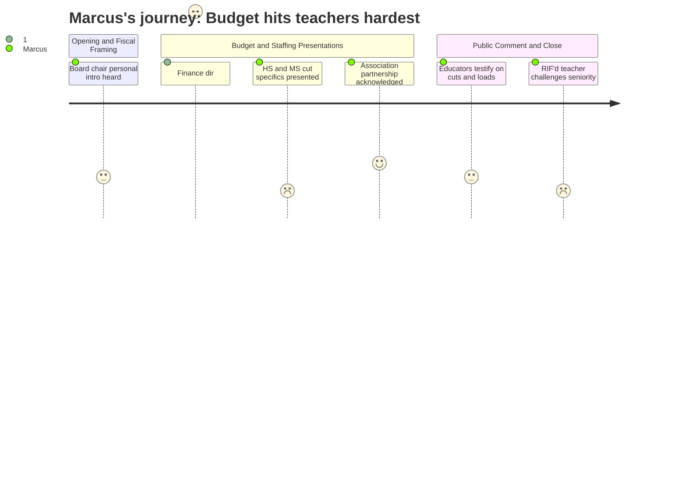

# Interpretation: Marcus (PERSONA-004)
## Meeting: School Board Budget Workshop -- March 23, 2026 -- 2026-03-23

### Structured Points

#### 1. 42 teachers RIF'd: 32 on recall list, 11 involuntary transfers
- **Fact:** The proposed FY27 budget eliminates positions held by 42 teachers. Of those, 32 current teachers have no position in the new staffing plan and land on a recall list — first in line only if a vacancy opens through resignation or retirement. Eleven others are being offered involuntary transfers to different roles.
- **Source:** [57:25--58:11] (Assistant Superintendent Prince presenting slide 37)
- **Emotional valence:** negative
- **Threat level:** 5
- **Open question:** true — Slide 37 was referenced with a breakdown of reductions by type and remaining count, but the position types were not read aloud in full. Which content areas bear the most cuts? Who specifically is on the recall list by certification area?

#### 2. South Portland High School: seven positions down, class averages rising
- **Fact:** SPHS is projected to reach its lowest enrollment in recent memory for 2026-27. The proposed budget eliminates seven teaching positions — four from retirements and vacancies not being backfilled, three additional — spread across multiple content areas. In science, average class size rises from 18.8 to 21.8 students. Administration stated all sections remain within existing section maxima.
- **Source:** [74:40--77:52] (Principal Glenn)
- **Emotional valence:** negative
- **Threat level:** 3
- **Open question:** true — Science averages are computed across 15 distinct courses. Which specific sections are already at or near the cap of 24? Which content areas lose the non-vacancy positions?

#### 3. Semesterizing proposal introduced as administrative plan, not working conditions discussion
- **Fact:** Principal Glenn proposed shifting SPHS to semester-based credit issuance rather than annual credit, and converting one math teaching position to a "learning lab" role. Both changes were presented as student-facing benefits with no mention of teacher consultation or meet-and-consult obligations.
- **Source:** [77:52--79:31] (Principal Glenn)
- **Emotional valence:** neutral
- **Threat level:** 2
- **Open question:** true — Shifting the credit-issuance structure changes how every teacher plans, grades, and sequences annual curriculum. Is this a working conditions change that triggers meet-and-consult with SPTA, or is the administration treating it as a unilateral scheduling decision?

#### 4. Middle school related arts: five-class teaching day, 250 fewer prep minutes weekly
- **Fact:** The budget cuts 4 of 20 related arts teachers at the middle school. The remaining 16 will each teach five classes per day instead of four. SPTA representative Jamie Watson stated in public comment that this means 250 more instructional minutes per day than core content teachers and 250 fewer planning minutes per week. Administration characterized remaining prep as "still above contractual" minimums.
- **Source:** [68:29--70:48] (Principal Stern); [193:29--198:07] (public comment, Jamie Watson and Lori Milton as SPTA representatives)
- **Emotional valence:** negative
- **Threat level:** 3
- **Open question:** true — Does the SPTA dispute the administration's framing that surviving prep time still satisfies contractual floors? Has meet-and-consult been scheduled specifically around the increased teaching load for this unit?

#### 5. Percussion ed tech proposed for elimination again — 378 days after the identical fight
- **Fact:** The shared middle school and high school percussion ed tech position is again proposed for elimination. Music educator Jen Fletcher noted she stood at the same podium "378 days ago" making the same argument against the same proposed cut. The position was restored after community pressure last budget cycle. It has existed continuously since the mid-1980s. The current position holder is also a certified special education teacher.
- **Source:** [198:54--201:58] (public comment, Jen Fletcher); [218:19--220:39] (public comment, Amy Haskins)
- **Emotional valence:** negative
- **Threat level:** 2
- **Open question:** true — If the board restored this position last year after community showed up en masse, what changed in the district's calculus? Is this a genuine budget necessity or a line item that keeps reappearing because administration treats music support as discretionary?

#### 6. Finance director: labor costs structurally exceed the 6% ceiling every year
- **Fact:** Finance Director Ketchem stated explicitly that district labor costs — with all staff remaining in their current positions and receiving only contractual step increases — naturally grow at a rate higher than 6% annually. Because personnel is the overwhelming majority of the budget, she said: "It's mathematically impossible not to have a problem." This was framed not as a crisis-year anomaly but as a structural condition.
- **Source:** [21:01--21:49]
- **Emotional valence:** negative
- **Threat level:** 5
- **Open question:** true — If the 6% tax cap and contractual salary growth are permanently misaligned, does this mean annual reduction-in-force cycles are structurally inevitable regardless of enrollment trends or state funding changes?

#### 7. Association leaders publicly praised — consultation process formally acknowledged
- **Fact:** Assistant Superintendent Prince offered explicit public acknowledgment of union association leaders at the start of the staffing section: they "showed deep knowledge, care, and offered partnership to district leaders and administrators and have undoubtedly made this process better." Leaders reviewed impact lists, sought contract compliance, and participated in a joint communication to all members on March 15th, ahead of individual notifications on March 18th.
- **Source:** [51:05--51:53]
- **Emotional valence:** positive
- **Threat level:** 1
- **Open question:** false

#### 8. A RIF'd teacher publicly challenges union seniority rules over professional credentials
- **Fact:** Blair Bacon, an interventionist at Skillen with 25 years of experience, a master's degree in literacy, a multilingual endorsement, and two national board certifications, told the board she lost her job because "in this contract, education and professional credentials matter second. The only thing that matters is a date" — her hire date of July 10, 2023. She also called the slogan "Contracts not closures" something that is "out of touch with the power you wield."
- **Source:** [156:05--159:08] (public comment, Blair Bacon)
- **Emotional valence:** negative
- **Threat level:** 2
- **Open question:** true — If the perception solidifies publicly that union contracts protect longevity over demonstrated expertise, does that weaken the union's standing to advocate for teacher investment and program preservation in subsequent budget fights?

---

### Journey Map

---

### Reactions

I was there for all five hours and I'll tell you what's going to keep me up — not the 42 number, I knew that going in — but the finance director saying out loud that this is a structural problem, not a one-year crisis. She said that even if nobody gets anything beyond their contractual step increase, labor costs grow faster than 6% every year, and since that's basically the whole budget, she literally said it's "mathematically impossible not to have a problem." The board set a 6% cap, the state funds us at 20% when it should be 55%, and our own labor structure outpaces the cap by design. She moved right past that like it was a footnote. Thirty-two people on a recall list. Eleven more getting involuntary transfers. And we're going to be back here next year having the same conversation unless something structural changes — the state formula, the tax ceiling, something.

At the high school, Sarah Glenn presented seven positions down. Four from retirements they're not backfilling, three actual bodies. Science averages go from 18.8 to 21.8. She kept saying "within section max" but 21.8 is an average across fifteen different science courses — some of those are already at 24. And then buried in the same presentation is this semesterizing proposal, issuing credit at the semester instead of year-end, plus converting a math teacher to a learning lab role. That's a direct change to how every teacher at the school plans their year. That's a working conditions issue. Nobody said a word about whether that had gone through meet-and-consult with SPTA or whether it's just being announced. I need to find out where that stands.

Two moments from public comment I'm still chewing on. Jen Fletcher stood up and said she was at that same podium 378 days ago fighting to save the percussion ed tech position. The community showed up, the board restored it, and here we are. That's the same fight, same position, same arguments, one year later — and the district apparently learned nothing from it. And then Blair Bacon, who got RIF'd out of Skillen — 25 years of experience, nationally board certified twice, master's in literacy — she stood up and said the only thing that mattered was her hire date of July 2023, that credentials come second to a date. She called "Contracts not closures" out of touch. That's hard to hear. I get it — seniority protection is the floor that keeps administration from cutting whoever they want for whatever reason they want, and you take that away and you create a different set of problems. But when someone with her record is standing there telling a room full of people she lost her job to a calendar entry, that lands. People are going to throw that back at us, and we need to be ready to explain why the alternative is worse.